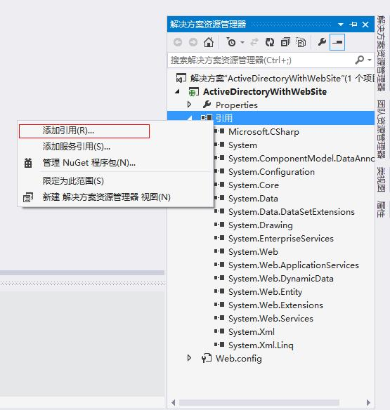
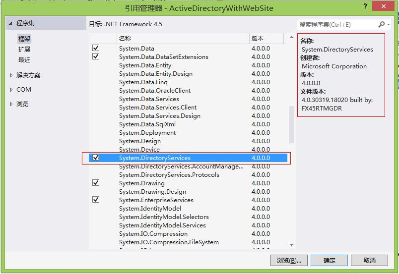

# DotNET与AD-基础 | 字痕随行

.NET Framework封装了用于操作AD的程序集，可以藉由此程序集查询、增加、修改、删除AD中的OU、User、Group等节点及其属性信息。

在VS2013中，新建一个项目，在项目中引用程序集“System.DirectoryServices”，即可在该项目中操作AD。如下图所示：

图：添加引用

图：引用管理器

添加成功后，即可在该项目中通过代码操作指定的AD中的信息。

如果有问题，欢迎指正讨论。

觉的不错？可以关注我的公众号↑↑↑