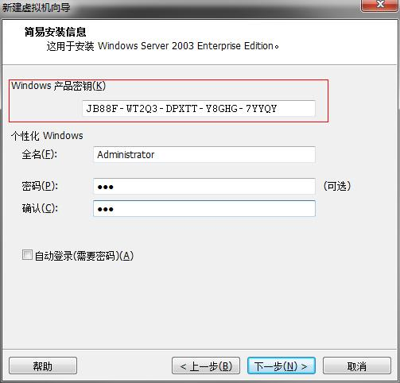

# DotNET与AD-构建开发环境 | 字痕随行

本章将介绍如何快速构建.NET与AD相结合的开发环境，需要的必备条件有：

1. 两台物理机：如果使用虚拟机，可以在一台物理机上同时安装，我使用的是VMware。
2. Windows Server 2003安装镜像：综合来看，Win Server 2003的安装包最小，运行时耗费资源最低，同时提供的AD功能已经够用，足够应对各种与AD域相结合的开发需求。
3. Winows操作系统安装镜像：我使用的是Windows 8.1。
4. Microsoft Visual Studio安装镜像：我使用的是VS2013。

一切准备完毕后，就可以开始了。虚拟机的安装和使用不在本文范围内，只会在必要的时候提及，如何使用可以参考其它教程。构建开发环境分为以下几步：

1. 安装Windows Server 2003。
2. 安装AD目录服务。
3. 安装Windows 8.1。
4. 安装VS2013。
5. 配置Windows 8.1网络连接。
6. 验证

# 安装Windows Server 2003

启动虚拟机，选择“文件”->“新建虚拟机”，开启“新建虚拟机向导”，按照提示进行配置，如下图：

图：菜单位置

图：新建虚拟机向导

图：安装客户机操作系统

图：配置安装信息

图：配置虚拟机名称及存储位置

使用向导配置完成后，虚拟机会自动运行，并且启动Windows Server 2003安装程序，接下来只需要按提示输入初始信息即可完成安装。

# 安装AD目录服务

Windows Server 2003安装完成后，由开始菜单中打开“管理您的服务器”界面，如下图：

图：“管理您的服务器”程序启动位置

点击“添加或删除角色”，打开“配置您的服务器向导”界面，开始配置服务器，如下图：

图：配置界面

图：输入域名

图：设置NetBIOS

图：总结界面

图：开始安装

安装完成后自动重启，重启后进入服务器，会再继续执行安装过程，如下图：

图：配置过程

点击下一步完成后，如果报无法配置转发器的错误，可以不用理会，至此AD目录服务安装完成，“管理您的服务器”界面会如下图所示：

图：管理您的服务器

# 安装Windows 8.1及VS2013

参照“安装Windows Server 2003”一节新建一台虚拟机，并安装Windows 8.1，安装完成后，更换“光盘镜像”，然后再安装VS2013。

# 配置Windows 8.1网络连接

首先要保证Windows Server 2003和Windows 8.1的网络处于同一个局域网内，查看Windows Server 2003的网络连接设置，之前在安装AD目录服务时，应该已经自动配置好，如下图：

在Windows 8.1中，参照以上信息进行配置，打开“网络和共享中心”，设置本地连接。打开“Internet协议版本4”属性设置，选择“使用下面的IP地址”，IP地址输入“10.10.1.2”，子网掩码输入“255.0.0.0”，默认网关置空；选择“使用下面的DNS服务器地址”，首选DNS服务器输入“10.10.1.1”。至此设置完毕。

# 验证

参见《连接与查询》章节。

如果有问题，欢迎指正讨论。

觉的不错？可以关注我的公众号↑↑↑