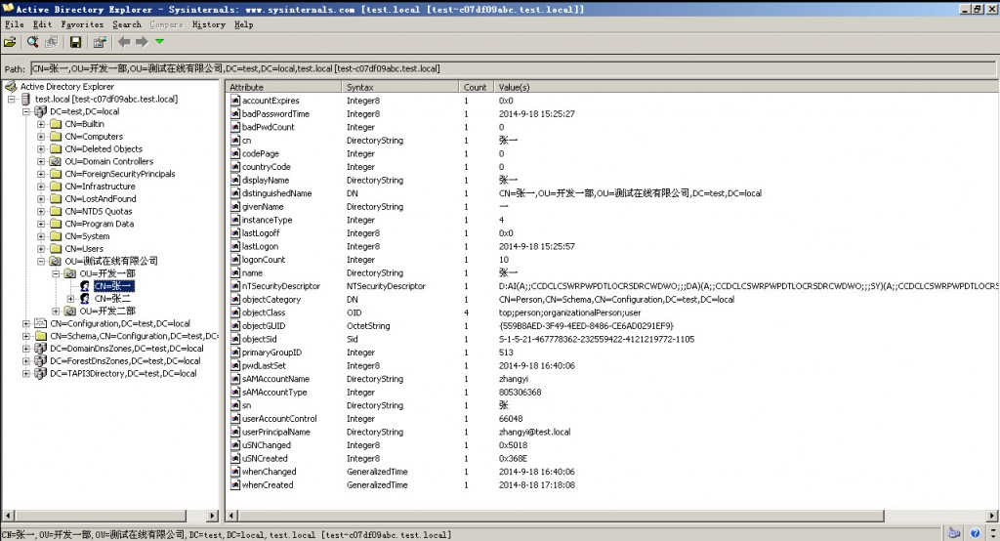
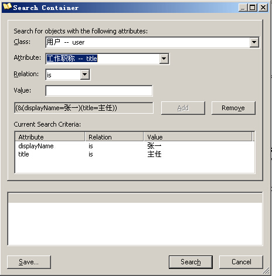

# DotNET与AD-连接与查询 | 字痕随行

## 连接

如果要连接AD服务器，首先要知道LDAP地址，LDAP地址一般形如：LADP://xxx.com。可以使用下面的代码进行连接：
```csharp
DirectoryEntry entry = new DirectoryEntry(
	strLDAP, 
	strAdminUserName, 
	strAdminPwd,
	AuthenticationTypes.Secure
);
```
其中，DirectoryEntry是封装Active Directory域服务层次结构中的节点或对象的类。

## 查询

成功连接服务器后，可以对AD中的节点进行查询，比如下面的代码就是搜索指定节点下所有的人员节点：
```csharp
DirectoryEntry entry = new DirectoryEntry(strLDAP, strAdminUserName, strAdminPwd, AuthenticationTypes.Secure);
DirectorySearcher searcher = new DirectorySearcher(entry);
searcher.Filter = "(objectClass=user)";
searcher.SearchScope = SearchScope.Subtree;
earchResultCollection resultes = searcher.FindAll();
foreach (SearchResult result in resultes)
{
   Response.Write(result.GetDirectoryEntry().Name + "");
}
```

在这里，最关键的是searcher的Filter属性，此属性相当于查询条件，限制了最终结果的范围，关于此属性的说明如下：

### 属性值

* 以 LDAP 格式表示的搜索筛选器，如“(objectClass=user)”。默认值为“(objectClass=\*)”，它检索所有对象。

### 备注

* 筛选器遵循下列原则：
* 字符串必须括在括号内。
* 表达式可以使用关系运算符：<、<=、=、>= 和 >。例如：“(objectClass=user)”。再例如：“(lastName>=Davis)”。
* 复合表达式带有前缀运算符 & 和 |。例如：“(&(objectClass=user)(lastName= Davis))”。再例如：“(&(objectClass=printer)(|(building=42)(building=43)))”。

## 辅助工具“ADExplorer”

ADExplorer是一个先进的Active Directory（AD）查看器和编辑器。您可以使用ADExplorer轻松浏览的AD数据库。

可以在这个位置下载：[http://technet.microsoft.com/en-us/sysinternals/bb963907.aspx](http://technet.microsoft.com/en-us/sysinternals/bb963907.aspx "ADExplorer")

主要界面如下：



此软件最大的用途在于你可以查看任一节点所拥有的属性、可以方便的拼凑搜索筛选器的值，如下图所示：



如果有问题，欢迎指正讨论。


觉的不错？可以关注我的公众号↑↑↑
