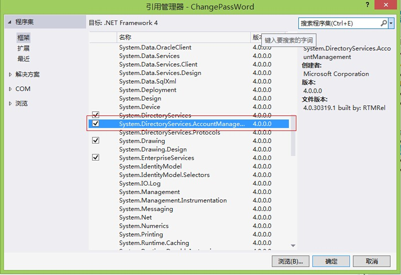

# DotNET与AD-验证用户名和密码1 | 字痕随行

.NET与AD相结合，比较常用的有一种情况——用户登录验证。本章节就是用来说明一下验证输入凭证正确与否的方法。网络上流传较广的是如下方法：
```csharp
DirectoryEntry entry = null;
try
{
    entry = new DirectoryEntry(strLDAP, strUserName, strOldPwd, AuthenticationTypes.Secure);
    object objID = entry.NativeGuid;
}
catch
{
    this.lbError.Text = "输入的用户名或密码不正确";
    return;
}
```

在一般情况下，这种登录验证方法是没有问题的，但是在用户密码过期的情况下，这种验证就会无法通过，会返回信息：“未知错误”或“无法操作服务器”。而有时候，我们会希望即使在密码过期的情况下，输入用户名和过期密码，验证也要通过，这时候就需要使用另外一种方法：
```csharp
PrincipalContext context = new PrincipalContext(ContextType.Domain, strLDAP, strAdminUserName, strAdminPwd);
bool blIsValid = context.ValidateCredentials(strUserName, strOldPwd);
if (!blIsValid)
{
    this.lbError.Text = "输入的用户名或密码不正确，修改失败";
    return;
}
else
{
    //凭证正确时的操作
}
```

PrincipalContext类属于命名空间System.DirectoryServices.AccountManagement，在使用此类之前，需要在项目中添加引用，如下图：



如果有问题，欢迎指正讨论。


觉的不错？可以关注我的公众号↑↑↑
