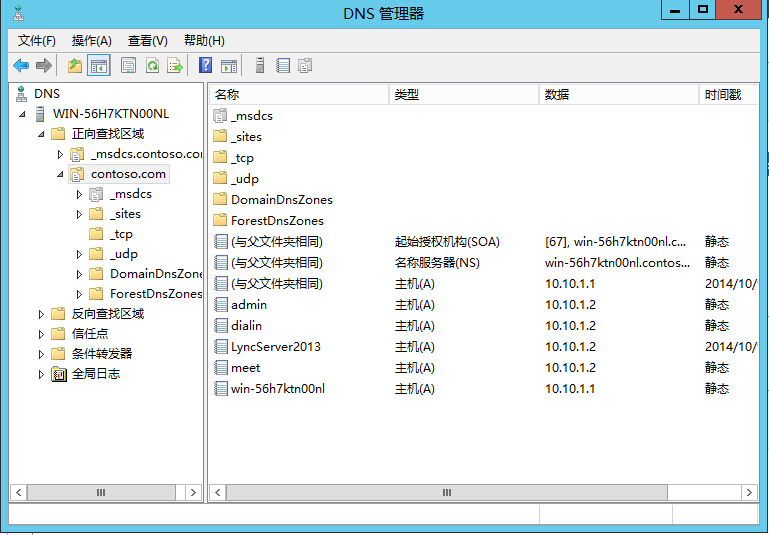
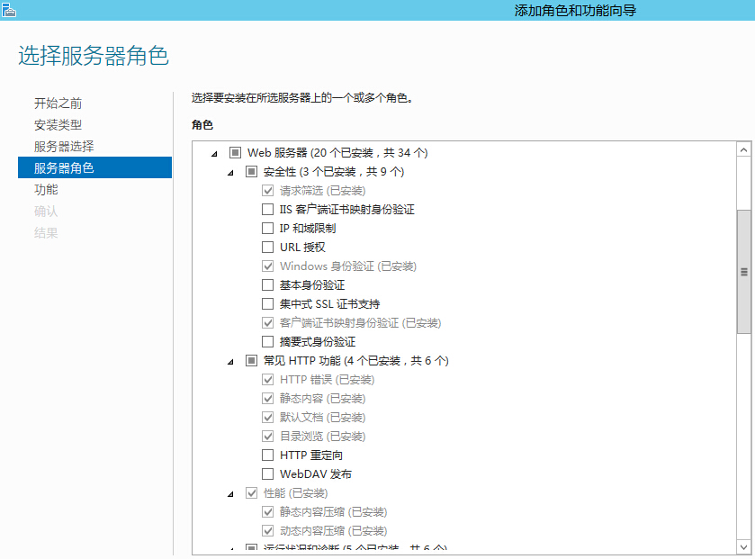
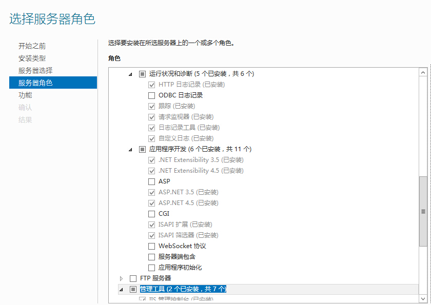
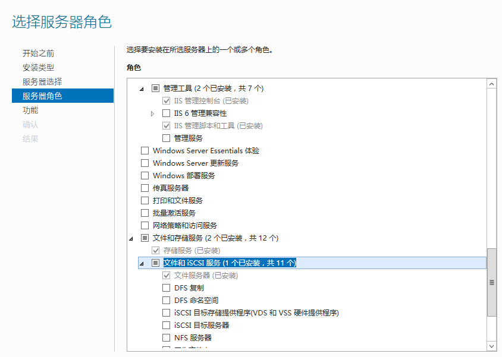
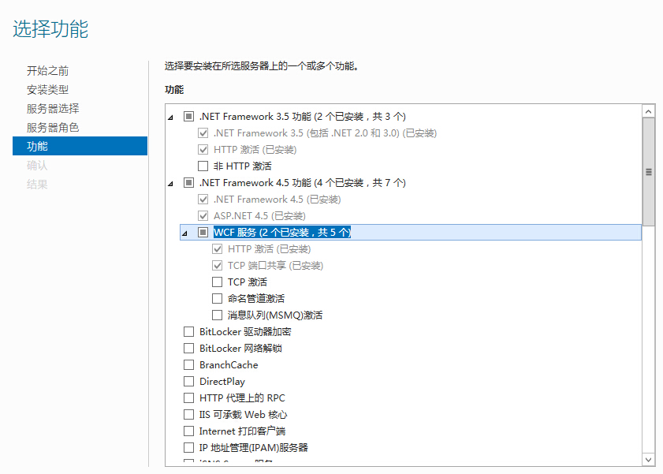
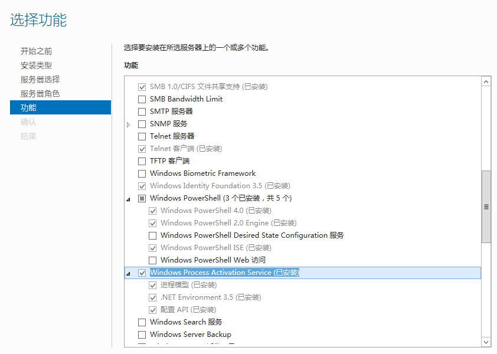
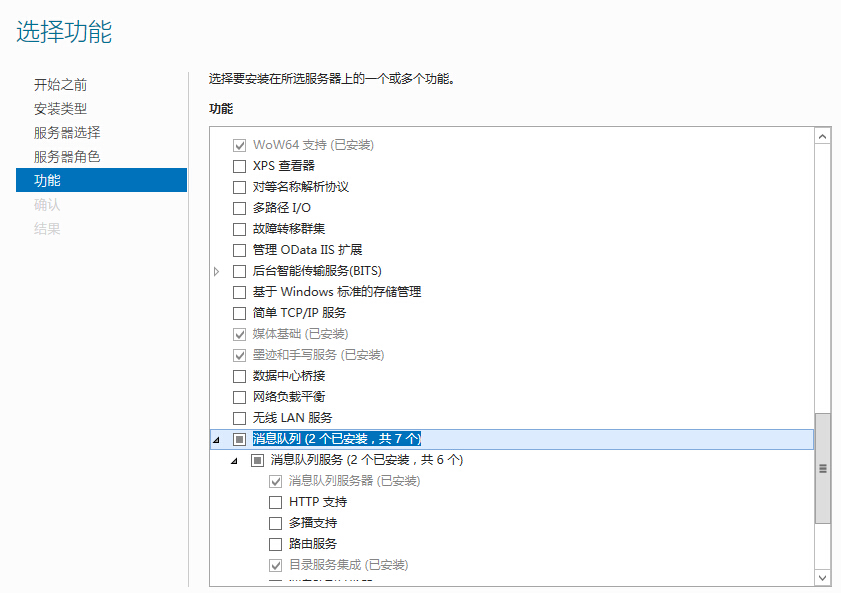
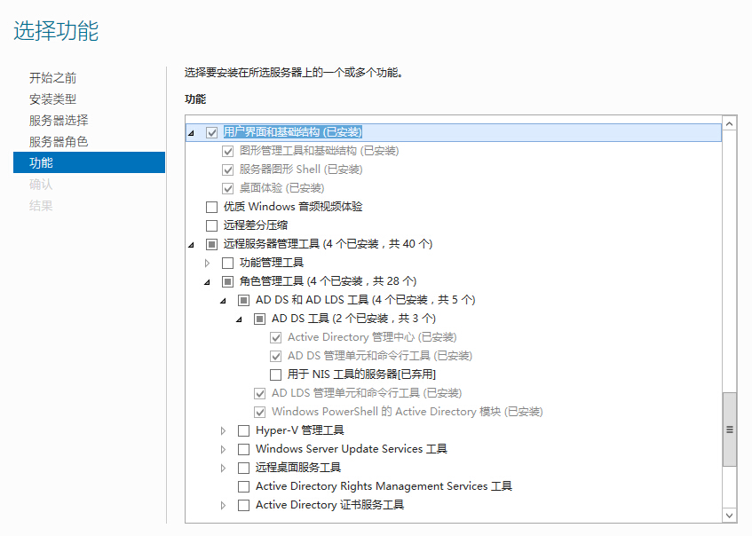

# LyncServer2013标准版安装部署 | 字痕随行

## 软硬件准备

Lync Server 2013的最小安装环境只需要两台独立的服务器（一台域控，一台Lync Server），准备好硬件后，需要准备以下必备软件：

1. Windows Server 2012 R2 Datacenter。其实Lync Server 2013可以使用Windows Server 2008 R2 SP1 或最新的 Service Pack、Windows Server 2012、Windows Server 2012 R2中的任何一项。但是需要注意的是Lync Server 2013 只提供 64 位版本，要求使用 64 位硬件和 64 位版本的 Windows Server 操作系统。此发行版不提供 Lync Server 2013 的 32 位版本。
2. Silverlight的64位安装程序。
3. Lync Server 2013安装程序。
4. Microsoft .NET Framework 4.5安装程序。

因为是安装开发环境，只需要部署Lync Standard Edition Server，所以不用准备Microsoft SQL Server的安装程序，届时会自动使用SQL Server Express。

## 安装前准备

1. 为两台服务器安装操作系统。
2. 为服务器重命名（比如作为域控的一台叫做DC1，作为Lync Server前端服务器的叫做LyncFront）。
3. 为两台服务器安装Microsoft .NET Framework 4.5。
4. 为作为Lync Server的服务器安装Silverlight。
5. 安装和配置域服务器。可以参考[《Windows Server 2012体验之部署第一台域控制器》](http://543925535.blog.51cto.com/639838/1104135 "Windows Server 2012体验之部署第一台域控制器")来搭建域服务器。如果不幸添加了不需要的角色或功能，可以参考[《Windows Server 2012之活动目录域服务的卸载》](http://ycrsjxy.blog.51cto.com/618627/926716/ "Windows Server 2012之活动目录域服务的卸载")来删除。
6. 为域服务器添加证书服务。
7. 将安装Lync Server的服务器加入已配置完毕的域。
8. 在域控服务器上准备DNS。准备完毕后，如下图：

9. 在将要安装Lync Server的服务器上添加必须的Windows角色和功能，完毕后如下图：

## 安装Lync Server 2013

可以参考[《Lync Server 2013安装部署图文教程》](http://www.jb51.net/softjc/148513.html "Lync Server 2013安装部署图文教程(标准版示例附软件下载)")、[《Lync Server 2013部署》](http://wenku.baidu.com/link?url=Rj_CFgH_nUPWeed2Ujmj6oXlDgtMAWnDqr4hn0Y68heVMU7XyGyTQl1p4kxYBbz3BfYthezKGbbv0xSNMQkJJZrIaCrafuYZtlttLWgeSDO&pn=50 "Lync Server 2013部署")。

## 可能遇到的问题

1. 在配置域时，提示:"新建域时，本地administrator帐户将成为域administrator账户。无法新建域，因为本地administrator账户密码不符合要求。目前，本地administrator账户不需要密码。我们建议您使用网络用户命令行工具的/passwordreq:yes选项获得该账户密码，然后再新建设域：否则，域administator帐户将不需要密码。 在命令行下键入命令“net user administrator /passwordreq:yes”，回车后即可解决。
2. 安装Lync Server 2013中需要请求证书，如果出现异常提示根证书不可信任，一般是由于安装Lync Server的服务器加入域后才在域中安装了证书服务器所导致的，可以将CA的根证书导出，并将其导入到前端服务器的“计算机账户”的“受信任的根证书颁发机构”中，然后再次尝试证书方面的操作。如何导出CA的根证书可以参考[http://support.microsoft.com/kb/555252](http://support.microsoft.com/kb/555252 "http://support.microsoft.com/kb/555252")。

如果有问题，欢迎指正讨论。

觉的不错？可以关注我的公众号↑↑↑
