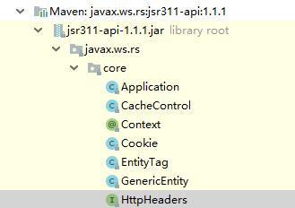

# Dubbo–NoSuchMethodErrorGetHeaderString异常 | 字痕随行

最近搭建项目结构做示例的时候，遇到了一个非常奇怪的问题，解决的时间有点长，所以记录一下整个过程。

这个问题的出现，是在使用rest协议提供对外服务的时候 (Spring Cloud Alibaba 2.1和2.2版本都有此问题) 。如果懒的看整体解决过程的，只想尝试解决办法的，可以试试在pom文件中增加：
```xml
<dependency>
    <groupId>com.alibaba.cloud</groupId>
    <artifactId>spring-cloud-alibaba-nacos-discovery</artifactId>
    <exclusions>
        <!-- 过滤掉jsr311,防止与rs-api冲突,导致缺少method -->
        <exclusion>
            <groupId>javax.ws.rs</groupId>
            <artifactId>jsr311-api</artifactId>
        </exclusion>
    </exclusions>
</dependency>

```
下面就开始正文了。

项目是很简单的一个示例，基于Spring Cloud Alibaba的，使用Nacos作为服务管理的平台，使用Dubbo作为RPC组件，同时使用dubbo和rest协议对外提供服务接口，pom文件的整体是这样的：
```xml
<dependencies>

    <!--单元测试-->
    <dependency>
        <groupId>org.springframework.boot</groupId>
        <artifactId>spring-boot-starter-test</artifactId>
        <scope>test</scope>
    </dependency>

    <!-- spring boot web -->
    <dependency>
        <groupId>org.springframework.boot</groupId>
        <artifactId>spring-boot-starter-web</artifactId>
    </dependency>
    <dependency>
        <groupId>org.springframework.boot</groupId>
        <artifactId>spring-boot-starter-jetty</artifactId>
    </dependency>

    <!--服务注册与发现-->
    <dependency>
        <groupId>com.alibaba.cloud</groupId>
        <artifactId>spring-cloud-starter-dubbo</artifactId>
    </dependency>
    <dependency>
        <groupId>com.alibaba.cloud</groupId>
        <artifactId>spring-cloud-alibaba-nacos-discovery</artifactId>
    </dependency>

    <!-- Dubbo REST support dependencies -->
    <dependency>
        <groupId>org.jboss.resteasy</groupId>
        <artifactId>resteasy-client</artifactId>
    </dependency>
    <dependency>
        <groupId>javax.validation</groupId>
        <artifactId>validation-api</artifactId>
    </dependency>
    <dependency>
        <groupId>org.hibernate.validator</groupId>
        <artifactId>hibernate-validator</artifactId>
    </dependency>

    <!--对外接口-->
    <dependency>
        <groupId>com.xxx</groupId>
        <artifactId>xxx-examples-service-api</artifactId>
    </dependency>

</dependencies>

```
代码也很简单：
```java
@Path("/example/service/test")
@Service(protocol = {"dubbo", "rest"})
public class TestApiServiceImpl implements TestApiService {

    @GET
    @Path("echo")
    @Override
    public String echoString() {
        return "hello, welcome";
    }

    @GET
    @Path("echo/{id}")
    @Override
    public String echoString(@PathParam("id") String id) {
        return "you input: " + id;
    }

    @Override
    public TestDTO getDto() {
        TestDTO testDTO = new TestDTO();
        testDTO.setCode("0");
        testDTO.setMsg("success");
        return testDTO;
    }
}

```
启动的时候没有任何异常，但是在调用接口的时候，异常就产生了：
```Plain Text
HTTP ERROR 500 java.lang.NoSuchMethodError: javax.ws.rs.core.HttpHeaders.getHeaderString(Ljava/lang/String;)Ljava/lang/String;
URI:    /example/service/test/echo
Caused by:
java.lang.NoSuchMethodError: javax.ws.rs.core.HttpHeaders.getHeaderString(Ljava/lang/String;)Ljava/lang/String;

```
这种异常很常见，无非就是缺包和包冲突，如果去百度一下，能发现一万种相同的解决办法。

从整个项目的情况上来看，该引入的包都引入了，而且第一步也尝试了增加：
```xml
<dependency>
    <groupId>javax.ws.rs</groupId>
    <artifactId>javax.ws.rs-api</artifactId>
</dependency>

```
但是没有任何效果(后来发现，加在最顶部可以解决问题)。然后就去找了官方示例和百度了N多示例去做比对，发现和项目的配置并没有什么出入。

没办法，只能按照错误日志去追源码了，发现是在下面这个类中报出的错误：
```java
org.jboss.resteasy.core.interception.PreMatchContainerRequestContext

```
相关的方法是：
```java
public String getHeaderString(String name) {
    return this.httpRequest.getHttpHeaders().getHeaderString(name);
}

```
在这个方法中，getHttpHeaders()返回的类型是：
```java
javax.ws.rs.core.HttpHeaders

```
那就是这个类有问题，最有可能的就是包冲突，然后在寻找可疑冲突包的过程中，发现了：


这个包从哪来的呢？使用Idea自带的dependencies查看器，发现是由ribbon-httpclient引入的，最终导致引入的包是spring-cloud-alibaba-nacos-discovery。

解决办法就像本文开头描述的，将这个jsr311从discovery中替掉即可，替换此包的所导致的问题暂时还未发现。

以上，如果有错误，欢迎探讨和指正。


觉的不错？可以关注我的公众号↑↑↑