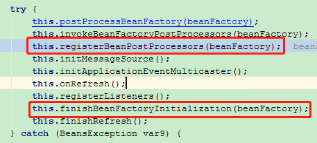
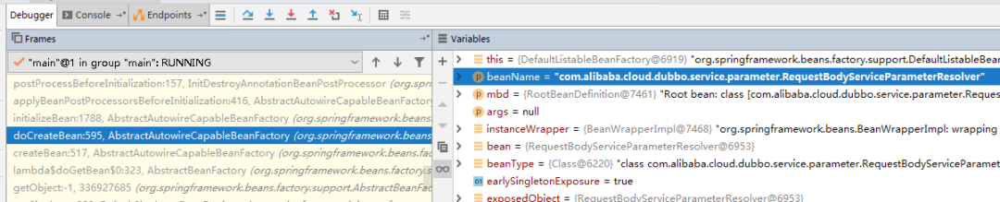

# SpringCloudAlibaba-莫名其妙的异常 | 字痕随行

每一次对莫名其妙发生的异常刨根问底的时候，都是非常痛苦的经历，脑仁要炸掉的感觉。

本文基于：
```text
Spring Cloud Alibaba 2.2.0.Release

Dubbo
```

最近吧，应用越来越多，规范也越来越重要，就想把Nacos的配置中心用起来。

去年已经进行过初步调研，这次算是再拾掇一下，感觉应该没什么难度。

开始在示例工程里面写例子的时候，还是相当轻松愉快的，但是想要替换一个工程落地测试一下的时候，画风就突变了。

简单说一下变更的过程：无非就是改了个配置文件，把之间在Application里面的一部分配置挪到了Bootstrap里面，然后引入了：
```xml
<dependency>
    <groupId>com.alibaba.cloud</groupId>
    <artifactId>spring-cloud-starter-alibaba-nacos-config</artifactId>
</dependency>

```
然后启动的时候就抛异常了：
```Plain Text
Caused by: java.lang.IllegalStateException: No registry config found or it's not a valid config! The registry config is: <dubbo:registry valid="false" zookeeperProtocol="false" prefix="dubbo.registry" />

```
最开始，看提示，感觉是配置有问题，所以翻来覆去检查了一下配置文件，得出的结论是：配置文件没问题。

那就搜一搜吧，百度搜出来的东西五花八门，没什么用。

Google还得翻墙，图简单就用Bing搜了一下，出来一堆issues，大概看了一下，感觉要升版。

于是呢，升了一下Spring Cloud Alibaba的小版本，从2.2.0升到了2.2.2。

然后启动，异常不再发生（**但是，这异常发生的原因其实跟版本没什么关系**）。

可是，这一切到底是为什么呢？

示例工程和实际工程没什么太大区别，引入的Jar包基本一样，配置文件的内容也全都一样，在使用2.2.0版本的时候，为什么一个报错，一个异常？

开始刨根问底吧。

**1\. 版本到底升了什么？**

Spring Cloud Alibaba 2.2.0.Release到2.2.2Release，关键的不同在于Dubbo的版本。

一个使用的是2.7.4.1，一个使用的是2.7.8。

我去看了一下版本发布的提交日志，然后发现RegistryConfig的相关Fix在这之间做了大量的修复。

但是我仍旧没法定位到具体的Commit，看了一遍提交的日志，感觉是在大海捞针，直接放弃了。

**2\. 跟踪代码**

既然是RegistryConfig的问题，那直接在实例化的地方打断点一点一点跟踪吧。

一点一点走下去，会发现两个特别的地方。

**一个就是触发RegistryConfig实例化的位置。**

无异常的示例项目，在AbstractApplicationContext触发实例化是在：
```java
this.finishBeanFactoryInitialization(beanFactory);

```
而发生异常的项目，触发实例化是在：
```java
this.registerBeanPostProcessors(beanFactory);

```
执行的顺序如下图所示：



**再一个就是BeanPostProcessor的数量。**

未发生异常的项目中，BeanPostProcessor的数量要远大于发生异常的项目，多了很多Dubbo扩展的BeanPostProcessor。

但是，到这里还是没有什么头绪，一样的工程结构，差不多的代码，为什么会出现完全不一样的情况。

**3\. 执行的顺序。**

既然上面的情况完全不一样，那就看看执行的过程到底是怎样的吧。

从断点的监视器，一点一点往下捋，最后终于找到了一个点：



RequestBodyServiceParameterResolver这个Bean实例化的时候，需要MessageConvert，继而需要MappingJackson2HttpMessageConverter。

巧合的是，项目中需要自定义Date类型的转换，所以自定义了MappingJackson2HttpMessageConverter。

更巧的是，当时把MappingJackson2HttpMessageConverter这个自定义类的实例化放到了WebMvcConfigurer。

平常没什么问题，但是使用Nacos当配置中心的时候，Spring MVC的一些配置都在Nacos里面，这时候需要远程去取。

就需要实例化RegistryConfig，但是RegistryConfig这时候的配置根本不对，所以直接就抛异常了。

**4\. 解决办法。**

解决办法很简单，别触发RegistryConfig实例化就行。那就需要不触发配置读取，所以直接把MappingJackson2HttpMessageConverter自定义类放到一个单独的配置类即可。

再启动终于正常了，但是为什么升了版本就没事了呢？

**5\. 升个版本继续断点调试追踪。**

升了版本之后，会发现在BeanPostProcessor中多了一个对象：
```java
com.alibaba.spring.beans.factory.annotation.ConfigurationBeanBindingPostProcessor

```
这个类存在于：
```xml
<dependency>
        <groupId>com.alibaba.spring</groupId>
        <artifactId>spring-context-support</artifactId>
</dependency>

```
然后去查看Dubbo的Commit日志，就会发现，中间这个包升过一次版。

成了，痛苦就到这，再扒就得折腾一遍源码了，以下是这次的一些参考：
```Plain Text
https://github.com/apache/dubbo-spring-boot-project/issues/643
https://github.com/apache/dubbo/pull/5710
https://github.com/apache/dubbo/issues/6039
https://blog.csdn.net/caihaijiang/article/details/35552859

```

以上，如果有错误，欢迎探讨和指正。


觉的不错？可以关注我的公众号↑↑↑