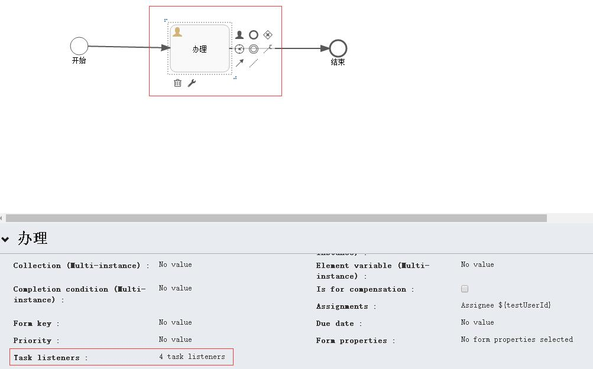
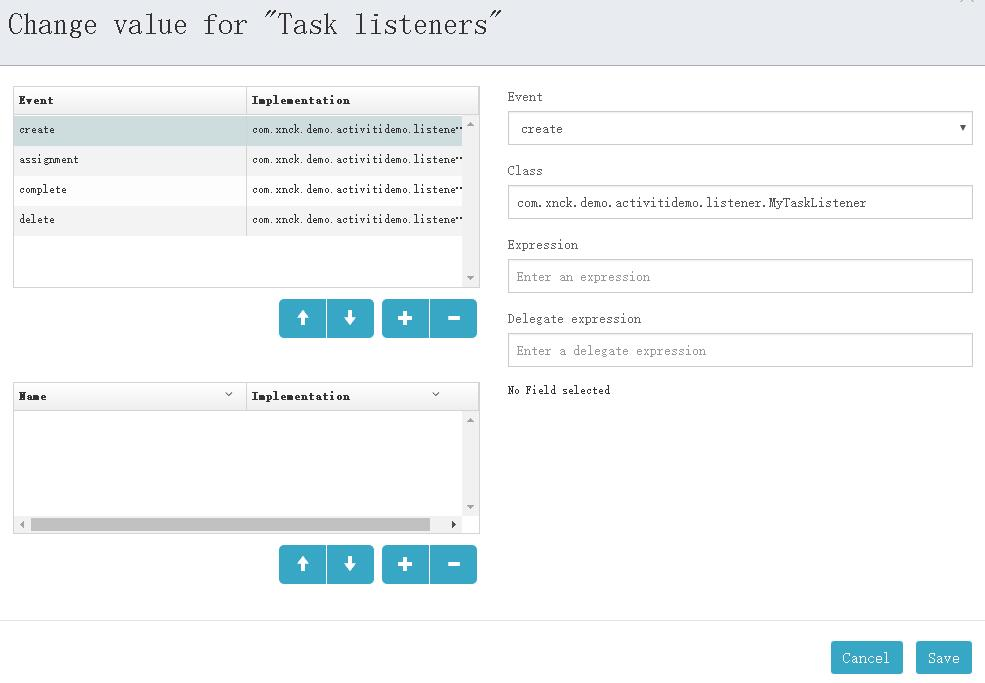
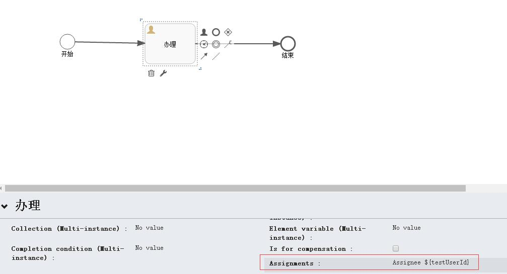
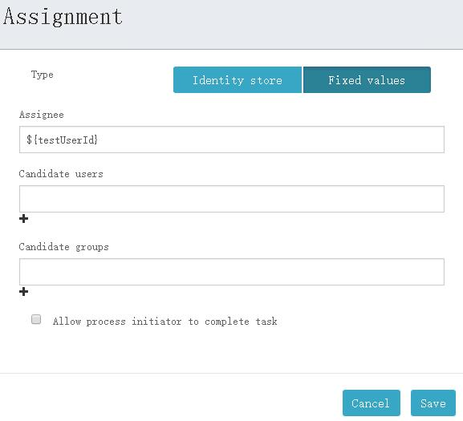

# Activiti任务监听器 | 字痕随行
Activiti提供了任务监听器，允许在任务执行的过程执行特定的Java程序或者表达式。

任务监听器只能添加到流程定义中的用户任务中。注意它必须定义在BPMN 2.0 extensionElements的子元素中， 并使用activiti命名空间，因为任务监听器是activiti独有的结构。  

首先，定义一个任务监听器，代码如下：

```Java
import org.activiti.engine.delegate.DelegateTask;
import org.activiti.engine.delegate.TaskListener;

public class MyTaskListener implements TaskListener {

    @Override
    public void notify(DelegateTask delegateTask) {
        System.out.println(delegateTask.getEventName());
        if ("assignment".equals(delegateTask.getEventName())) {
            System.out.println("办理人" + delegateTask.getAssignee());
        }
    }
}

```
在之前的简单流程上，选中UserTask1，设置监听器：




*流程设计*




*设置监听器*

启动，生成一个流程实例，可以看到以下输出：

```Plain Text
流程启动
assignment
办理人admin
create

```
提交完成UserTask1节点，可以看到以下输出：

```Plain Text
complete
delete
流程结束

```
以上输出也反映了事件的执行顺序，这四个事件的说明如下：

assignment：任务分配给指定的人员时触发。当流程到达userTask， assignment事件会在create事件之前发生。

create：任务创建并设置所有属性后触发。

complete：当任务完成，并尚未从运行数据中删除时触发。

delete：只在任务删除之前发生。注意在通过completeTask正常完成时，也会执行。

需要注意的是，如果想要触发assignment事件，就必须将任务分配给指定的人员，可以进行如下操作，以触发此事件：

首先，设置UserTask1的assignment，如下图所示。




*设置assignment*  





*设置assignment*  

在流程启动时，设置变量：

```Java
    /**
     * 启动一个流程
     * @param modelId
     */
    @RequestMapping(value = "start/{modelId}")
    public void start(@PathVariable("modelId") String modelId) {
        Model modelData = repositoryService.getModel(modelId);
        Map<String, Object> map = new HashMap<>();
        map.put("id", "111111");
        map.put("testUserId", "admin");
        ProcessInstance processInstance = null;
        try {
            // 用来设置启动流程的人员ID，引擎会自动把用户ID保存到activiti:initiator中
            identityService.setAuthenticatedUserId("admin");

            processInstance = runtimeService.startProcessInstanceByKey(modelData.getKey(), "myTestFlow1", map);
            String processInstanceId = processInstance.getId();
            System.out.println(processInstanceId);
        } finally {
            identityService.setAuthenticatedUserId(null);
        }
    }

```

如果有问题，欢迎指正讨论。


觉的不错？可以关注我的公众号↑↑↑