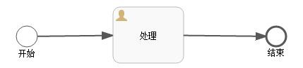
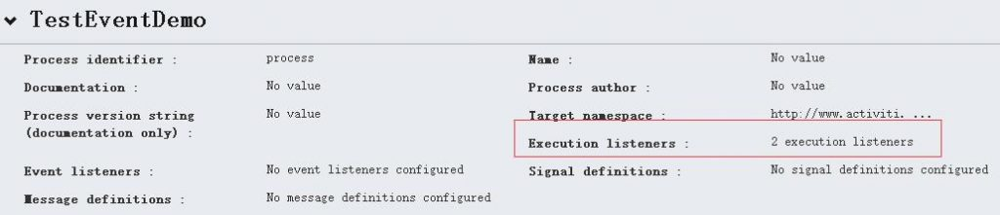
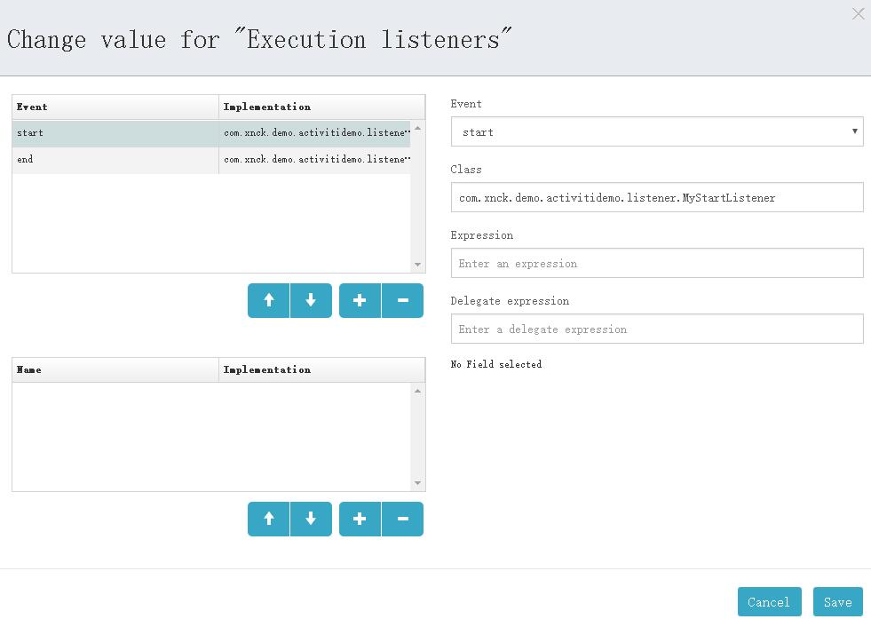
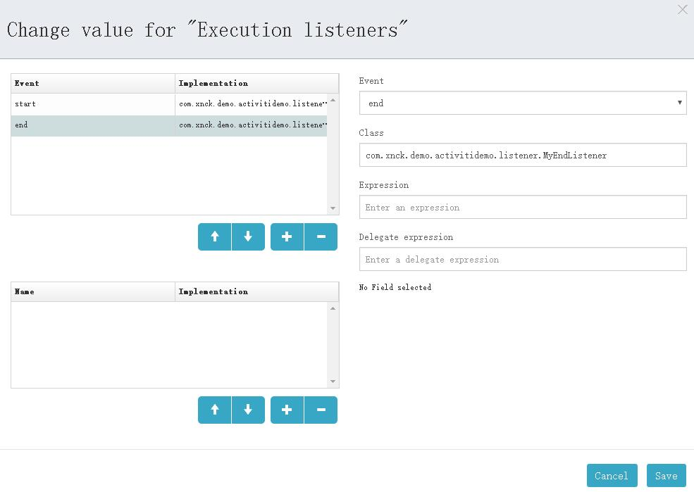
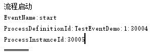
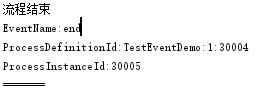

# Activiti执行监听器-启动和结束 | 字痕随行
按照Activiti的官方文档，流程的执行监听器可以捕获的事件有：

* 流程实例的启动和结束。
* 选中一条连线。
* 节点的开始和结束。
* 网关的开始和结束。
* 中间事件的开始和结束。
* 开始时间结束或结束事件开始。

在接下来的一段时间内，我会逐一尝试一下，并且通过Demo记录一下整个过程。

首先，我们来尝试捕获一下“流程实例的启动和结束”。下图是一个简单的流程图：



声明了两个类：MyStartListener和MyEndListener，各自实现了接口：

```Plain Text
org.activiti.engine.delegate.ExecutionListener

```
MyStartListener的代码如下：

```Java
import org.activiti.engine.delegate.DelegateExecution;
import org.activiti.engine.delegate.ExecutionListener;

public class MyStartListener implements ExecutionListener {

    @Override
    public void notify(DelegateExecution delegateExecution) {
        System.out.println("流程启动");
        System.out.println("EventName:" + delegateExecution.getEventName());
        System.out.println("ProcessDefinitionId:" + delegateExecution.getProcessDefinitionId());
        System.out.println("ProcessInstanceId:" + delegateExecution.getProcessInstanceId());
        System.out.println("=======");
    }
}

```
MyEndListener的代码如下：

```Java
import org.activiti.engine.delegate.DelegateExecution;
import org.activiti.engine.delegate.ExecutionListener;

public class MyEndListener implements ExecutionListener {

    @Override
    public void notify(DelegateExecution delegateExecution) {
        System.out.println("流程结束");
        System.out.println("EventName:" + delegateExecution.getEventName());
        System.out.println("ProcessDefinitionId:" + delegateExecution.getProcessDefinitionId());
        System.out.println("ProcessInstanceId:" + delegateExecution.getProcessInstanceId());
        System.out.println("=======");
    }
}

```
在流程设计器中进行相应的配置，如下图：




*Listener配置*




*StartListener配置*




*EndListener配置*

启动这个流程，控制台会输出：




*流程启动时StartEvent触发*




*流程结束时EndEvent触发*

到此，流程的Start和End事件全部触发完毕，至于DelegateExecution内的方法都是什么含义，将会在之后带来。

如果有问题，欢迎指正讨论。


觉的不错？可以关注我的公众号↑↑↑