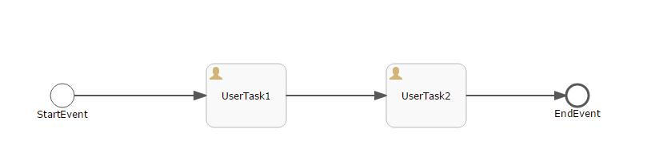

# 整合Activiti6.0流程设计器-发布和运行 | 字痕随行
之前相关的教程：

《[整合Activiti6.0Web流程设计器](http://www.blackzs.com/archives/1217)》

《[整合Activiti6.0流程设计器-编辑保存](http://www.blackzs.com/archives/1244)》

这篇就介绍一下如何发布已经保存的流程，并且进行一次简单的流转。

**如何发布？**

发布其实比较简单，在《[整合Activiti6.0流程设计器-编辑保存](http://www.blackzs.com/archives/1244)》这篇教程里面可以看到，前端编辑器传送到后端的数据包，其中有一个参数为“json\_xml”，这个其实就是我们需要发布的内容。

同样的，我们在上一篇教程中，将“json\_xml”反序列化成了“ObjectNode modelNode”，我们只需要使用Activiti提供的类将modelNode转化一下，再调用对应的发布接口进行发布即可。实际的代码片段如下：

```Java
BpmnModel model = new BpmnJsonConverter().convertToBpmnModel(modelNode);
byte[] bpmnBytes = new BpmnXMLConverter().convertToXML(model);
String processName =name + ".bpmn20.xml";
repositoryService.createDeployment().name(name).addString(processName, new String(bpmnBytes)).deploy();

```
**如何流转？**

这里需要使用两个新的接口：

1、RuntimeService：Activiti的七大接口之一，可以启动流程及控制流程、查询流程实例、触发流程操作等。

2、TaskService：Activiti的七大接口之一，控制系统中由真实人员执行的任务。

3、IdentityService：Activiti的七大接口之一，可以用来进行身份管理和认证。

先简单的画一个流程：



启动一个流程的过程：

1、 先按照modelId取出这个流程定义。

2、设置启动人。

3、按照流程定义的关键字启动流程。

代码如下：

```Java
Model modelData = repositoryService.getModel(modelId);
ProcessInstance processInstance = null;
try {
      // 用来设置启动流程的人员ID，引擎会自动把用户ID保存到activiti:initiator中
      identityService.setAuthenticatedUserId("admin");

      processInstance = runtimeService.startProcessInstanceByKey(modelData.getKey(), "myTestFlow1", map);
      String processInstanceId = processInstance.getId();
      System.out.println(processInstanceId);
} finally {
      identityService.setAuthenticatedUserId(null);
}

```
当流程启动后，会生成一个流程实例，当需要真实人员操作的时候，就需要使用TaskService提供的接口来操作任务。比如流程图里面的UserTask1和UserTask2。

完成任务的代码片段如下：

```Java
//taskId，任务的唯一标识，对应表act_ru_task
taskService.complete(taskId);

```

如果有问题，欢迎指正讨论。


觉的不错？可以关注我的公众号↑↑↑