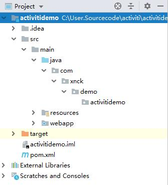
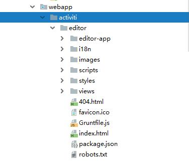
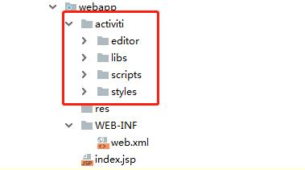

# 整合Activiti6.0流程设计器 | 字痕随行
最近一个多月都在尝试了解Activiti6.0，趁着放假整合编辑器这件事情终于有了些眉目，到此可以总结一下了。


**第一步：下载源码**

整合的时候肯定要从源码拷贝一些东西，有些问题出现的时候，源码也是非常有效的参考资料，所以要去Github下载源码到本地。


**第二步：新建项目**

建立个SpringMVC项目，如下图：




**第三步：拷贝文件**

新建一个文件夹，我这里是“activiti”，然后将Activiti源码中的editor文件夹全部拷贝过来（该文件夹位于\\modules\\activiti-ui\\activiti-app\\src\\main\\webapp内）。如下图：



将所缺失的JS、CSS等静态文件，从Activiti的源工程内拷贝到我们新建的工程，最终的工程如下：




**第三步：修改JS**

直接运行，我这里的RequestContextRoot为：

```Plain Text
localhost:8080/activiti

```
直接访问地址localhost:8080/activiti/activiti/editor/index.html，在浏览器的调试器内肯定会报一堆错误，解决的步骤如下：

1\. 将\\activiti\\scripts\\app-cfg.js内的路径设置为当前值。

```JavaScript
ACTIVITI.CONFIG = {
  'onPremise' : true,
  //远程请求根地址
  'contextRoot' : '/activiti',
  //web目录根地址
  'webContextRoot' : '/activiti/activiti'
};

```
2\.  先将app.js里面的“\$routeProvider.otherwise”部分注释掉，替换为（为了显示一些隐藏的错误）：

```JavaScript
$routeProvider.otherwise({
  templateUrl: appResourceRoot + 'editor-app/editor.html',
  controller: 'EditorController'
});

```
3\. 将url-config.js替换为以下内容：

```JavaScript
KISBPM.URL = {

    getModel: function(modelId) {
        return ACTIVITI.CONFIG.contextRoot + '/app/rest/models/' + modelId + '/editor/json?version=' + Date.now();
    },

    getStencilSet: function() {
        return ACTIVITI.CONFIG.webContextRoot + '/editor/editor-app/stencilset.json';
    },

    putModel: function(modelId) {
        return ACTIVITI.CONFIG.contextRoot + '/app/rest/models/' + modelId + '/editor/json';
    },

    newModelInfo: function () {
        return ACTIVITI.CONFIG.contextRoot + '/app/rest/models/';
    }
};

```
4\. 找一个stencilset.json文件放到指定的位置。我从"咖啡兔"的开源工程里直接拷贝了一份，其实也可以运行Activiti6的Release War包，然后在开发者工具里面找到对应的地址，然后拷贝一份。

5\. 替换oryx.js里面stencilset.json的地址。

6\. 在editor-controller.js的fetchModel()内的access方法内增加一行代码：

```Plain Text
$rootScope.account = angular.toJson("{\"login\":\"admin\"}");

```
**第四步：增加Controller文件**

在工程内新增加一个Controller，我这里的名为“ActivitiAppRest”，主要的代码如下：

```Java
@RestController
@RequestMapping("/app/rest/")
public class ActivitiAppRest {

    /**
     * 身份认证
     */
    @RequestMapping("authenticate")
    public Map<String, Object> getAuthenticate() {
        Map<String, Object> map = new HashMap<String, Object>();
        map.put("login", "admin");
        return map;
    }

    /**
     * 账号信息
     */
    @RequestMapping("account")
    public Map<String, Object> getAccount() {
        Map<String, Object> map = new HashMap<String, Object>();
        map.put("email", "admin");
        map.put("firstName", "My");
        map.put("fullName", "Administrator");
        map.put("id", "admin");
        map.put("lastName", "Administrator");

        Map<String, Object> groupMap = new HashMap<String, Object>();
        map.put("id", "ROLE_ADMIN");
        map.put("name", "Superusers");
        map.put("type", "security-role");

        List<Map<String, Object>> groups = new ArrayList<Map<String, Object>>();
        groups.add(groupMap);

        map.put("groups", groups);

        return map;
    }

    /**
     * 初始化
     */
    @RequestMapping("models")
    public ObjectNode getModels() {
        Map<String, Object> map = new HashMap<String, Object>();
        String jsonStr = "{\"modelId\":\"9dd84f5d-e9ed-44fa-b328-c7646efd766e\",\"name\":\"TEST1\",\"key\":\"TEST\",\"description\":\"\",\"lastUpdated\":\"2019-01-20T15:14:43.200+0000\",\"lastUpdatedBy\":\"admin\",\"model\":{\"id\":\"canvas\",\"resourceId\":\"canvas\",\"stencilset\":{\"namespace\":\"http://b3mn.org/stencilset/bpmn2.0#\"},\"properties\":{\"process_id\":\"TEST\",\"name\":\"TEST1\"},\"childShapes\":[{\"bounds\":{\"lowerRight\":{\"x\":130,\"y\":193},\"upperLeft\":{\"x\":100,\"y\":163}},\"childShapes\":[],\"dockers\":[],\"outgoing\":[],\"resourceId\":\"startEvent1\",\"stencil\":{\"id\":\"StartNoneEvent\"}}],\"modelType\":\"model\"}}";
        JSONObject jsonObject = JSONObject.parseObject(jsonStr);
        return jsonObject;
    }
}

```
**第五步：启动运行**

以上都修改完成以后，就可以启动运行了，直接在地址栏输入：

```Plain Text
http://localhost:8080/activiti/activiti/editor/index.html#/editor

```
这只是可以顺利显示静态页面，如果希望能够"创建/修改"流程信息，还需要引入Activiti Jar包，然后修改一下Controller里面的逻辑，稍后会继续讲解。

如果有问题，欢迎指正讨论。


觉的不错？可以关注我的公众号↑↑↑