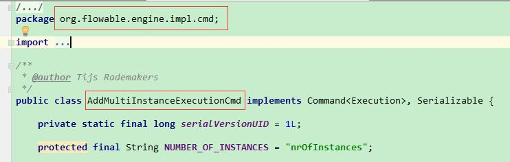
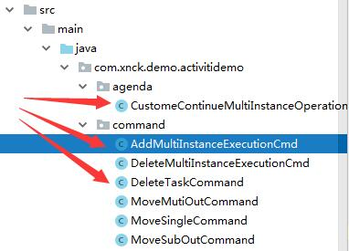

# Activiti6.0 – 加签 | 字痕随行
试验过了Flowable的加签和减签，并且简单分析了一下其源码之后，这次就来尝试一下实现基于Activiti6.0的加签功能。

Activiti6.0并没有提供加签的API接口，不过完全可以参照Flowable的源码来实现，甚至于有的接口照抄即可。

首先，找到AddMultiInstanceExecutionCmd这个命令所在的位置，如下图：



将这个类直接拷贝到Activiti的相关项目里，比如我这里的结构如下：



拷贝完后，进入编辑器，这个类会报一些错误：

1\. CommandContextUtil在Activiti中不存在，不过可以直接改为使用CommandContext。

2\. 在Activiti中需要去除一些有效性验证。

3. BpmnModel只能通过repositoryService来获得。

4\. 最麻烦的是，Activiti中的planContinueMultiInstanceOperation和Flowable中的不一样，所以需要重新声明一个，如上图中，重新创建了一个CustomeContinueMultiInstanceOperation。

AddMultiInstanceExecutionCmd改造后的主要代码如下：

```Java
@Override
public Execution execute(CommandContext commandContext) {
    ExecutionEntityManager executionEntityManager = commandContext.getExecutionEntityManager();

    ExecutionEntity miExecution = searchForMultiInstanceActivity(activityId, parentExecutionId, executionEntityManager);

    if (miExecution == null) {
        throw new RuntimeException("No multi instance execution found for activity id " + activityId);
    }

    ExecutionEntity childExecution = executionEntityManager.createChildExecution(miExecution);
    childExecution.setCurrentFlowElement(miExecution.getCurrentFlowElement());

    BpmnModel bpmnModel = repositoryService.getBpmnModel(miExecution.getProcessDefinitionId());
    Activity miActivityElement = (Activity) bpmnModel.getFlowElement(miExecution.getActivityId());
    MultiInstanceLoopCharacteristics multiInstanceLoopCharacteristics = miActivityElement.getLoopCharacteristics();

    Integer currentNumberOfInstances = (Integer) miExecution.getVariable(NUMBER_OF_INSTANCES);
    miExecution.setVariableLocal(NUMBER_OF_INSTANCES, currentNumberOfInstances + 1);

    if (executionVariables != null) {
        childExecution.setVariablesLocal(executionVariables);
    }

    if (!multiInstanceLoopCharacteristics.isSequential()) {
        miExecution.setActive(true);
        miExecution.setScope(false);

        childExecution.setCurrentFlowElement(miActivityElement);
        commandContext.getAgenda().planOperation(new CustomeContinueMultiInstanceOperation(commandContext, childExecution, miExecution, currentNumberOfInstances));
    }

    return childExecution;
}

```
CustomeContinueMultiInstanceOperation没什么改动，只需要改动一下命名空间，基本上就可以直接使用。

最后，在Controller中创建一个方法，接收请求，测试即可：

```Java
/**
 * 增加流程执行实例
 * @param nodeId
 * @param proInstId
 * @param assigneeStr 以逗号隔开的字符串
 */
@RequestMapping(value = "addExecution/{nodeId}/{proInstId}/{assignees}")
public void addExecution(@PathVariable("nodeId") String nodeId,
                         @PathVariable("proInstId") String proInstId,
                         @PathVariable("assignees") String assigneeStr) {
    String[] assignees = assigneeStr.split(",");
    for (String assignee : assignees) {
        managementService.executeCommand(
                new AddMultiInstanceExecutionCmd(
                        nodeId, proInstId, Collections.singletonMap("assignee", (Object) assignee))
        );
    }
}

```
下一次再试试Activiti6.0的减签，以上，如有问题，欢迎讨论指正。


觉的不错？可以关注我的公众号↑↑↑