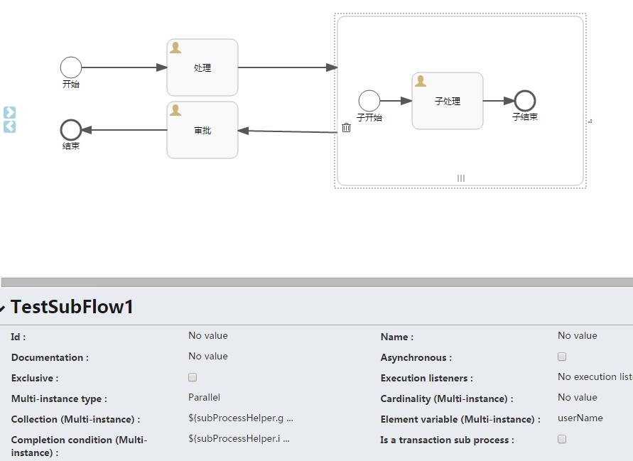

# Activiti6.0 – 多实例 | 字痕随行
**以下引自Activiti开发手册：**

多实例节点是在业务流程中定义重复环节的一个方法。 从开发角度讲，多实例和循环是一样的： 它可以根据给定的集合，为每个元素执行一个环节甚至一个完整的子流程， 既可以顺序依次执行也可以并发同步执行。

**本文以子流程为例，试验一下如何实现多实例子流程。**

首先，还是使用之前的流程图，如下：



上图中需要注意以下几个属性：  

**Multi-instance type** : 流程是串行还是并行，Parallel代表并行，Sequential代表串行。

**Collection (Multi-instance) :** 指定一个集合，对于集合中的每个元素，都会创建一个实例。

**Element variable (Multi-instance) :** 声明一个变量，此变量会包含集合(Collection)中的对应元素。

**Completion condition (Multi-instance) :** 结束条件，在此指定的表达式会在每个实例结束时执行。 如果表达式返回true，所有其他的实例都会销毁，多实例节点也会结束，流程会继续执行。

在上图中，SubProcessHelper是一个辅助的类，并在Spring中初始化，主要的代码如下：

```Java
public class SubProcessHelperImpl implements SubProcessHelper {

    @Override
    public List<String> getUserNames() {
        List<String> userNames = new ArrayList<>();
        userNames.add("test001");
        userNames.add("test002");
        userNames.add("test003");
        return userNames;
    }

    @Override
    public boolean isComplete(DelegateExecution execution) {
        return true;
    }
}

```
如此定义，子流程会生成3个实例，并且会在子流程的第一个实例运行完毕时，整个流程进入到“审批”节点。

多实例还有3个参数需要注意：

**nrOfInstances：**实例总数

**nrOfActiveInstances：**当前活动的实例数量。 对于顺序执行的多实例，值一直为1。

**nrOfCompletedInstances：**已经完成实例的数目。

如果将上面的代码修改为：

```Java
public class SubProcessHelperImpl implements SubProcessHelper {

    @Override
    public List<String> getUserNames() {
        List<String> userNames = new ArrayList<>();
        userNames.add("test001");
        userNames.add("test002");
        userNames.add("test003");
        return userNames;
    }

    @Override
    public boolean isComplete(DelegateExecution execution) {
        Integer completeInstCount = (Integer) execution.getVariable("nrOfCompletedInstances");
        Integer instCount = (Integer) execution.getVariable("nrOfInstances");
        return completeInstCount > 1;
    }
}

```
整个流程会在子流程的第二个实例运行完毕时，进入到“审批”节点。

**再次引用\*\*\*\*Activiti开发手册中的内容：**

多实例其实是在一个普通的节点上添加了额外的属性定义，这样运行时节点就会执行多次。 下面的节点都可以成为一个多实例节点：

User Task

Script Task

Java Service Task

Web Service Task

Business Rule Task

Email Task

Manual Task

Receive Task

(Embedded) Sub-Process

Call Activity

主要注意的是：网关和事件不能设置多实例。

每个创建的分支都会有分支级别的本地变量（其他实例不可见，不会保存到流程实例级别）：

**loopCounter：**表示特定实例的在循环的索引值。可以使用activiti的elementIndexVariable属性修改loopCounter的变量名。

如果有问题，欢迎指正讨论。


觉的不错？可以关注我的公众号↑↑↑