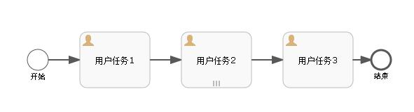
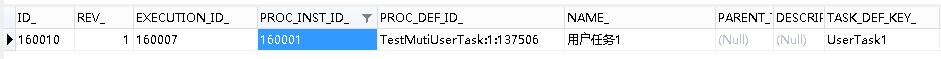
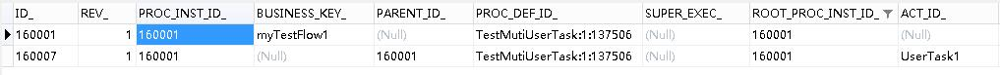
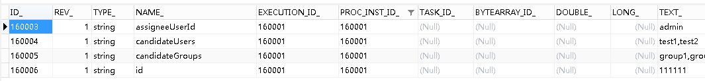
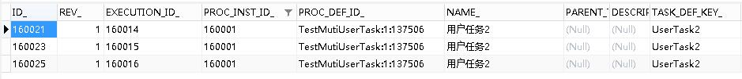
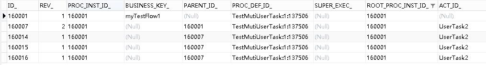
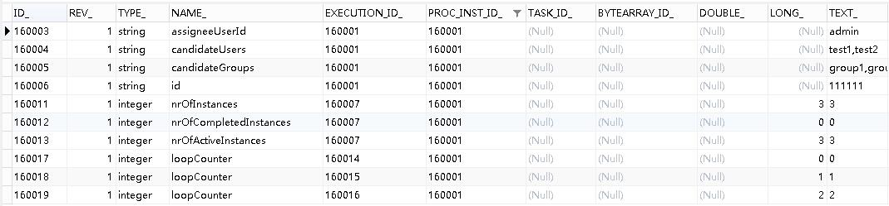
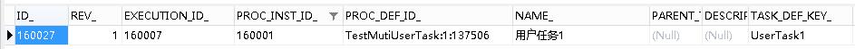
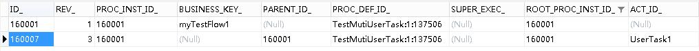

# Activiti6.0 – 多实例节点跳转 | 字痕随行
最近都在试验Activiti6.0的节点跳转，其它的文章见[索引](http://www.blackzs.com/archives/1306)。

本次就试验一下在Activiti6.0的一个流程内，由多实例节点跳转至其它的用户节点。

首先，仍旧是先上流程图：



上图中，用户任务1和用户任务3是普通的用户节点，用户任务2是多实例节点。

当流程处于节点“用户任务1”时，数据表中的记录如下图：




*act\_ru\_task*




*act\_ru\_execution*




*act\_ru\_variable*

对比一下，当流程处于节点“用户任务2”时，数据库表中的记录如下图：




*act\_ru\_task*




*act\_ru\_execution*




*act\_ru\_variable*

同样的思路，当从多实例节点向普通用户节点跳转时，只需要清除Task记录、Execution记录和相关的Variable记录。  

这里需要注意，与子流程节点跳转不同，act\_ru\_execution中的字段SUPER\_EXEC\_并没有值，所以只需要删除掉Task所属的Execution即可，即表中的ID\_ IN ('160014', '160015', '160016')。

还需要注意，因为进入多实例节点后，有一些特殊的参数产生，如：nrOfInstances、nrOfCompletedInstances、nrOfActiveInstances，这些参数也需要删除掉，以避免流程的后续操作产生异常。

具体的代码如下：

```Java
/**
 * 移出多实例节点至父流程
 */
public class MoveMutiOutCommand implements Command<Object> {

    private String currentTaskId;

    private String targetNodeId;

    public MoveMutiOutCommand(String currentTaskId, String targetNodeId) {
        this.currentTaskId = currentTaskId;
        this.targetNodeId = targetNodeId;
    }

    public String getCurrentTaskId() {
        return currentTaskId;
    }

    public void setCurrentTaskId(String currentTaskId) {
        this.currentTaskId = currentTaskId;
    }

    public String getTargetNodeId() {
        return targetNodeId;
    }

    public void setTargetNodeId(String targetNodeId) {
        this.targetNodeId = targetNodeId;
    }

    @Override
    public Object execute(CommandContext commandContext) {
        //获得用到的Manager
        ExecutionEntityManager executionEntityManager = commandContext.getExecutionEntityManager();
        TaskEntityManager taskEntityManager = commandContext.getTaskEntityManager();
        IdentityLinkEntityManager identityLinkEntityManager = commandContext.getIdentityLinkEntityManager();
        VariableInstanceEntityManager variableInstanceEntityManager = commandContext.getVariableInstanceEntityManager();
        //获得当前流程处于的Task信息
        TaskEntity taskEntity = taskEntityManager.findById(this.currentTaskId);
        //获得流程实例信息
        ExecutionEntity executionEntity = executionEntityManager.findById(taskEntity.getExecutionId());
        ExecutionEntity parentExecutionEntity = executionEntityManager.findById(executionEntity.getParentId());
        List<ExecutionEntity> childExecutionEntities = executionEntityManager.findChildExecutionsByParentExecutionId(parentExecutionEntity.getId());
        //设置需要删除参数的流程实例
        Set<String> executionIds = new HashSet<>();
        executionIds.add(parentExecutionEntity.getId());
        for (ExecutionEntity childExecutionEntity : childExecutionEntities) {
            executionIds.add(childExecutionEntity.getId());
        }
        //获得流程定义信息
        Process process = ProcessDefinitionUtil.getProcess(executionEntity.getProcessDefinitionId());
        //删相关的办理人
        identityLinkEntityManager.deleteIdentityLink(executionEntity, null, null, null);
        identityLinkEntityManager.deleteIdentityLink(parentExecutionEntity, null, null, null);
        //删相关的参数
        List<VariableInstanceEntity> variableInstanceEntities = variableInstanceEntityManager.findVariableInstancesByExecutionIds(executionIds);
        for (VariableInstanceEntity variableInstanceEntity : variableInstanceEntities) {
            variableInstanceEntityManager.delete(variableInstanceEntity, true);
        }
        //删Task
        taskEntityManager.deleteTasksByProcessInstanceId(taskEntity.getProcessInstanceId(), "测试删除子节点", true);
        //删子流程的流程实例
        executionEntityManager.deleteChildExecutions(parentExecutionEntity, "", true);
        //移动节点
        FlowElement targetFlowElement = process.getFlowElement(targetNodeId);
        parentExecutionEntity.setCurrentFlowElement(targetFlowElement);
        ActivitiEngineAgenda agenda = commandContext.getAgenda();
        agenda.planContinueProcessInCompensation(parentExecutionEntity);

        return null;
    }
}

```
请求一下地址，触发此命令：

```Plain Text
http://localhost:8080/activiti/flow/moveMutiOut/160021/UserTask1

```
查询一下数据库，可以确认节点已经完成跳转：




*act\_ru\_task*




*act\_ru\_execution*

至此，关于Activiti6.0节点跳转的试验已经全部完成，如果有遗漏的，以后用到或者想到的时候再补充。

如果有问题，欢迎指正讨论。


觉的不错？可以关注我的公众号↑↑↑