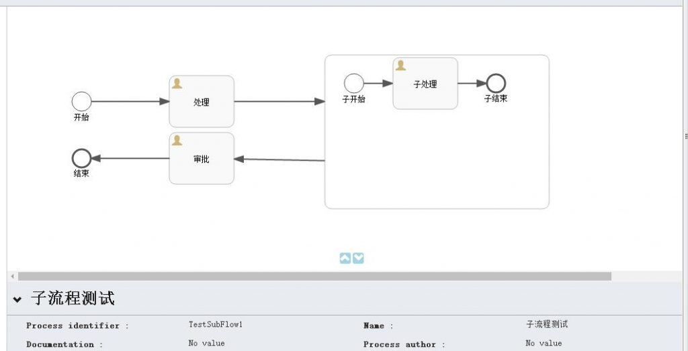
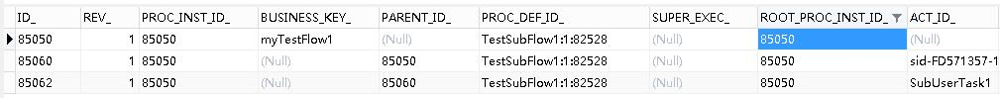
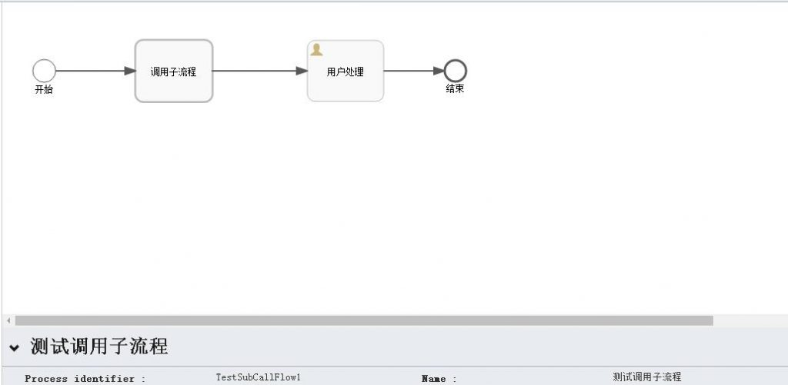
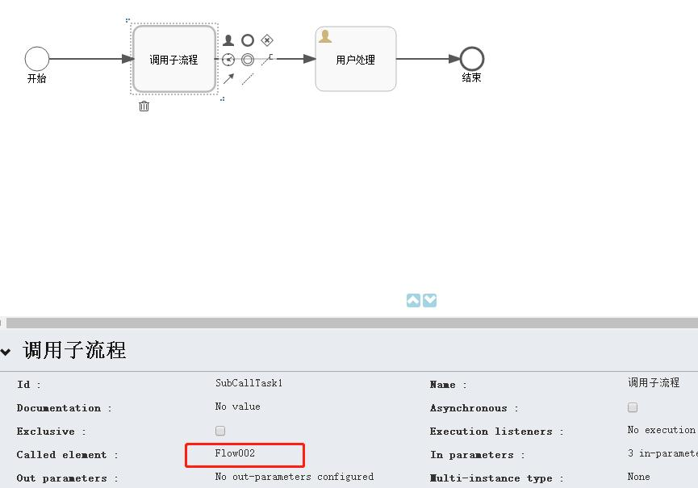
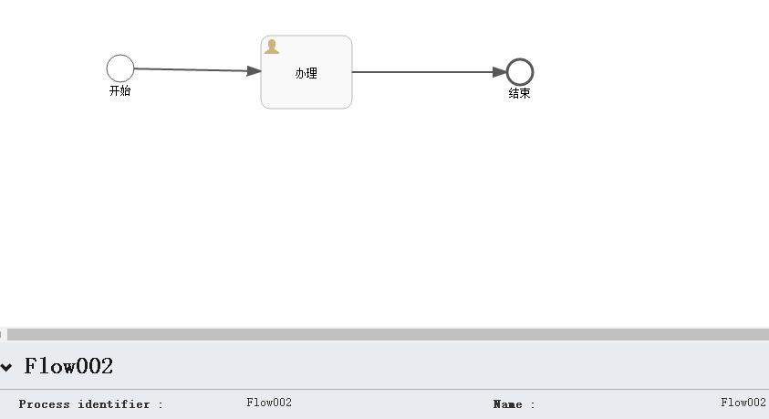
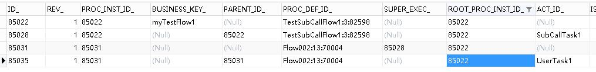

# Activiti6.0 – 子流程 | 字痕随行
简单试验一下子流程，主要是以下两种：

1\. 内嵌子流程：内嵌在父流程中，外部无法访问。

2\. 调用子流程：引用外部的已存在的流程，增加了流程的复用性。

首先，试验一下**内嵌子流程**。

以下是流程的截图，很简单的一个流程：

启动该流程，观察一下在进入到“子处理”这个节点时发生了什么？

会发现只有一个流程实例在运行，这说明，内嵌子流程和其父流程运行在同一个流程实例下。  

然后，再试验一下**调用子流程**。

也创建一个简单的流程，如下图：

需要注意的是，调用子流程需要指定它调用的目标流程，这里我使用了之前的测试流程，如下图：

*调用子流程设置*

*被调用的流程Flow002*

启动该流程，观察一下在进入到“子处理”这个节点时会发生什么？

会看到上图中生成了两个流程实例，所以调用子流程在进入子流程节点后，会单独启动一个流程实例，用来运行子流程。

如果有问题，欢迎指正讨论。

觉的不错？可以关注我的公众号↑↑↑