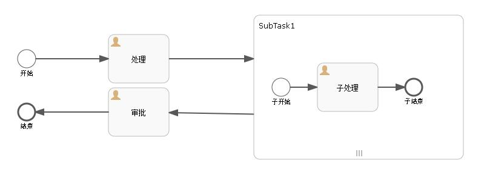
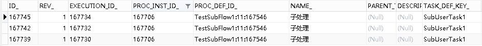
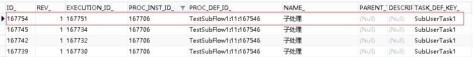
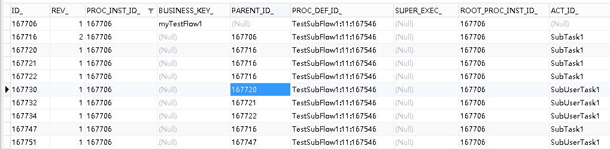
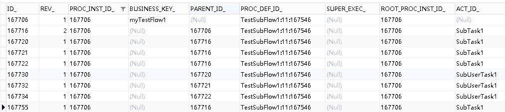
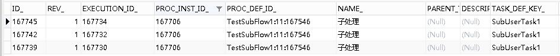

# Activiti6.0 – 子流程加签和减签 | 字痕随行
之前完成了加签和减签的功能，但是只是在普通多实例节点上测试了一下。趁着魔兽世界排队的功夫，我又测试了一下子流程，目前来看还算正常。  

先看一下流程图，用的其实就是之前的流程，如下：



**首先，加签。**  

启动流程，将流程流转至SubTask1，此时act\_ru\_task的数据如下：



此时，直接请求之前已经有的接口：

```Plain Text
http://localhost:8080/activiti/flow/addExecution/SubTask1/167706/test004

```
这里需要注意的是，nodeId必须填写子流程的ID标识，而不能填写子流程内用户节点的ID标识。


请求接口后，act\_ru\_task的数据如下：



此时，加签成功，可以继续执行其它的操作。

**其次，减签。**

接着上面的流程，如果在加签之后，直接请求减签接口。在请求之前，先看一下act\_ru\_execution表内的数据：



请求减签的接口，如下：

```Plain Text
http://localhost:8080/activiti/flow/delExecution/167747/0

```
这里需要注意的是，excutionId需要填写的是SubTask1的ID标识，不要填写成SubUserTask1的ID标识，否则会报异常。所以上面的接口中会填写167747。


请求完毕后，查看act\_ru\_execution表内的数据，会发现SubTask1减少了一条记录：



同时，act\_ru\_task的数据也减少了一条：



证明减签成功，此时可继续其它操作。

如果有问题，欢迎指正讨论。


觉的不错？可以关注我的公众号↑↑↑