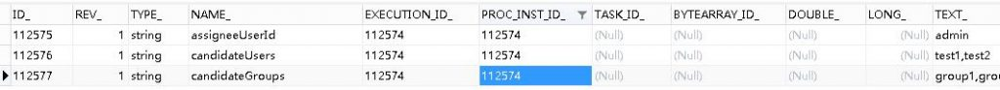

# Activiti6.0 – 子流程的传参 | 字痕随行
子流程的传参仅仅限于调用子流程(Call activity)，因为调用子流程试用的是外部已有的流程，相当于重新生成了一个流程实例。

如果在[上一次](http://www.blackzs.com/archives/1321)文章中的Flow002内声明了变量，比如声明了Assignments变量，如下图：


*Flow002内UserTask1的Assignments*

如果将Flow002作为子流程调用，会直接抛出异常，如下：

```Plain Text
HTTP Status 500 - Request processing failed; nested exception is org.activiti.engine.ActivitiException: Unknown property used in expression: ${assigneeUserId}

```
意思就是使用了未知的属性\${assigneeUserId}，要解决这个问题，就需要设置调用子流程的入参和出参，步骤如下：


*设置入参和出参*


*此处以入参为例*

设置完毕后，启动时设置以上参数：

```Java
//设置办理人、候选人、候选组
map.put("assigneeUserId", "admin");
map.put("candidateUsers", "test1,test2");
map.put("candidateGroups", "group1,group2");

```
再次运行，启动成功，此时查看数据库，会发现：


*流程实例*


*流程任务(节点)*




*流程参数*

**以下是引自Activiti5用户手册的相关内容：**

可以把流程变量传递给子流程，反之亦然。当流程启动的时候，数据会复制给子流程。 在流程结束的时候，数据会复制回主流程。

我们可以使用activiti扩展来简化BPMN标准元素调用：

\_dataInputAssociation\_和 *dataOutputAssociation。*

这种简化方式只有在你使用BPMN 2.0标准方式声明流程变量时才会生效。

以下是BPMN的XML片段：

```Plain Text
<callActivity id="callSubProcess" calledElement="checkCreditProcess" >
  <extensionElements>
          <activiti:in source="someVariableInMainProcess" target="nameOfVariableInSubProcess" />
          <activiti:out source="someVariableInSubProcss" target="nameOfVariableInMainProcess" />
  </extensionElements>
</callActivity>

```
也可以使用表达式：

```Plain Text
<callActivity id="callSubProcess" calledElement="checkCreditProcess" >
        <extensionElements>
          <activiti:in sourceExpression="${x+5}" target="y" />
          <activiti:out source="${y+5}" target="z" />
        </extensionElements>
</callActivity>

```
当子流程执行完毕时，最后的结果为：：z = y + 5 = x + 5 + 5。

如果有问题，欢迎指正讨论。


觉的不错？可以关注我的公众号↑↑↑