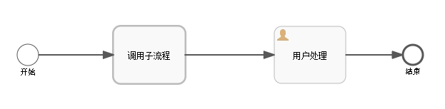
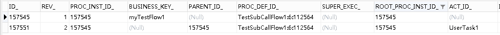
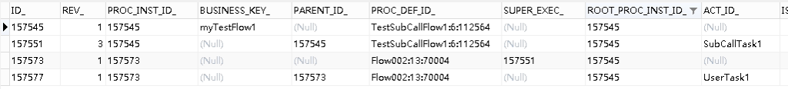
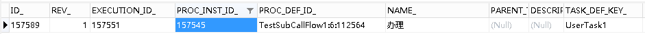
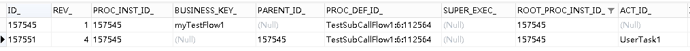

# Activiti6.0 – 子流程节点跳转 | 字痕随行
[上一篇](http://www.blackzs.com/archives/1417)中介绍了如何在一个简单的流程中，实现节点的自由跳转。正常的流程肯定不会如此简单，本篇就介绍一下如何实现子流程的节点跳转。

内嵌子流程其实使用[上一篇](http://www.blackzs.com/archives/1417)中介绍的方法就可以实现，因为从本质上来说，内嵌子流程并没有脱离父流程，仍旧属于它不可分割的一部分。  

本篇着重介绍的如何实现调用子流程的节点跳转，主要介绍一下如何从子流程内的节点跳出到父流程节点。流程在进入调用子流程这部分后，会新生成一个流程实例，这就使得调用子流程的节点跳转和[上一篇](http://www.blackzs.com/archives/1417)中所实现的逻辑有本质不同。

先上流程图：



如果处于父流程中的节点，act\_ru\_execution中的记录为：



进入子流程后，act\_ru\_execution中的记录会变为4条，会为子流程新创建一个流程实例：



所以，由子流程中的节点移动至父流程中的节点时，实现的思路如下：

1\. 通过当前的TaskId找到所属的子流程实例，即图中的ID\_=157577。为了方便说明，此流程实例暂时使用execution指代。

2\. 通过execution查找其父流程，即图中的ID\_=157573，此流程实例暂时使用parentExecution指代。

3\. 通过parentExecution查找其Super流程，即图中的ID\_=157551，此流程实例暂时使用rootExecution指代。

4\. 按照[上一篇](http://www.blackzs.com/archives/1417)中的实现逻辑，删除当前的Task记录，并且清除与其相关的流程实例execution、parentExecution及其它的附加信息（办理人、Variable）。

 5. 在rootExecution上，将流程节点跳转至指定的节点。

完整的实现代码如下：

```Java
/**
 * 移出子节点至父流程
 */
public class MoveSubOutCommand implements Command<Object> {

    private String currentTaskId;

    private String targetNodeId;

    public MoveSubOutCommand(String currentTaskId, String targetNodeId) {
        this.currentTaskId = currentTaskId;
        this.targetNodeId = targetNodeId;
    }

    public String getCurrentTaskId() {
        return currentTaskId;
    }

    public void setCurrentTaskId(String currentTaskId) {
        this.currentTaskId = currentTaskId;
    }

    public String getTargetNodeId() {
        return targetNodeId;
    }

    public void setTargetNodeId(String targetNodeId) {
        this.targetNodeId = targetNodeId;
    }

    @Override
    public Object execute(CommandContext commandContext) {
        //获得用到的Manager
        ExecutionEntityManager executionEntityManager = commandContext.getExecutionEntityManager();
        TaskEntityManager taskEntityManager = commandContext.getTaskEntityManager();
        IdentityLinkEntityManager identityLinkEntityManager = commandContext.getIdentityLinkEntityManager();
        VariableInstanceEntityManager variableInstanceEntityManager = commandContext.getVariableInstanceEntityManager();
        //获得当前流程处于的Task信息
        TaskEntity taskEntity = taskEntityManager.findById(this.currentTaskId);
        //获得流程实例信息
        ExecutionEntity executionEntity = executionEntityManager.findById(taskEntity.getExecutionId());
        ExecutionEntity parentExecutionEntity = executionEntityManager.findById(executionEntity.getParentId());
        ExecutionEntity rootExecutionEntity = executionEntityManager.findById(parentExecutionEntity.getSuperExecutionId());
        //获得流程定义信息
        Process process = ProcessDefinitionUtil.getProcess(executionEntity.getProcessDefinitionId());
        //删相关的办理人
        identityLinkEntityManager.deleteIdentityLink(executionEntity, null, null, null);
        identityLinkEntityManager.deleteIdentityLink(parentExecutionEntity, null, null, null);
        //删相关的参数
        List<VariableInstanceEntity> variableInstanceEntities = variableInstanceEntityManager.findVariableInstancesByExecutionId(parentExecutionEntity.getId());
        for (VariableInstanceEntity variableInstanceEntity : variableInstanceEntities) {
            variableInstanceEntityManager.delete(variableInstanceEntity, true);
        }
        //删Task
        taskEntityManager.deleteTask(taskEntity, "测试删除子节点", true, true);
        //删子流程的流程实例
        executionEntityManager.deleteChildExecutions(parentExecutionEntity, "", true);
        executionEntityManager.delete(parentExecutionEntity, true);
        //移动节点
        FlowElement targetFlowElement = process.getFlowElement(targetNodeId);
        rootExecutionEntity.setCurrentFlowElement(targetFlowElement);
        ActivitiEngineAgenda agenda = commandContext.getAgenda();
        agenda.planContinueProcessInCompensation(rootExecutionEntity);

        return null;
    }
}

```
测试一下，请求如下地址：

```Plain Text
http://localhost:8080/activiti/flow/moveSubOut/157528/UserTask1

```
跳转至父流程的UserTask1节点：




*act\_ru\_task*




*act\_ru\_execution*

在之后应该还有一篇，来实现一下，如何完成多实例节点的跳转。

如果有问题，欢迎指正讨论。


觉的不错？可以关注我的公众号↑↑↑