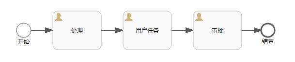
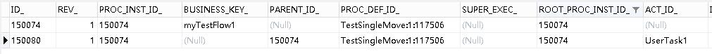
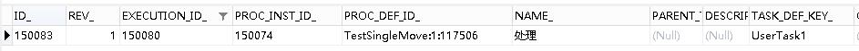
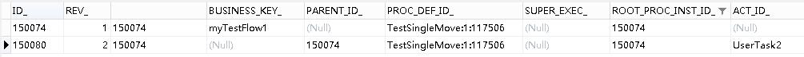
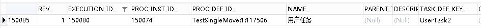
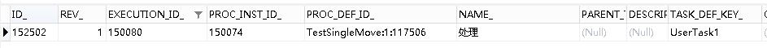

# Activiti6.0 – 节点跳转 | 字痕随行
之前一直在试验Flowable的节点跳转，可以参见以下文章：  

《[Flowable6.4节点跳转初探](http://www.blackzs.com/archives/1377)》

《[Flowable6.4子流程节点跳转](http://www.blackzs.com/archives/1392)》

《[Flowable6.4多实例流程节点跳转](http://www.blackzs.com/archives/1404)》

但是，Activiti并没有这些API接口，那么应该如何实现呢？接下来就实现一下简单流程节点的跳转。

首先，本文是基于Command接口实现，关于Activiti中的Command会在之后的文章中详解一下，本篇文章就暂时只是说明如何实现、使用。

先上流程图，如下：



非常简单的一个流程，只包含开始、结束和三个用户节点。这样的流程在正常流转时，会在表act\_ru\_execution内生成两条数据：



在表act\_ru\_task内生成一条数据：



并且，在流程的流转过程中，基本保持不变：




*D\_没有变化，只有ACT\_ID\_有所变化*




*​ID\_和TASK\_DEF\_KEY\_有变化，所属EXECUTION\_ID\_无变化*  


所以，只需要删除掉act\_ru\_task表中的数据，然后让流程向指定节点流转即可。

此时，就需要利用Command接口实现，具体的代码如下：

```Java
/**
 * 移动节点命令
 */
public class MoveSingleCommand implements Command<Object> {

    /**
     * 当前TaskId
     */
    private String currentTaskId;

    /**
     * 目标流程定义节点Id
     */
    private String targetNodeId;

    public MoveSingleCommand(String currentTaskId, String targetNodeId) {
        this.currentTaskId = currentTaskId;
        this.targetNodeId = targetNodeId;
    }

    public String getCurrentTaskId() {
        return currentTaskId;
    }

    public void setCurrentTaskId(String currentTaskId) {
        this.currentTaskId = currentTaskId;
    }

    public String getTargetNodeId() {
        return targetNodeId;
    }

    public void setTargetNodeId(String targetNodeId) {
        this.targetNodeId = targetNodeId;
    }

    @Override
    public Object execute(CommandContext commandContext) {
        ExecutionEntityManager executionEntityManager = commandContext.getExecutionEntityManager();
        TaskEntityManager taskEntityManager = commandContext.getTaskEntityManager();
        TaskEntity taskEntity = taskEntityManager.findById(this.currentTaskId);
        ExecutionEntity executionEntity = executionEntityManager.findById(taskEntity.getExecutionId());
        Process process = ProcessDefinitionUtil.getProcess(executionEntity.getProcessDefinitionId());
        taskEntityManager.deleteTask(taskEntity, "移动节点", true, true);
        FlowElement targetFlowElement = process.getFlowElement(targetNodeId);
        executionEntity.setCurrentFlowElement(targetFlowElement);
        ActivitiEngineAgenda agenda = commandContext.getAgenda();
        agenda.planContinueProcessInCompensation(executionEntity);
        return null;
    }
}

```
然后开放一个Url地址执行此Command即可，代码如下：

```Java
 /**
     * 移动节点
     */
    @RequestMapping(value = "move/{taskId}/{toNodeId}")
    public void move(@PathVariable("taskId") String taskId,
                     @PathVariable("toNodeId") String toNodeId) {
        managementService.executeCommand(new MoveSingleCommand(taskId, toNodeId));
    }

```
链接地址示例：

```Plain Text
http://localhost:8080/activiti/flow/move/150085/UserTask1

```
可以看到节点由UserTask2回退至UserTask1：



如果有问题，欢迎指正讨论。


觉的不错？可以关注我的公众号↑↑↑