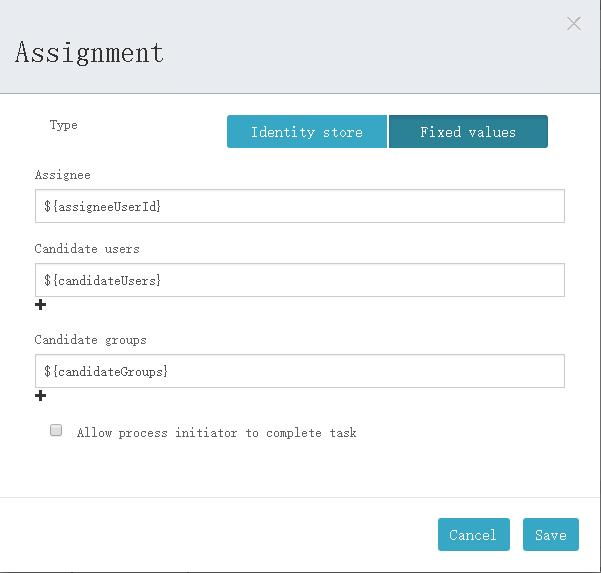
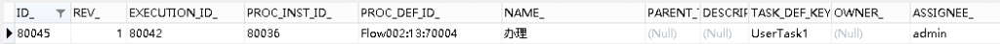
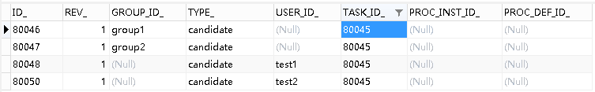

# Activiti6.0 – 设置节点处理人 | 字痕随行
Activiti以三种方式设置节点处理人，分别是：

1\. Assignment：办理人，指定唯一一个。

2. Candidate users：候选人，可以指定多个人。

3. Candidate groups：候选组，可以指定多个组。  

具体的设置如下图：



设置节点处理人的相关代码如下：

```Java
    /**
     * 启动一个流程
     * @param modelId
     */
    @RequestMapping(value = "start/{modelId}")
    public void start(@PathVariable("modelId") String modelId) {
        Model modelData = repositoryService.getModel(modelId);
        Map<String, Object> map = new HashMap<>();
        map.put("id", "111111");
        //设置办理人、候选人、候选组
        map.put("assigneeUserId", "admin");
        map.put("candidateUsers", "test1,test2");
        map.put("candidateGroups", "group1,group2");
        ProcessInstance processInstance = null;
        try {
            // 用来设置启动流程的人员ID，引擎会自动把用户ID保存到activiti:initiator中
            identityService.setAuthenticatedUserId("admin");

            processInstance = runtimeService.startProcessInstanceByKey(modelData.getKey(), "myTestFlow1", map);
            String processInstanceId = processInstance.getId();
            System.out.println(processInstanceId);
        } finally {
            identityService.setAuthenticatedUserId(null);
        }
    }

```
启动流程后，可以看到：

1\. act\_ru\_task表中，相关流程节点的Assignment字段变更为设定值。



2\. act\_ru\_identitylink表中，增加了多条记录。



如果依照[上节](http://www.blackzs.com/archives/1300)设置了任务监听器，如下变更一下代码：

```Java
public class MyTaskListener implements TaskListener {

    @Override
    public void notify(DelegateTask delegateTask) {
        System.out.println(delegateTask.getEventName());
        if ("assignment".equals(delegateTask.getEventName())) {
            System.out.println("代理人" + delegateTask.getAssignee());
            System.out.println("参与者数量" + delegateTask.getCandidates().size());
        }
        if ("create".equals(delegateTask.getEventName())) {
            System.out.println("代理人" + delegateTask.getAssignee());
            for (IdentityLink identityLink : delegateTask.getCandidates()) {
                if ("candidate".equals(identityLink.getType())) {
                    if (null != identityLink.getUserId()) {
                        System.out.println("参与者" + identityLink.getUserId());
                    } else if (null != identityLink.getGroupId()) {
                        System.out.println("参与组" + identityLink.getGroupId());
                    }
                }
            }
        }
    }
}

```
可以看到以下输出：

```Plain Text
assignment
代理人admin
参与者数量0
create
代理人admin
参与者test2
参与组group1
参与者test1
参与组group2

```
最后，需要注意：

1\. 在类型为assignment的事件中，获得不到候选者和候选人的信息。

2\.  办理人、候选人、候选组不必是Activiti内的组织结构信息。

如果有问题，欢迎指正讨论。


觉的不错？可以关注我的公众号↑↑↑