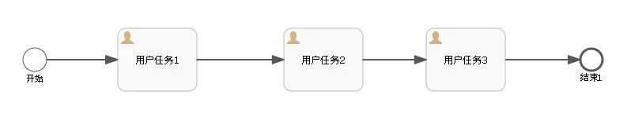
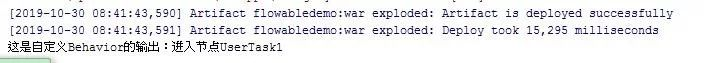
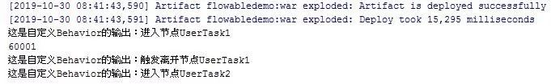

# Flowable6.4 - Behavior使用初探 | 字痕随行
原创 字痕随行 字痕随行

收录于话题

#流程引擎

52个

通过之前分析Behavior的源码，基本上搞清楚了它的作用，这次就简单试验一下它的用法。

如果看过ProcessEngineConfigurationImpl的源码，会在其中的init()方法中发现BehaviorFactory的初始化方法。由此入手，就能够了解如何定制Behavior。

这块的源码暂时先不分析，本次直接使用一个简单的Demo介绍一下如何定制UserTaskActivityBehavior。

首先，声明一个自定义类，直接继承自UserTaskActivityBehavior，具体的代码如下：

```Java
/**
 * 自定义UserTask节点的Behavior
 */
public class ExtUserTaskActivityBehavior extends UserTaskActivityBehavior {

    private static final long serialVersionUID = 7711531472879418236L;

    ExtUserTaskActivityBehavior(UserTask userTask) {
        super(userTask);
    }

    @Override
    public void execute(DelegateExecution execution) {
        System.out.println("这是自定义Behavior的输出：进入节点" + execution.getCurrentActivityId());
        super.execute(execution);
    }

    @Override
    public void trigger(DelegateExecution execution, String signalName, Object signalData) {
        System.out.println("这是自定义Behavior的输出：触发离开节点" + execution.getCurrentActivityId());
        super.trigger(execution, signalName, signalData);
    }
}

```
非常简单，就是在进入和离开节点之前，输出一段日志。如果想让这个自定义的Behavior生效，就必须依靠BehaviorFactory实现。

自定义BehaviorFactory，然后使用上文中已定义的ExtUserTaskActivityBehavior替换原有的UserTaskActivityBehavior，具体代码如下：

```Java
/**
 * 自定义的BehaviorFactory,在ProcessEngineConfiguration中引入
 */
public class ExtActivityBehaviorFactory extends DefaultActivityBehaviorFactory {

    @Override
    public UserTaskActivityBehavior createUserTaskActivityBehavior(UserTask userTask) {
        return new ExtUserTaskActivityBehavior(userTask);
    }
}

```
此时，已经在自定义的Factory中替换了原有的UserTaskActivityBehavior，但是这只是准备工作，接下来需要让Flowable知晓ExtActivityBehaviorFactory的存在。

在配置文件中，将ExtActivityBehaviorFactory注入到ProcessEngineConfiguration中，具体代码如下：

经过上面的操作后，ExtUserTaskActivityBehavior就会正式生效，在遇到流程中的UserTask节点时，会输出日志。

比如，下面这个流程：



请求以下地址，启动流程：

```Plain Text
http://localhost:8080/flowabledemo/flow/start/1

```
输出的日志如下：



请求以下地址，完成用户任务1：

```Plain Text
http://localhost:8080/flowabledemo/flow/complate/60011

```
输出的日志如下：



至此，自定义的Behavior已经生效。这次的Demo比较简单，下次搞个稍微复杂点的。

以上，如有问题，欢迎指正讨论。


觉的不错？可以关注我的公众号↑↑↑