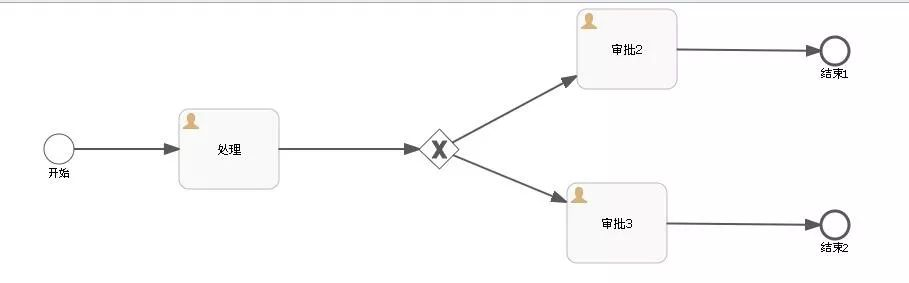
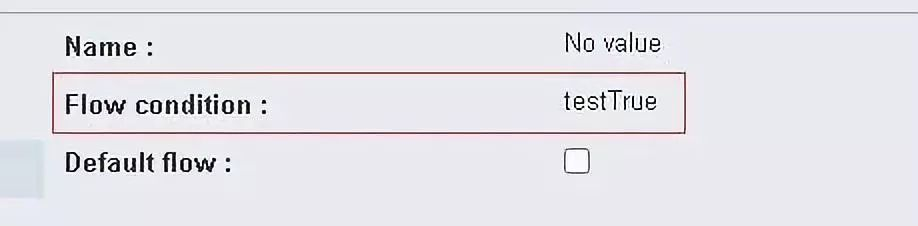
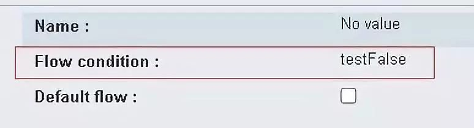
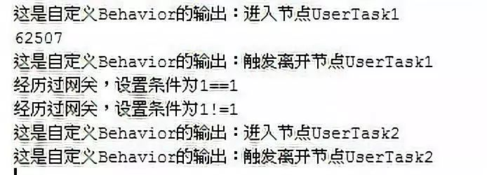
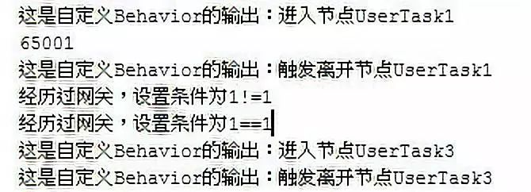

# Flowable6.4 - Behavior改变ConditionExpression | 字痕随行
原创 字痕随行 字痕随行

收录于话题

#流程引擎

52个

[上一篇](http://mp.weixin.qq.com/s?__biz=MzI3NTE2NzczMQ==&mid=2650046010&idx=1&sn=fab3c8cca45e6ec30d3ad28a1ad96fa2&chksm=f3083ea6c47fb7b0da6461be4cec87a8731a78183b6be427b5c72afd557bac5773b0b6cdc742&scene=21#wechat_redirect)简单介绍了一下如何自定义Behavior，此篇就试验一个稍微复杂一些的：使用Behavior改变ExclusiveGateway的Outgoing条件。

先上流程图：



设置一下分支节点(ExclusiveGateway)后面两条路径(SequenceFlow)的执行条件：



*第一条路径*



*第二条路径*

然后，扩展一个ExclusiveGatewayActivityBehavior，源码如下：

```Java
public class ExtExclusiveGatewayActivityBehavior extends ExclusiveGatewayActivityBehavior {

    private static final long serialVersionUID = -2245991955225188129L;

    @Override
    public void leave(DelegateExecution execution) {
        ExclusiveGateway exclusiveGateway = (ExclusiveGateway) execution.getCurrentFlowElement();
        for (SequenceFlow sequenceFlow : exclusiveGateway.getOutgoingFlows()) {
            if ("testTrue".equals(sequenceFlow.getConditionExpression())) {
                sequenceFlow.setConditionExpression("${1==1}");
                System.out.println("经历过网关，设置条件为1==1");
            } else if ("testFalse".equals(sequenceFlow.getConditionExpression())) {
                sequenceFlow.setConditionExpression("${1!=1}");
                System.out.println("经历过网关，设置条件为1!=1");
            } else {
                System.out.println("经历过网关，保持原条件");
            }
        }
        super.leave(execution);
    }
}

```
上面代码的逻辑很简单，在遇到testTrue时，自动将条件变更为\${1=1}，即永远为True，在遇到testFalse时，正好与testTrue时相反。

在[上一篇](http://mp.weixin.qq.com/s?__biz=MzI3NTE2NzczMQ==&mid=2650046010&idx=1&sn=fab3c8cca45e6ec30d3ad28a1ad96fa2&chksm=f3083ea6c47fb7b0da6461be4cec87a8731a78183b6be427b5c72afd557bac5773b0b6cdc742&scene=21#wechat_redirect)中的BehaviorFactory设置一下，代码如下：

```Java
@Override
public ExclusiveGatewayActivityBehavior createExclusiveGatewayActivityBehavior(ExclusiveGateway exclusiveGateway) {
    return new ExtExclusiveGatewayActivityBehavior();
}

```
直接运行一下这个流程，控制台内就会输出：



上图中的UserTask2代表审批2，可以看到条件起作用了。

如果将Behavior的代码改为下面这样：

```Java
public class ExtExclusiveGatewayActivityBehavior extends ExclusiveGatewayActivityBehavior {

    private static final long serialVersionUID = -2245991955225188129L;

    @Override
    public void leave(DelegateExecution execution) {
        ExclusiveGateway exclusiveGateway = (ExclusiveGateway) execution.getCurrentFlowElement();
        for (SequenceFlow sequenceFlow : exclusiveGateway.getOutgoingFlows()) {
            if ("testTrue".equals(sequenceFlow.getConditionExpression())) {
                sequenceFlow.setConditionExpression("${1!=1}");
                System.out.println("经历过网关，设置条件为1!=1");
            } else if ("testFalse".equals(sequenceFlow.getConditionExpression())) {
                sequenceFlow.setConditionExpression("${1==1}");
                System.out.println("经历过网关，设置条件为1==1");
            } else {
                System.out.println("经历过网关，保持原条件");
            }
        }
        super.leave(execution);
    }
}

```
也就是将条件反转一下，再执行一下流程，就会发现如下的输出：



上图中的UserTask3代表审批3，可以看到条件依然生效了。


究其原因，可以阅读一下ExclusiveGatewayActivityBehavior的源码，在其leave()方法中，可以看到比较关键的一段：

```Java
Iterator<SequenceFlow> sequenceFlowIterator = exclusiveGateway.getOutgoingFlows().iterator();
while (outgoingSequenceFlow == null && sequenceFlowIterator.hasNext()) {
    SequenceFlow sequenceFlow = sequenceFlowIterator.next();

    String skipExpressionString = sequenceFlow.getSkipExpression();
    if (!SkipExpressionUtil.isSkipExpressionEnabled(skipExpressionString, sequenceFlow.getId(), execution, commandContext)) {
        //开始寻找条件为True的那条路径，如果找到之后就使用这条路径流转
        boolean conditionEvaluatesToTrue = ConditionUtil.hasTrueCondition(sequenceFlow, execution);
        if (conditionEvaluatesToTrue && (defaultSequenceFlowId == null || !defaultSequenceFlowId.equals(sequenceFlow.getId()))) {
            if (LOGGER.isDebugEnabled()) {
                LOGGER.debug("Sequence flow '{}' selected as outgoing sequence flow.", sequenceFlow.getId());
            }
            outgoingSequenceFlow = sequenceFlow;
        }

    } else if (SkipExpressionUtil.shouldSkipFlowElement(skipExpressionString, sequenceFlow.getId(), execution, Context.getCommandContext())) {
        outgoingSequenceFlow = sequenceFlow;
    }

    // Already store it, if we would need it later. Saves one for loop.
    if (defaultSequenceFlowId != null && defaultSequenceFlowId.equals(sequenceFlow.getId())) {
        defaultSequenceFlow = sequenceFlow;
    }

}

```
这个示例如果扩展一下，其实可以加入Groovy脚本引擎来作为条件控制方，具体的实现就看自身场景需要了。  


以上就是本次的内容，欢迎指正和探讨。


觉的不错？可以关注我的公众号↑↑↑