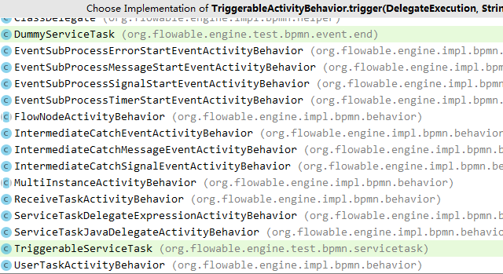

# Flowable6.4 - Behavior的用途分析 | 字痕随行
原创 字痕随行 字痕随行

收录于话题

#流程引擎

52个

Flowable和Activiti里面有一个很重要的部分 - Behavior，接下来分析一下这部分的主要作用是什么。

首先，要找一个切入点，看一下在调用TaskServiceImpl.complete()时发生了什么。下面是该函数的源码：

```Java
@Override
public void complete(String taskId) {
    commandExecutor.execute(new CompleteTaskCmd(taskId, null));
}

```
这里可以看到执行了CompleteTaskCmd，进入这个类的内部，基于以前的文章，看一看这个命令的execute()方法发生了什么，这里主要关注以下的方法：

```Java
TaskHelper.completeTask(task, variables, transientVariables, localScope, commandContext);

```
追踪下去，可以在completeTask()的最末尾找到一段代码：

```Java
// Continue process (if not a standalone task)
if (taskEntity.getExecutionId() != null) {
    ExecutionEntity executionEntity = CommandContextUtil.getExecutionEntityManager(commandContext).findById(taskEntity.getExecutionId());
    CommandContextUtil.getAgenda(commandContext).planTriggerExecutionOperation(executionEntity);
}

```
继续追踪下去，就进入了TriggerExecutionOperation这个类，在这个类的run()方法内就可以看到Behavior出现了。

```Java
@Override
public void run() {
    FlowElement currentFlowElement = getCurrentFlowElement(execution);
    if (currentFlowElement instanceof FlowNode) {

        ActivityBehavior activityBehavior = (ActivityBehavior) ((FlowNode) currentFlowElement).getBehavior();
        if (activityBehavior instanceof TriggerableActivityBehavior) {

            if (currentFlowElement instanceof BoundaryEvent
                    || currentFlowElement instanceof ServiceTask) { // custom service task with no automatic leave (will not have a activity-start history entry in ContinueProcessOperation)
                CommandContextUtil.getActivityInstanceEntityManager(commandContext).recordActivityStart(execution);
            }

            if(!triggerAsync) {
                ((TriggerableActivityBehavior) activityBehavior).trigger(execution, null, null);
            }
            else {
            //此处省略代码若干
            }
        }
    }
}

```
当跟踪((TriggerableActivityBehavior) activityBehavior).trigger()的实现时，会发现一堆实现类：



挑选一个最简单的UserTaskActivityBehavior进入，看看发生了什么。会发现调用了一个最关键的方法leave()。然后看看leave()的实现：

```Java
@Override
public void leave(DelegateExecution execution) {
    FlowElement currentFlowElement = execution.getCurrentFlowElement();
    Collection<BoundaryEvent> boundaryEvents = findBoundaryEventsForFlowNode(execution.getProcessDefinitionId(), currentFlowElement);
    if (CollectionUtil.isNotEmpty(boundaryEvents)) {
        executeCompensateBoundaryEvents(boundaryEvents, execution);
    }
    //关键在这里，如果没有loop的关键字，就不是多实例，直接调用super.leave
    if (!hasLoopCharacteristics()) {
        super.leave(execution);
    } else if (hasMultiInstanceCharacteristics()) {
        multiInstanceActivityBehavior.leave(execution);
    }
}

```
再看看super.leave()的实现，如下：

```Java
/**
 * Default way of leaving a BPMN 2.0 activity: evaluate the conditions on the outgoing sequence flow and take those that evaluate to true.
 */
public void leave(DelegateExecution execution) {
    bpmnActivityBehavior.performDefaultOutgoingBehavior((ExecutionEntity) execution);
}

```
到这里，通过这些关键字就大体可以猜测出接下来的实现了，同时也应该大概明白Behavior的作用了。

如果再看一下多实例用户节点的Behavior也许就会更加清晰，比如ParallelMultiInstanceBehavior，关键的代码如下：

```Java
/**
 * Called when the wrapped {@link ActivityBehavior} calls the {@link AbstractBpmnActivityBehavior#leave(DelegateExecution)} method. Handles the completion of one of the parallel instances
 */
@Override
public void leave(DelegateExecution execution) {

    //代码略.....

    int loopCounter = getLoopVariable(execution, getCollectionElementIndexVariable());
    int nrOfInstances = getLoopVariable(execution, NUMBER_OF_INSTANCES);
    int nrOfCompletedInstances = getLoopVariable(execution, NUMBER_OF_COMPLETED_INSTANCES) + 1;
    int nrOfActiveInstances = getLoopVariable(execution, NUMBER_OF_ACTIVE_INSTANCES) - 1;

    //代码略.....

    if (zeroNrOfInstances) {
        return;
    }

    ExecutionEntity executionEntity = (ExecutionEntity) execution;
    if (executionEntity.getParent() != null) {

        //代码略.....
        //只有满足跳出条件时，才会调用super.leave

        if (nrOfCompletedInstances >= nrOfInstances || isCompletionConditionSatisfied) {

             //代码略.....

            if (isCompletionConditionSatisfied) {
                //代码略.....

              sendCompletedWithConditionEvent(leavingExecution);
            }
            else {
                sendCompletedEvent(leavingExecution);
            }

            super.leave(leavingExecution);
          }

    } else {
        sendCompletedEvent(execution);
        super.leave(execution);
    }
}

```
所以综上分析，我个人觉得，Behavior就是控制节点是否跳转的，每一次流转，都会进入到这里，然后在此判断是否满足离开此节点的条件，如果满足就离开此节点，进入到下一个节点，否则的话仍旧保持处于此节点。

以上，就是关于Behavior的分析，欢迎指正和讨论。


觉的不错？可以关注我的公众号↑↑↑