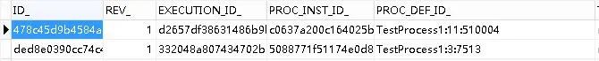

# Flowable6.6 - ID生成器 | 字痕随行
原创 字痕随行 字痕随行

收录于话题

#流程引擎

53个

最近被Flowable的自定义缓存搞的神烦，今天先看看如何自定义它的ID生成器，后面再细说缓存的事。

如果只是想使用自定义ID生成策略，只需要以下代码就好了：

```Java
configuration.setIdGenerator(new IdGenerator() {
    @Override
    public String getNextId() {
        //这里使用hutool的UUID工具类生成
        return IdUtil.simpleUUID();
    }
});

```
然后随便启动个流程，就可以看到所有的ID都变成UUID了：



如果还想了解一下为什么，可以继续往下看。

在UserTaskActivityBehavior的execute()中可以找到创建Task的方法。

这个方法可以追踪到TaskHelper中，一路追踪下去：

```Java
TaskHelper.insertTask->
TaskService.insertTask->
TaskEntityManagerImpl.insert->
AbstractEntityManager.insert->
AbstractDataManager.insert->
DbSqlSession.insert->
String id = idGenerator.getNextId();

```
就可以找到为Task赋予ID的方法，至于idGenerator来源于哪里，其实是在ProcessEngineConfigurationImpl中。

```Java
public void initIdGenerator() {
        if (idGenerator == null) {
            DbIdGenerator dbIdGenerator = new DbIdGenerator();
            dbIdGenerator.setIdBlockSize(idBlockSize);
            idGenerator = dbIdGenerator;
        }

        if (idGenerator instanceof DbIdGenerator) {
            DbIdGenerator dbIdGenerator = (DbIdGenerator) idGenerator;
            if (dbIdGenerator.getIdBlockSize() == 0) {
                dbIdGenerator.setIdBlockSize(idBlockSize);
            }
            if (dbIdGenerator.getCommandExecutor() == null) {
                dbIdGenerator.setCommandExecutor(getCommandExecutor());
            }
            if (dbIdGenerator.getCommandConfig() == null) {
                dbIdGenerator.setCommandConfig(getDefaultCommandConfig().transactionRequiresNew());
            }
        }
    }

```
同样，在这个方法中可以发现我们之前自定义ID生成策略的Set方法：

```Java
public ProcessEngineConfigurationImpl setIdGenerator(IdGenerator idGenerator) {
    this.idGenerator = idGenerator;
    return this;
}

```
以上就是自定义ID生成策略的简单实现，如有错误，欢迎指正。


觉的不错？可以关注我的公众号↑↑↑