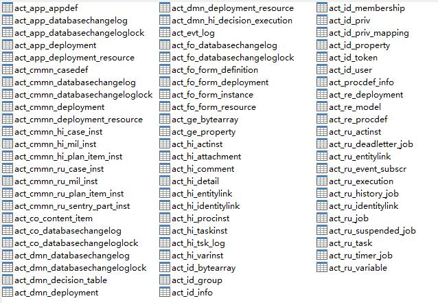

# SpringBoot整合Flowable6.4 | 字痕随行
大量的配置文件让人很烦躁，尤其是某个项目中无处不在却怎么也找不到的配置文件，所以之前的示例项目也是时候改成SpringBoot了。

基于上一篇的示例，首先在Pom文件中新增加DataSource、Flowable和其它一些将要用到的配置：

然后，配置DataSource：

```java
@Configuration
@EnableTransactionManagement
public class DataSourceConfig {

    @Primary
    @Bean(name = "dataSource")
    @ConditionalOnBean(PropertiesConfigurer.class)
    public DataSource getDataSource() throws Exception {
        DruidDataSource dataSource = new DruidDataSource();
        //PropertiesConfigurer是一个获得配置文件属性的持久类
        dataSource.setDriverClassName(PropertiesConfigurer.getProperty("db.driver"));
        dataSource.setUrl(PropertiesConfigurer.getProperty("db.url"));
        dataSource.setUsername(PropertiesConfigurer.getProperty("db.user"));
        dataSource.setPassword(PropertiesConfigurer.getProperty("db.password"));
        dataSource.setInitialSize(1);
        dataSource.setMinIdle(1);
        dataSource.setMaxActive(20);
        dataSource.setFilters("stat");
        return dataSource;
    }

    @Primary
    @Bean(name = "transactionManager")
    public DataSourceTransactionManager getDataSourceTransactionManager(@Qualifier("dataSource")DataSource dataSource) {
        DataSourceTransactionManager dataSourceTransactionManager = new DataSourceTransactionManager();
        dataSourceTransactionManager.setDataSource(dataSource);
        return dataSourceTransactionManager;
    }
}

```
配置Flowable：

```java
@Configuration
public class FlowableConfig {

    @Primary
    @Bean(name = "processEngineConfiguration")
    public SpringProcessEngineConfiguration getSpringProcessEngineConfiguration(@Qualifier("dataSource") DataSource dataSource, @Qualifier("transactionManager")DataSourceTransactionManager transactionManager) {
        SpringProcessEngineConfiguration configuration = new SpringProcessEngineConfiguration();
        configuration.setDataSource(dataSource);
        configuration.setTransactionManager(transactionManager);
        configuration.setDatabaseSchemaUpdate("true");
        configuration.setAsyncExecutorActivate(true);
        configuration.setCustomPostDeployers(new ArrayList<EngineDeployer>(){
            private static final long serialVersionUID = 4041439225480991716L;
            {
                add(new RulesDeployer());
            }
        });
        return configuration;
    }
}

```
配置一下数据库连接字符串，指向一个空库，启动App，就会开始自动创建所需表，如下图：


这里有两个地方值得注意一下：

1\. 如果使用flowable-spring-boot-starter，就相当于引入了Flowable全家桶，运行程序后会将所有的表创建出来，如下图：



2\. 不需要再像之前使用Spring的时候，将7大接口全都声明一遍，可以在项目中直接使用。

以后有空的话，再看看starter的源码。以上，如果有错误，欢迎探讨和指正。


觉的不错？可以关注我的公众号↑↑↑