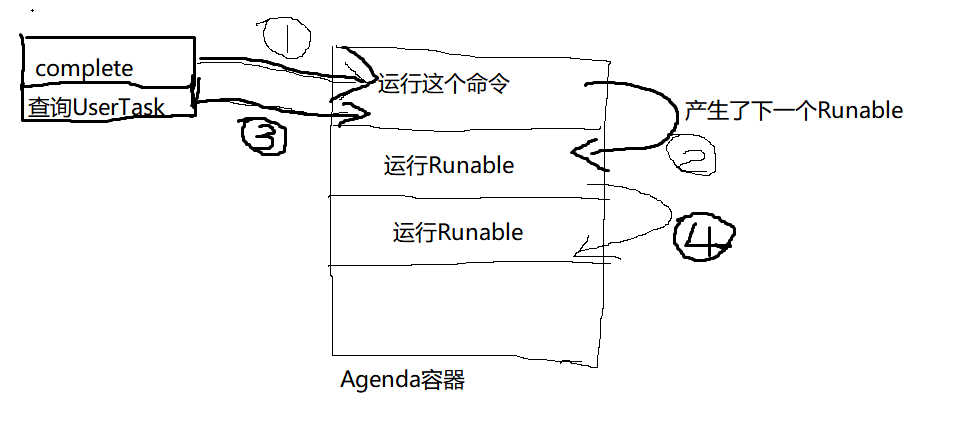

# Flowable6.4 - 一种同步返回用户任务的想法 | 字痕随行
原创 字痕随行 字痕随行

收录于合集

#Flowable 2 个

#流程引擎 58 个

为什么之前重新梳理了一下Agenda？

主要是因为有人问过我，为什么调用TaskService.complete()方法没有返回值。

如果无法获得返回值，就不知道任务到达哪个节点，可能无法满足某些业务场景。

当时，我想可能是因为基于流程引擎进行流转，无法预测最终会流转到什么节点。

可是，后来我觉得不对，如果节点不需要进行异步流转，所有的处理都是同步的，按理来说应该是可以获得的。

所以，才有了之前的那篇梳理。也就找到了根本原因，这是由于Flowable的运行原理导致的。

Flowable基于链表执行命令链，无法在Complete Command里面嵌入查询最终用户任务的语句，原因如下图：



画的粗糙了点，但是意思差不多了，就是在查询UserTask命令之后，Flowable还会执行一堆命令链，然后才能停止在UserTask节点。

所以想在**事务内**查询不太可能，除非自定义一个拦截器，但是自定义拦截器是不是能够返回结果，还是个问题。

所以，我尝试了一种方案，没经过**生产环境**测试，只是以供参考（只限定于节点都是同步处理的情况）。

主要的过程如下：

1. 声明一个ThreadLocal，用来存储在当前线程中生成的UserTask。
2. 捕捉UserTask的Complete和Create事件，更新ThreadLocal中的UserTask。
3. 在同步执行完TaskService.complete()后，返回ThreadLocal中的UserTask。

整个过程，应该是可以包裹在事务中的，应该不会出现线程安全问题。

ThreadLocal代码如下：

```java
 1public class ThreadLoaclCache {
 2
 3    private final static ThreadLocal<ThreadLoaclCache> threadLocalCache = new ThreadLocal<>();
 4
 5    private Set<String> taskIds;
 6
 7    public ThreadLoaclCache() {
 8        this.taskIds = new HashSet<>();
 9    }
10
11    public Set<String> getTaskIds() {
12        return taskIds;
13    }
14
15    public void setTaskIds(Set<String> taskIds) {
16        this.taskIds = taskIds;
17    }
18
19    public static ThreadLoaclCache getInstance() {
20        return threadLocalCache.get();
21    }
22
23    public static Set<String> addTaskIds(String taskId) {
24        ThreadLoaclCache threadLoaclCache = threadLocalCache.get();
25        if (null == threadLoaclCache) {
26            threadLoaclCache = new ThreadLoaclCache();
27            threadLocalCache.set(threadLoaclCache);
28        }
29        threadLoaclCache.getTaskIds().add(taskId);
30        return threadLoaclCache.getTaskIds();
31    }
32
33    public static void removeTaskIds(String taskId) {
34        ThreadLoaclCache threadLoaclCache = threadLocalCache.get();
35        if (null == threadLoaclCache) {
36            threadLoaclCache = new ThreadLoaclCache();
37            threadLocalCache.set(threadLoaclCache);
38        }
39        threadLoaclCache.getTaskIds().remove(taskId);
40    }
41}

```
TaskComplete和TaskCreate的事件处理如下：

```java
 1public class TaskCreateEventListenerHandleImpl implements EventListenerHandle {
 2
 3    @Override
 4    public void onEvent(FlowableEvent event) {
 5        if (event instanceof FlowableEntityEvent) {
 6            FlowableEntityEvent entityEvent = (FlowableEntityEvent) event;
 7            TaskEntity entity = (TaskEntity) entityEvent.getEntity();
 8            ThreadLoaclCache.addTaskIds(entity.getId());
 9        }
10    }
11}
12
13public class TaskCompleteEventListenerHandleImpl implements EventListenerHandle {
14
15    @Override
16    public void onEvent(FlowableEvent event) {
17        if (event instanceof FlowableEntityEvent) {
18            FlowableEntityEvent entityEvent = (FlowableEntityEvent) event;
19            TaskEntity entity = (TaskEntity) entityEvent.getEntity();
20            ThreadLoaclCache.removeTaskIds(entity.getId());
21        }
22    }
23}

```
然后就可以测试一下了：

```java
1@ResponseBody
2@RequestMapping(value = "customCompleteTask/{taskId}")
3public List<String> customCompleteTask(@PathVariable("taskId") String taskId) {
4    taskService.complete(taskId);
5    return new ArrayList<>(ThreadLoaclCache.getInstance().getTaskIds());
6}

```
以上，一种设想，纯粹是闲得没事干。

如果有错误，欢迎指正。

觉的不错？可以关注我的公众号↑↑↑

如果有问题，欢迎指正讨论。


觉的不错？可以关注我的公众号↑↑↑