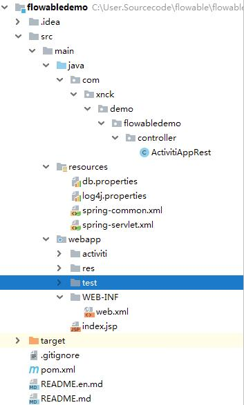
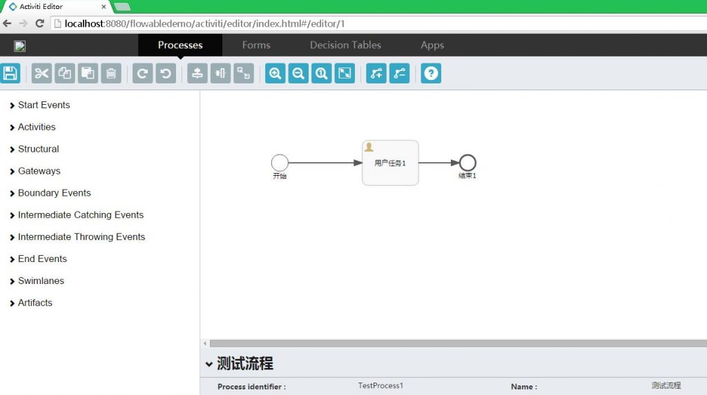

# Flowable使用Activiti设计器 | 字痕随行
Flowable和Activiti的渊源就不说了，反正是一个妈生的。最近尝试着使用Activiti6的设计器设计流程，然后给Flowable使用。

之前已经进行过Activiti6设计器的整合（参考[这里](http://mp.weixin.qq.com/s?__biz=MzI3NTE2NzczMQ==&mid=2650045675&idx=1&sn=12fa3c52724ddc3744832f8551771290&chksm=f3083c77c47fb561aea002653b32f01a5492056d3832ead5080dd98f73587fc661c0025bf42b&scene=21#wechat_redirect)），这里就可以直接拿过来用了。先创建一个Maven工程，然后将Controller、配置文件、设计器的静态文件拷贝过来，最后如下图：



修改pom.xml内的引用内容，主要是将Activiti的引用改为Flowable的引用，同时修改Spring的版本，如果继续使用Spring4，项目会无法启动。

这里使用的版本如下：

```xml
<properties>
    <!-- spring版本号 -->
    <spring.version>5.1.5.RELEASE</spring.version>
    <!-- flowable -->
    <flowable.version>6.4.1</flowable.version>
  </properties>

```
然后修改spring-common.xml和spring-servlet.xml，spring-common.xml主要是将Activiti的包名换为Flowable的，比如：

spring-servlet.xml主要是之前使用Spring4的一些类已经不存在了，需要修改为Spring5中对应的类。

最后，需要修改\\src\\main\\webapp\\activiti\\scripts下的app-cfg.js，将其中的内容替换，如下：

```javascript
ACTIVITI.CONFIG = {
    'onPremise' : true,
    'contextRoot' : '/your-app-context',
    'webContextRoot' : '/your-app-context/activiti'
};

```
然后运行，效果如下图：




觉的不错？可以关注我的公众号↑↑↑