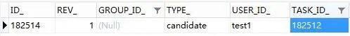

# Flowable6.4 - 分派办理人 | 字痕随行
原创 字痕随行 字痕随行

收录于话题

#流程引擎

52个

这次分享的是从一个开源项目的代码里面学来的，有兴趣的同学可以去阅读一下该项目的源码，还是有很多可以参考的地方，项目地址如下：

https://gitee.com/threefish/NutzFw.git

**首先**，存储办理人的表：act\_ru\_identitylink。如果想为一个Task分配办理人，可以使用以下的API：

```Java
task.addCandidateGroup(String groupId);
task.addCandidateUser(String userId);

task.addCandidateGroups(Collection<String> candidateGroups);
task.addCandidateUsers(Collection<String> candidateUsers);

```
如果使用以上的API增加一个办理人，会在act\_ru\_identitylink表中增加一条记录，如下：



使用上述API设置的人员或者组，表中的TYPE\_为“candidate”。如果阅读Flowable的源代码，就会发现原因：

```Java
//设置人员
public IdentityLinkEntity addCandidateUser(String taskId, String userId) {
    return this.addTaskIdentityLink(taskId, userId, (String)null, "candidate");
}
//设置组
public IdentityLinkEntity addCandidateGroup(String taskId, String groupId) {
    return this.addTaskIdentityLink(taskId, (String)null, groupId, "candidate");
}

```
**但是**，有时候这种固定的属性无法满足我们的业务需要。比如，有时候期望设置部门、岗位、角色。这时候，就需要使用其它的API进行设置，如下：

```Java
task.addUserIdentityLink(String userId, String identityLinkTyp);
task.addGroupIdentityLink(String groupId, String identityLinkType);

```
通过上面的“identityLinkTyp”，就可以自定义TYPE\_的值，如下图所示：


**之后**，就可以进入本次的主要内容了，如何为UserTask节点分配办理人。这里提供的一个方案是通过重写UserTaskActivityBehavior来实现。


关于如何重写UserTaskActivityBehavior，可以参考之前的文章，链接如下：

[Flowable6.4 - Behavior使用初探](http://mp.weixin.qq.com/s?__biz=MzI3NTE2NzczMQ==&mid=2650046010&idx=1&sn=fab3c8cca45e6ec30d3ad28a1ad96fa2&chksm=f3083ea6c47fb7b0da6461be4cec87a8731a78183b6be427b5c72afd557bac5773b0b6cdc742&scene=21#wechat_redirect)  

这里需要重写UserTaskActivityBehavior内的handleAssignments方法，主要的代码如下：

```Java
public class ExtUserTaskActivityBehavior extends UserTaskActivityBehavior {

    private static final long serialVersionUID = 7711531472879418236L;

    public ExtUserTaskActivityBehavior(UserTask userTask) {
        super(userTask);
    }

    /**
     * 分配办理人员
     */
    @Override
    protected void handleAssignments(TaskService taskService, String assignee, String owner, List<String> candidateUsers, List<String> candidateGroups, TaskEntity task, ExpressionManager expressionManager, DelegateExecution execution) {

        //此处可以根据业务逻辑自定义

        super.handleAssignments(taskService, assignee, owner, candidateUsers, candidateGroups, task, expressionManager, execution);
    }
}

```
比如NutzFW这个开源项目就是通过如下的过程设置的：

1. 通过扩展UserTask节点属性，设置办理人。
2. 当触发handleAssignments方法时，读取UserTask节点属性。
3. 根据节点属性设置办理人。

主要的设置代码如下：

```Java
case SINGLE_USER:
    //单人情况下，直接设置办理人
    assignee = taskExtensionDTO.getAssignee();
    break;
case MULTIPLE_USERS:
    //多人情况下，设置candidateUsers 
    candidateUsers = taskExtensionDTO.getCandidateUsers().stream().map(CandidateUsersDTO::getUserName).collect(Collectors.toList());
    break;
case USER_ROLE_GROUPS:
    //角色时，设置group
    candidateGroups = taskExtensionDTO.getCandidateGroups().stream().map(CandidateGroupsDTO::getRoleCode).collect(Collectors.toList());
    break;

```
以上，就是本次的分享，如有问题欢迎指正。


觉的不错？可以关注我的公众号↑↑↑