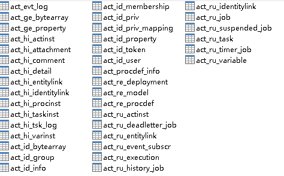

# Flowable6.6 - 升级初体验 | 字痕随行
原创 字痕随行 字痕随行

收录于话题

#流程引擎

53个

**上次**在[Flowable - 运行UI](http://mp.weixin.qq.com/s?__biz=MzI3NTE2NzczMQ==&mid=2650046263&idx=1&sn=eb8424474c464b4641ff03d76d8331b3&chksm=f3083fabc47fb6bd4a882b7d83ab3b5232a697aebfc8f917079d92d1c78ec853413db7f53e6d&scene=21#wechat_redirect)时，遇到了索引超长的问题，后来我又仔细琢磨了一下。

当时运行的语句是：

```Plain Text
CREATE TABLE ACT_APP_DEPLOYMENT (ID_ VARCHAR(255) NOT NULL, NAME_ VARCHAR(255) NULL, CATEGORY_ VARCHAR(255) NULL, KEY_ VARCHAR(255) NULL, DEPLOY_TIME_ datetime NULL, TENANT_ID_ VARCHAR(255) DEFAULT '' NULL, CONSTRAINT PK_ACT_APP_DEPLOYMENT PRIMARY KEY (ID_));

```
因为要创建主键索引，所以遇到了索引超长的问题。开始也没仔细看，就想着增大索引允许的长度，但是未果。

后来，仔细看了看，觉得很蹊跷，一个255字符长度，不至于索引超长。想了想字符和字节的转换，大概问题在于，我开始创建的数据库，字符集类型是UTF-8mb4的。

如果是UTF-8mb4，一个字符可能占用4个字节长度，最大的索引长度是255\*4，自然超长了。

所以，重新创建了一个数据库，改为UTF-8，按照之前的步骤，Flowable-UI终于能够正常的运行起来了。

这里顺带提一下，如果使用Flowable-UI应用创建的流程模型，是保存在act\_de\_model中的，和act\_re\_model没有关系。

**然后**，又把之前的项目升级了一下，使用Flowable6.6.0：

```Plain Text
<dependency>
      <groupId>org.flowable</groupId>
      <artifactId>flowable-spring-boot-starter-process</artifactId>
      <version>6.6.0</version>
</dependency>

```
简单运行了一下，过程中没有发现什么问题。

如果创建一个新库，使用升级后的应用运行，自动创建的数据库表并没有什么变化，如下图所示：



Gitee上分享的项目也已经更新到6.6.0版本：

```Plain Text
https://gitee.com/blackzs/flowable-designer

```
以上，如有错误，欢迎指正。


觉的不错？可以关注我的公众号↑↑↑