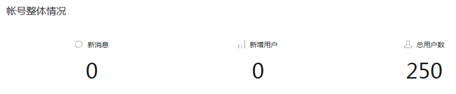
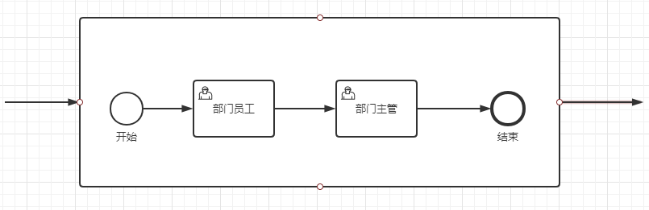
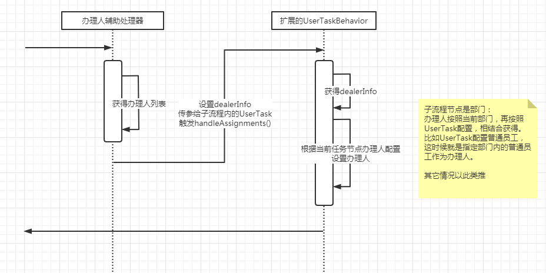

# Flowable6 - 多实例子流程(会签的方案) | 字痕随行
原创 字痕随行 字痕随行

收录于话题

#流程引擎

55个

今天我要写这篇文章的时候，关注量变成了一个傻数，哈哈：

之前有一篇文章，介绍过基于多实例用户任务实现会签的方案 - 《[Flowable6.4 - 会签实现方案](http://mp.weixin.qq.com/s?__biz=MzI3NTE2NzczMQ==&mid=2650046129&idx=1&sn=05d38490b21f17e2a9aa787390ee976f&chksm=f3083e2dc47fb73b9b15b688bf27fe0419ccc7d3cefe5d0bbd25e6492b2eaed11fc7b6949975&scene=21#wechat_redirect)》。

有的场景，使用多实例用户任务无法实现，比如下面这种会签场景：

在会签时，需要“部门普通员工”先审核，然后“部门主管”再审核，这种情况使用多实例用户任务显然无法实现，即使勉强实现，最终所描述的场景肯定有所欠缺。

在使用多实例子流程实现会签时，最主要的两个问题是：

1.  办理人如何分派。
2. 会签结束时，投票结果如何统计。

这篇文章介绍一下我能想到的方案，梳理自己思路的同时，希望对大家有所帮助。

**1\. 办理人如何分派**

在这里首先需要确定一个规则：多实例子流程内，用户任务节点的办理人只能由多实例子流程决定(设置)。

也就是说，在多实例子流程这个元素上设置办理人，多实例子流程按照设置的办理人来决定产生多少个流程实例，然后决定每个流程实例中用户任务的办理人。

多实例子流程设置的办理人只能是：角色、部门、岗位等这种用户组，不能是具体的人员。

如果是具体的人员，我觉得使用子流程就显得毫无意义，比如上面的流程图中，先不说是否符合需求，单说每个子流程都是确定的人来执行的话，用多实例用户任务来实现是一样的。

设定了这个规则以后，基本的实现就和多实例用户任务差不多了：

**2\. 会签结束时，投票结果如何统计**

**首先**，多实例用户任务时，投票的结果以“SIGN\_VOTE\_TASKID”来表示，这在多实例子流程时，就无法使用这种规则了。

这时候，可以使以“SIGN\_VOTE\_EXECUTIONID”表示。其实多实例子流程生成的每一个流程实例，其ExecutionId在执行期间是不变的，这样就能够保证每一次用户任务的操作，可以改变自己所属子流程的投票结果。

**然后**，每一个子流程执行完毕时，如何判断会签是否达到结束条件。这个判断的关键点在于“SIGN\_VOTE\_EXECUTIONID”的设置。

如果像UserTask一样，在每次Complete时，就设置。那么每一次子流程执行完毕，需要进行Completion Condition判断时，如果只是判断是否包含关键字“SIGN\_VOTE\_”，统计到的子流程的投票结果可能是未执行完毕的。

这时候怎么办？我觉得可以通过判断loopCounter参数是否存在，来判断子流程是否结束完毕，然后再通过获得“SIGN\_VOTE\_”作为投票结果。

还有一种方式，就是在流程结束事件内对“SIGN\_VOTE\_”进行设置。当然，每一次流程结束事件，还需要判断这个流程是否是子流程，如果是，再设置。否则的话，正常的主流程结束了也是会抛出这个事件的。

**最后**，以上的方案，我没有想过子流程再嵌套子流程的情况，太复杂了。也没有想过调用子流程的情况，因为调用子流程的机制不太一样，也是比较复杂。

全是文字，因为这只是个想法，我还没有实现呢。如果以上有错误，欢迎指正。

觉的不错？可以关注我的公众号↑↑↑