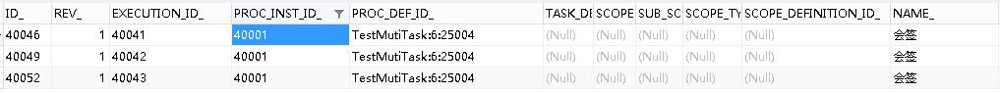
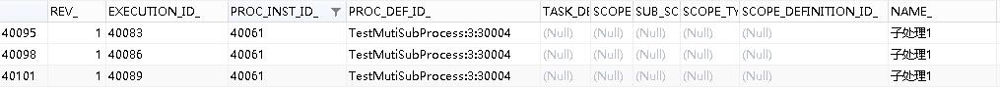

# Flowable6.4多实例流程节点跳转 | 字痕随行

本文将试验一下多实例流程节点的跳转。

**首先，试验一下多实例用户任务节点。**

流程图如下：


可以看到，上图中的“会签”节点为多实例节点，并且为并行模式。启动这个流程，并且使流程流转至“会签”节点：


请求下面的地址：

```Plain
http://localhost:8080/flowabledemo/flow/move/40001/UserTask2/UserTask1

```

流程会由“会签”节点流转至“处理”节点：


继续请求下面的地址：

```Plain
http://localhost:8080/flowabledemo/flow/move/40001/UserTask1/UserTask2

```

流程会由“处理”节点流转至“会签”节点：



**然后，试验一下多实例子流程。**

流程图如下：


启动这个流程，使流程进入子流程节点：



请求下面的地址：

```Plain
http://localhost:8080/flowabledemo/flow/move/40061/SubProcess1/UserTask1

```

流程会由“子流程”流转至“处理”节点：


继续请求下面的地址：

```Plain
http://localhost:8080/flowabledemo/flow/move/40061/UserTask1/SubProcess1

```

流程会由“处理”流转至“子流程”节点：


如果子流程内的节点需要跳转，可以使用以下代码进行跳转：

```java
/**
 * 移动流程实例
 */
@RequestMapping(value = "moveExecution/{proInstId}/{toNodeId}")
public void moveExecution(@PathVariable("proInstId") String proInstId,
                          @PathVariable("toNodeId") String toNodeId) {
    runtimeService.createChangeActivityStateBuilder()
            .moveExecutionToActivityId(proInstId, toNodeId)
            .changeState();
}

```

请求以下地址：

```Plain
http://localhost:8080/flowabledemo/flow/moveExecution/40122/SubUserTask2

```

EXECUTION\_ID等于40122的子流程将跳转至“子处理2”，如图：


以上，就是本次试验的全部记录。


觉的不错？可以关注我的公众号↑↑↑
