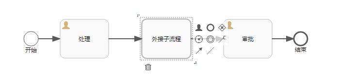

# Flowable6.4子流程节点跳转 | 字痕随行
​本文将继续试验一下子流程的节点跳转，包含以下两种子流程：内嵌子流程和调用子流程。

**首先，试验一下内嵌子流程。**

流程图如下：


启动流程，流程处于“处理”节点：


使用以下代码进行跳转：

```java
 /**
 * 移动节点
 */
@RequestMapping(value = "move/{proInstId}/{nodeId}/{toNodeId}")
public void move(@PathVariable("proInstId") String proInstId,
                 @PathVariable("nodeId") String nodeId,
                 @PathVariable("toNodeId") String toNodeId) {
    runtimeService.createChangeActivityStateBuilder()
            .processInstanceId(proInstId)
            .moveActivityIdTo(nodeId, toNodeId)
            .changeState();
}

```
在浏览器地址栏中输入跳转地址进行测试：

```Plain Text
 http://localhost:8080/flowabledemo/flow/move/37501/UserTask1/SubUserTask1

```
节点可以由UserTask1跳转至SubUserTask1:


同样的，节点也可以由SubUserTask1跳转至UserTask1。

**然后，试验一下调用子流程。**

流程图如下：



外接的子流程如下（见[上一篇](http://www.blackzs.com/archives/1377)）：


启动流程，流程处于“处理”节点：


因为进入到外接子流程时，会单独启动一个流程实例，所以跳转的代码也比较特殊，如下所示：

```java
/**
 * 移动到子流程
 * @param proInstId
 * @param subProcess
 * @param subNodeId
 * @param parentNodeId
 */
@RequestMapping(value = "moveToSub/{proInstId}/{parentNodeId}/{subNodeId}/{subProcess}")
public void moveToSub(@PathVariable("proInstId") String proInstId,
                      @PathVariable("subProcess") String subProcess,
                      @PathVariable("subNodeId") String subNodeId,
                      @PathVariable("parentNodeId") String parentNodeId) {
    runtimeService.createChangeActivityStateBuilder()
            .processInstanceId(proInstId)
            .moveActivityIdToSubProcessInstanceActivityId(parentNodeId, subNodeId, subProcess)
            .changeState();
}

```
其中参数subProcess为节点“外接子流程”的ID，如下图：


此时在浏览器地址栏输入：

```Plain Text
http://localhost:8080/flowabledemo/flow/moveToSub/37530/UserTask1/UserTask1/SubProcess

```
可以跳转至子流程内的UserTask1节点：


如果需要将流程由子流程内的UserTask1节点跳转至父流程的“审批(UserTask2)”节点，则需要另外一段代码：

```java
/**
 * 移动到父节点
 * @param subProInstId
 * @param subNodeId
 * @param parentNodeId
 */
@RequestMapping(value = "moveToParent/{subProInstId}/{subNodeId}/{parentNodeId}")
public void moveToParent(@PathVariable("subProInstId") String subProInstId,
                         @PathVariable("subNodeId") String subNodeId,
                         @PathVariable("parentNodeId") String parentNodeId) {
    runtimeService.createChangeActivityStateBuilder()
            .processInstanceId(subProInstId)
            .moveActivityIdToParentActivityId(subNodeId, parentNodeId)
            .changeState();
}

```
此时在浏览器地址栏输入：

```Plain Text
http://localhost:8080/flowabledemo/flow/moveToParent/37543/UserTask1/UserTask2

```
流程将跳转至“审批”节点：


以上就是本次关于子流程节点跳转的全部试验过程，下一次将试验一下多实例节点的跳转。


觉的不错？可以关注我的公众号↑↑↑