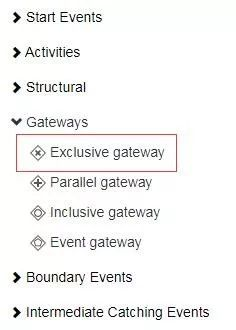
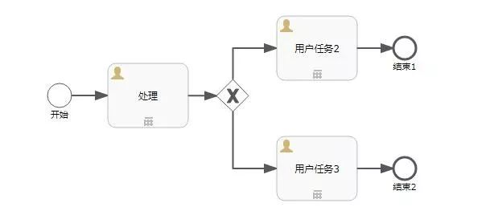
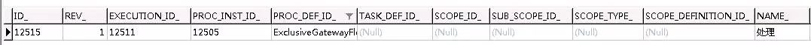
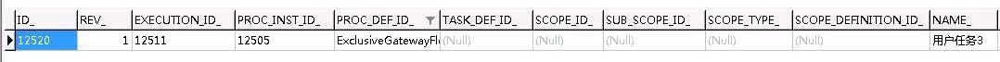
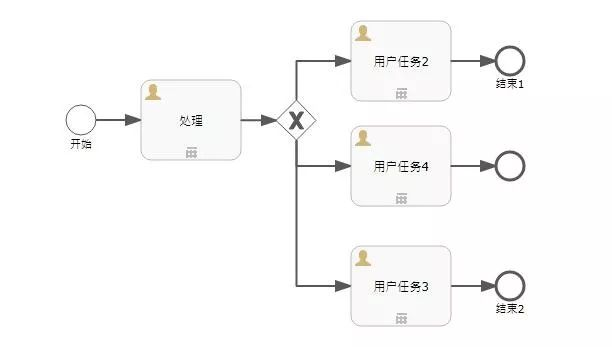
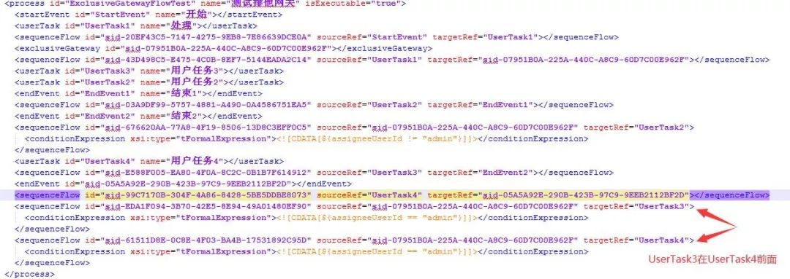
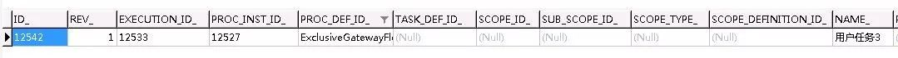

# Flowable6.4 - 排他网关 | 字痕随行
原创 字痕随行 字痕随行

收录于话题

#流程引擎

52个

一般情况下，通过开始事件、用户任务、网关、结束事件，就可以组成一个简单的顺序流。

在之前的文章中，开始事件、用户任务、结束事件都有过介绍，这次就来着重介绍一下网关中的排他网关。

顾名思义，排他网关只会选择一条顺序流，即当流程到达排他网关这个节点时，会按顺序(XML中定义的前后顺序)选择出口顺序流(sequenceFlow)计算其定义的条件，如果被计算的条件为True，则按照该出口顺序流向下执行。如果所有出口顺序流的条件都为False，则会抛出异常。

在流程设计器内，排他网关位于Gateways内，其英文名称为Exclusive gateway，如下图所示：



下面就以一个简单流程实验一下排他网关的用法，流程图如下：



由排他网关到达用户任务2的Flow condition设置为：

```Plain Text
${assigneeUserId != "admin"}

```
由排他网关到达用户任务3的Flow condition设置为：

```Plain Text
${assigneeUserId == "admin"}

```
启动流程时如下设置：

```Java
map.put("assigneeUserId", "admin");
runtimeService.startProcessInstanceByKey(modelData.getKey(), "myTestFlow1", map);

```
整体的流程运行如下：



*启动后*



*通过排他网关后*

可以看到，由排他网关到达用户任务3的Flow condition为True，所以流程会自动流转至对应的节点。

如果新加入一个节点，如下图：



由排他网关到达用户任务4的Flow condition设置为：

```Plain Text
${assigneeUserId == "admin"}

```
然后再启动流程，此时流程到达排他网关的流转规则会按照XML中的顺序流转，如下图所示：



实际运行时的结果也是如此：



如果将用户任务3和用户任务4的Flow condition设置为：

```Plain Text
${assigneeUserId != "admin"}

```
此时，再次启动流程，并流转，将输出异常：

```Plain Text
org.springframework.web.util.NestedServletException: Request processing failed; 
nested exception is org.flowable.common.engine.api.FlowableException: 
No outgoing sequence flow of the exclusive gateway 'sid-07951B0A-225A-440C-A8C9-60D7C00E962F' could be selected for continuing the process

```
大概的意思就是：

排他网关没有任何向外路径，流程无法流转。

以上，相继介绍了排他网关的用法、条件生效的顺序、全都不符合条件时所产生的异常。

可以点击”阅读原文“查看流程的XML文件，如有错误欢迎指出和讨论。


觉的不错？可以关注我的公众号↑↑↑