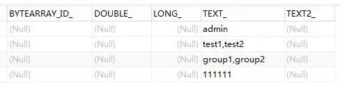
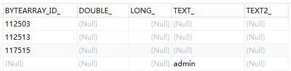
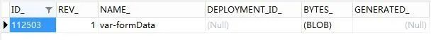

# Flowable6.4 - 流程变量
原创 字痕随行 字痕随行

收录于话题

#流程引擎

52个

这次分享一下流程变量的相关API，有关流程变量的解释如下：


***流程实例按步骤执行时，需要使用一些数据。\_\_在Flowable中，这些数据称作“变量(variable)”，并会存储在数据库中。变量可以用在表达式中（例如在排他网关中用于选择正确的出口路径），也可以在Java服务任务(service task)中用于调用外部服务（例如为服务调用提供输入或结果存储），等等。***

有关流程局部变量的解释如下：


***局部变量将只在该执行中可见，对执行树的上层则不可见。任务与执行一样，可以持有局部变量，其生存期为任务持续的时间。***


流程变量有以下几种写入方式：

**1\. 启动流程时。**

启动流程时写入变量的代码如下：

```Java
//声明一个JsonObject
JSONObject jsonObject = new JSONObject();
jsonObject.put("id", "1");
jsonObject.put("name", "zhangsan");
jsonObject.put("desc", "sssssssssssssss");
//将JsonObject放入map中
map.put("formData", jsonObject);
//将map作为参数传递
ProcessInstance processInstance = runtimeService.startProcessInstanceByKey(modelData.getKey(), "myTestFlow1", map);

```
**2\. 完成Task时。**

完成Task时写入变量的代码如下：

```Java
Map<String, Object> map = new HashMap<>();
//声明一个JsonObject
JSONObject jsonObject = new JSONObject();
jsonObject.put("id", "2");
jsonObject.put("name", "zhangsan2");
jsonObject.put("desc", "dddddddddddddddddddd");
//将JsonObject放入map中
map.put("formData", jsonObject);
//声明局部变量
Map<String, Object> localMap = new HashMap<>();
localMap.put("num", 1);
localMap.put("string", "1");
//将map作为流程变量，localMap作为局部变量
taskService.complete(taskId, map, localMap);

```
**3\. 通过set方法**。

通过TaskService内的Set方法的代码如下：

```Java
Map<String, Object> map = new HashMap<>();
//声明一个JsonObject
JSONObject jsonObject = new JSONObject();
jsonObject.put("id", "2");
jsonObject.put("name", "zhangsan2");
jsonObject.put("desc", "dddddddddddddddddddd");
//将JsonObject放入map中
map.put("formData", jsonObject);
//声明局部变量
Map<String, Object> localMap = new HashMap<>();
localMap.put("num", 1);
localMap.put("string", "1");
//将map作为流程变量，localMap作为局部变量
taskService.setVariables(taskId, map);
taskService.setVariablesLocal(taskId, localMap);

```
**流程变量的获得方式如下：**


1\. 通过ExecutionId获得流程变量，代码如下：

```Java
//获得流程变量
Map<String, Object> execMap = runtimeService.getVariables(task.getExecutionId());
//获得局部变量
Map<String, Object> execLocalMap = runtimeService.getVariablesLocal(task.getExecutionId());

```
2\. 通过TaskId获得流程变量，代码如下：

```Java
//获得流程变量
Map<String, Object> map = taskService.getVariables(taskId);
//获得局部变量
Map<String, Object> localMap = taskService.getVariablesLocal(taskId);

```
**需要特别注意的是：**

流程变量在数据库中的存储方式。一般情况下一个流程变量会在act\_ru\_variable中存储为一行，如果格式为普通格式，就会在这张表中可见，如下图：



但是，当传入的参数为复杂类型时，比如上文中传入的JsonObject，这时流程变量会存储为二进制格式，通过BYTEARRAY\_ID\_字段关联存储至表act\_ge\_bytearray中，如下图：



*act\_ru\_variable*



*act\_ge\_bytearray*

以上就是关于流程变量的分享，如果有问题欢迎指正讨论。


觉的不错？可以关注我的公众号↑↑↑