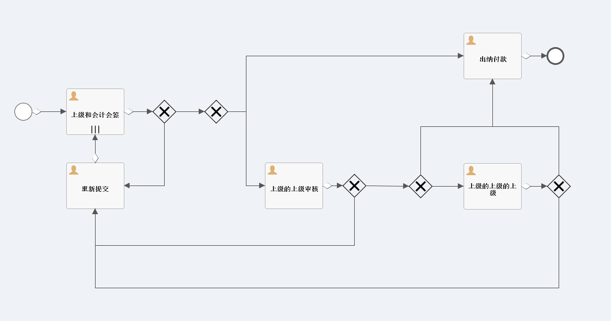
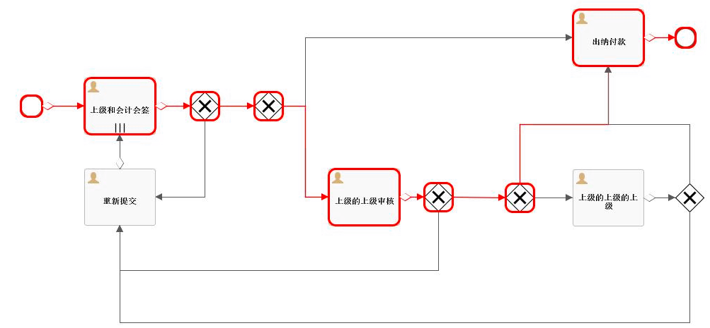

# Flowable6.4 - 绘制流程图 | 字痕随行
原创 字痕随行 字痕随行

收录于话题

#Flowable 1

#流程引擎 52

一般需要流程图的场景：

1\. 发起流程时，需要从全局了解整体情况、所涉及的经办人，便于必要时进行催办或者发起线下沟通。

2\. 流程运行时或结束后，查看流程所经历的办理过程。

在Flowable中，流程图的绘制可以参见：

```Java
org.flowable.image.impl.DefaultProcessDiagramGenerator

```
本文将分成两部分，简单介绍一下流程图的绘制和办理节点的高亮现实。

**首先**，如何绘制流程图。

总共三个步骤：

1\. 获得流程定义的BpmnModel。

2\. 根据BpmnModel获得图片流。

3\. 输出图片流。

直接上代码了，基本上都是Flowable Api的使用：

```Java
/**
 * @param type 输入的图片类型(png或jpg)
 * @param modelId 流程模型标识
 * @param response HttpServletResponse
 */
@ResponseBody
@RequestMapping(value = "diagram/{type}/{modelId}")
public void getJpgDiagram(@PathVariable(value = "type") String type,
                          @PathVariable(value = "modelId") String modelId,
                          HttpServletResponse response) {
    try {
        //根据modelId或者BpmnModel
        Model modelData = repositoryService.getModel(modelId);
        ExtBpmnJsonConverter jsonConverter = new ExtBpmnJsonConverter();
        byte[] modelEditorSource = repositoryService.getModelEditorSource(modelData.getId());
        JsonNode editorNode = new ObjectMapper().readTree(modelEditorSource);
        BpmnModel bpmnModel = jsonConverter.convertToBpmnModel(editorNode);
        //获得图片流
        DefaultProcessDiagramGenerator diagramGenerator = new DefaultProcessDiagramGenerator();
        InputStream inputStream = diagramGenerator.generateDiagram(
                bpmnModel,
                type,
                Collections.emptyList(),
                Collections.emptyList(),
                "宋体",
                "宋体",
                "宋体",
                null,
                1.0,
                false);
        //输出为图片
        IOUtils.copy(inputStream, response.getOutputStream());
        response.setHeader("Content-Disposition", "attachment; filename=" + bpmnModel.getMainProcess().getId() + "." + type);
        response.flushBuffer();
    } catch (Exception e) {
        e.printStackTrace();
    }
}

```
需要注意的是，如果未指定文字信息，中文就会以方框显示。如果设定了文字，但是输出还是以方框显示，可以尝试在设置Configuration时，加入：

```Java
configuration.setActivityFontName("宋体");
configuration.setLabelFontName("宋体");

```
效果如下：



**然后**，如何高亮显示已经办理的节点。

除了上面的三步之外，需要预先提取高亮的节点和Sequence Flow。即设置上文中的diagramGenerator.generateDiagram方法中的两个emptyList。

依然是直接上代码：

```Java
/**
 * @param type     输入的图片类型(png或jpg)
 * @param modelId  流程模型标识
 * @param instId   流程实例标识
 * @param response HttpServletResponse
 */
@ResponseBody
@RequestMapping(value = "acitvityDiagram/{type}/{modelId}/{instId}")
public void getJpgActivityDiagram(@PathVariable(value = "type") String type,
                                  @PathVariable(value = "modelId") String modelId,
                                  @PathVariable(value = "instId") String instId,
                                  HttpServletResponse response) {
    //获得已经办理的历史节点
    List<HistoricActivityInstance> activityInstances = historyService.createHistoricActivityInstanceQuery().processInstanceId(instId).orderByHistoricActivityInstanceStartTime().asc().list();
    List<String> activties = new ArrayList<>();
    List<String> flows = new ArrayList<>();
    for (HistoricActivityInstance activityInstance : activityInstances) {
        if ("sequenceFlow".equals(activityInstance.getActivityType())) {
            //需要高亮显示的连接线
            flows.add(activityInstance.getActivityId());
        } else {
            //需要高亮显示的节点
            activties.add(activityInstance.getActivityId());
        }
    }

    try {
        //根据modelId或者BpmnModel
        Model modelData = repositoryService.getModel(modelId);
        ExtBpmnJsonConverter jsonConverter = new ExtBpmnJsonConverter();
        byte[] modelEditorSource = repositoryService.getModelEditorSource(modelData.getId());
        JsonNode editorNode = new ObjectMapper().readTree(modelEditorSource);
        BpmnModel bpmnModel = jsonConverter.convertToBpmnModel(editorNode);
        //获得图片流
        DefaultProcessDiagramGenerator diagramGenerator = new DefaultProcessDiagramGenerator();
        InputStream inputStream = diagramGenerator.generateDiagram(
                bpmnModel,
                type,
                activties,
                flows,
                "宋体",
                "宋体",
                "宋体",
                null,
                1.0,
                false);
        //输出图片
        IOUtils.copy(inputStream, response.getOutputStream());
        response.setHeader("Content-Disposition", "attachment; filename=" + bpmnModel.getMainProcess().getId() + "." + type);
        response.flushBuffer();
    } catch (Exception e) {
        e.printStackTrace();
    }
}

```
最终的效果如下：



以上，如有错误，欢迎指正。


觉的不错？可以关注我的公众号↑↑↑