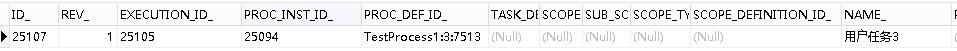
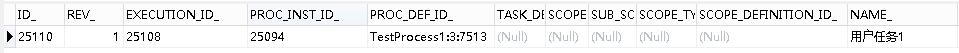

# Flowable6.4节点跳转初探 | 字痕随行
Flowable6已经实现了流程节点间的跳转，本次就初探一下相关的API。  

相关的示例代码在Flowable的开源代码中可以找到，具体的位置如下：

```Plain Text
\flowable\6.4.2\modules\flowable-engine\src\test\java\org\flowable\engine\test\api\runtime\changestate

```
本次试验先介绍普通节点间的跳转，主要用到的API如下：

```java
//普通节点间跳转
runtimeService.createChangeActivityStateBuilder()
                .processInstanceId(proInstId)
                .moveActivityIdTo(nodeId, toNodeId)
                .changeState();

```
**1\. 普通流程图**


这种流程下，节点的跳转非常容易，这里做了一个rest接口来试验，代码如下：

```java
/**
 * 移动节点
 */
@RequestMapping(value = "move/{proInstId}/{nodeId}/{toNodeId}")
public void move(@PathVariable("proInstId") String proInstId,
                 @PathVariable("nodeId") String nodeId,
                 @PathVariable("toNodeId") String toNodeId) {
    runtimeService.createChangeActivityStateBuilder()
            .processInstanceId(proInstId)
            .moveActivityIdTo(nodeId, toNodeId)
            .changeState();
}

```
流程启动后，在地址栏输入：

```Plain Text
http://localhost:8080/flowabledemo/flow/move/25094/UserTask1/UserTask3

```
流程节点由UserTask1变化为UserTask3：



再在地址栏输入：

```Plain Text
http://localhost:8080/flowabledemo/flow/move/25094/UserTask3/UserTask1

```
流程节点由UserTask3变化为UserTask1：



**2\. 多实例流程图**

此处以并行的多实例节点为例，相关的代码同第一节。流程图如下：


流程启动后，在地址栏输入：

```Plain Text
http://localhost:8080/flowabledemo/flow/move/25005/UserTask1/UserTask2

```
流程节点由UserTask1变为UserTask2，数据库表内会创建三个新的流程实例，如下图：


完成一个任务节点，流程变为：


在地址栏输入：

```Plain Text
http://localhost:8080/flowabledemo/flow/move/25005/UserTask2/UserTask3

```
流程节点由UserTask2变为UserTask3:


在地址栏再次输入：

```Plain Text
http://localhost:8080/flowabledemo/flow/move/25005/UserTask3/UserTask2

```
流程节点再次变为UserTask2，数据库表内再次创建三个新的流程实例，如下图：


其它复杂的流程，比如分支、子流程等，会在接下来的实验中带来。


觉的不错？可以关注我的公众号↑↑↑