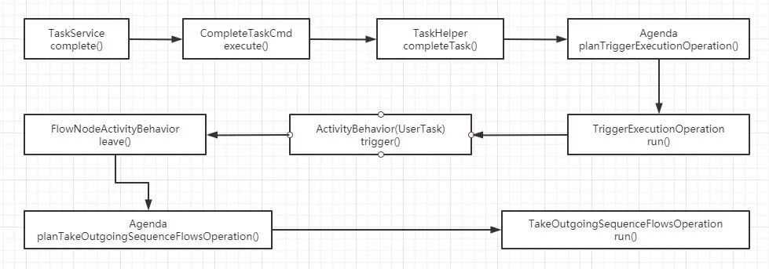
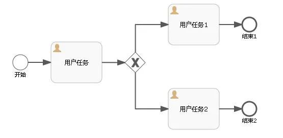

# Flowable6 - 获得下一节点 | 字痕随行
原创 字痕随行 字痕随行

收录于话题

#流程引擎

55个

打了个疫苗，找个借口歇一下。面试太多，再找个借口歇一下。没啥内容可写，继续歇一下。

躺着是最舒服的。好了，言归正传（本文基于Flowable6.6测试通过）。

有的集成了流程引擎的系统提供流程执行预测功能，说白了就是按照流程图提前跑一下，看看会到达哪个节点。

要实现这个功能，大概的步骤如下：

1. 获得当前的节点。
2. 获得当前节点的出口连接线。
3. 按照连接线获得下一个节点。
4. 如果是非用户任务节点，则继续重复第2和第3步。
5. 返回最终的用户任务节点。

从编码上来说，麻烦的点在于：

1.  连接线的目标节点。
2. 连接线如果有条件，如何判断是否执行。

其实以上的点都可以通过Flowable的源码得到答案。还是通过TaskService的complete()方法入手，大概的代码查找过程如下：



在最后一个run()方法中，有一段关键的代码：

```Java
if (currentFlowElement instanceof FlowNode) {
    handleFlowNode((FlowNode) currentFlowElement);
} else if (currentFlowElement instanceof SequenceFlow) {
    handleSequenceFlow();
}

```
其实大概的过程就是，complete用户任务时，会触发UserTask Behavior中的leave()方法离开此节点，从而触发寻找出口的连接线，就能找到我们所需的代码了：

```Java
// Determine which sequence flows can be used for leaving
List<SequenceFlow> outgoingSequenceFlows = new ArrayList<>();
for (SequenceFlow sequenceFlow : flowNode.getOutgoingFlows()) {

    String skipExpressionString = sequenceFlow.getSkipExpression();
    if (!SkipExpressionUtil.isSkipExpressionEnabled(skipExpressionString, sequenceFlow.getId(), execution, commandContext)) {

        //关键的在这里
        if (!evaluateConditions
                || (evaluateConditions && ConditionUtil.hasTrueCondition(sequenceFlow, execution) && (defaultSequenceFlowId == null || !defaultSequenceFlowId.equals(sequenceFlow.getId())))) {
            outgoingSequenceFlows.add(sequenceFlow);
        }

    } else if (flowNode.getOutgoingFlows().size() == 1 || SkipExpressionUtil.shouldSkipFlowElement(
                    skipExpressionString, sequenceFlow.getId(), execution, commandContext)) {

        // The 'skip' for a sequence flow means that we skip the condition, not the sequence flow.
        outgoingSequenceFlows.add(sequenceFlow);
    }
}

```
最关键的代码就是这个了：

```Java
ConditionUtil.hasTrueCondition(sequenceFlow, execution)

```
上面这段代码就是判断连接线是否符合执行条件，是不是会流转到这条连接线的所连接的节点。至于参数execution，其实是为了使用其携带的参数计算表达式。

麻烦的点基本解决了，于是我简单的写了一段代码做测试：

```Java
private FlowElement getTargetFlowElement(Execution execution, FlowElement sourceFlowElement) {
    //遇到下一个节点是UserTask就返回
    FlowElement flowElement = null;
    if (sourceFlowElement instanceof FlowNode) {
        //当前节点必须是FlowNode才做处理，比如UserTask或者GateWay
        FlowNode thisFlowNode = (FlowNode) sourceFlowElement;
        if (thisFlowNode.getOutgoingFlows().size() == 1) {
            //如果只有一条连接线，直接找这条连接线的出口节点，然后继续递归获得接下来的节点
            SequenceFlow sequenceFlow = thisFlowNode.getOutgoingFlows().get(0);
            FlowElement targetFlowElement = sequenceFlow.getTargetFlowElement();
            if (targetFlowElement instanceof UserTask) {
                flowElement = targetFlowElement;
            } else {
                flowElement = getTargetFlowElement(execution, targetFlowElement);
            }
        } else if (thisFlowNode.getOutgoingFlows().size() > 1) {
            //如果有多条连接线，遍历连接线，找出一个连接线条件执行为True的，获得它的出口节点
            for (SequenceFlow sequenceFlow : thisFlowNode.getOutgoingFlows()) {
                boolean result = true;
                if (StrUtil.isNotBlank(sequenceFlow.getConditionExpression())) {
                    //计算连接线上的表达式
                    Expression expression = processEngineConfiguration.getExpressionManager().createExpression(sequenceFlow.getConditionExpression());
                    Condition condition = new UelExpressionCondition(expression);
                    result = condition.evaluate(sequenceFlow.getId(), (ExecutionEntity) execution);
                }
                if (result) {
                    FlowElement targetFlowElement = sequenceFlow.getTargetFlowElement();
                    if (targetFlowElement instanceof UserTask) {
                        flowElement = targetFlowElement;
                    } else {
                        flowElement = getTargetFlowElement(execution, targetFlowElement);
                    }
                }
            }
        }
    }
    return flowElement;
}

```
差不多，简单的流程图，比如下面这个，还是能够正常获得的：



以上，如有错误，欢迎指正。


觉的不错？可以关注我的公众号↑↑↑