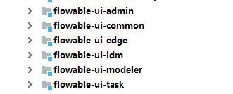
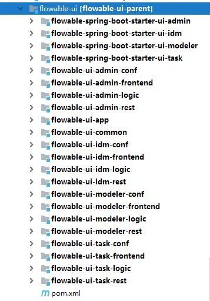

# Flowable - 运行UI | 字痕随行
原创 字痕随行 字痕随行

收录于话题

#流程引擎

53个

Flowable最近的版本已经是6.6了，源码的下载地址：

```Plain Text
https://github.com/flowable/flowable-engine.git

```
不过github的地址下载速度堪忧，所以可以尝试一下国内的镜像：

```Plain Text
https://gitee.com/mirrors/flowable.git

```
之前一直介绍的都是如何整合自带的编辑器，如果只是想入门，或者想体验一下Flowable，可以直接使用其自带的管理界面。

**在6.4版本内**，它的UI是分为多个Module管理的，如下图：



设计器需要启动idm和modeler(它们都是基于SpringBoot的)，然后访问地址：

```Plain Text
http://localhost:8080/flowable-idm/

```
输入账户(admin)和密码(test)，就可以进入流程模型的创建和设计界面。

**而在6.6版本**，整个UI包整合为一个包，如下图：



在6.6中，如果想要尝试创建模型，需要运行位于flowable-ui-app中的应用，启动后访问地址：

```Plain Text
http://localhost:8080/flowable-ui/

```
用户名和密码同6.4版本，即可进入。这个界面是原来所有管理界面的统一入口，所以访问和使用起来体验会更加好一些。

如果从未更改过配置文件，应用运行时，默认使用的是H2数据库。

**以下仅做参考，需要自行尝试**

如果希望使用Mysql来运行flowable-ui，则需要以下几步：

1\. 检查flowable-ui-app的pom文件内是否包含mysql-connector，如果未包含，则增加包：

```Plain Text
<dependency>
    <groupId>mysql</groupId>
    <artifactId>mysql-connector-java</artifactId>
</dependency>

```
2\. 更改flowable-default.properties内的数据库地址、用户名和密码，注意数据库链接需要增加&serverTimezone=UTC。

3\. 运行distro/sql/create/all中的数据库脚本。

4\. 运行应用。

我卡在了第3步，因为我的数据库版本有点低，还要更改数据库属性，使其支持大长度索引。因为时间不够，我就没再尝试了，见谅。

以上，简单的使用说明，接下来会尝试一下新的版本。如有错误，欢迎指正。


觉的不错？可以关注我的公众号↑↑↑