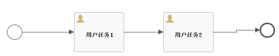

# Flowable6.6-再谈自定义缓存 | 字痕随行

很久之前，我写过两篇文章来介绍Flowable的自定义缓存，然后完败。

这次再折腾这个，起因是群里的大佬告诉我可以用编辑字节码的方式来实现，我就寻了个空又重新折腾了一下。

先说我折腾之后的结论：

1. 字节码的方式我实在搞不定，需要各种调试，实在没时间搞了。
2. 仍旧不建议使用进程外缓存，官方挖的坑也太多了些。
3. 这次不需要重新解析，但是需要递归处理，再加上序列化和反序列化，性价比贼差。

我遇到的坑点：

1. 官方在一些属性上标识了@JsonIgnore，但是反序列化之后的对象缺需要这些属性不为Null。
2. 某些Behavior没有默认的构造函数，导致反序列化失败，比如UserTaskActivityBehavior。
3. 有很多循环引用，比如FlowElement，循环引用直接导致堆栈溢出。
4. getter、setter不规范，有的包含了业务逻辑，返回的类型和属性类型不一致。
5. 官方用Object类型来恶心人。

我解决的办法：

1. 把标识了@JsonIgnore但是却需要用到属性单独处理get、set。
2. 重新定义一个子类，给子类定义默认构造函数，使用子类替代父类。
3. 一般循环引用的官方都给了@JsonIgnore，所以使用Jackson来处理序列化和反序列化。
4. 不要使用getter、setter来进行序列化，只使用原始属性。
5. 对Object类型进行特殊处理。

下面是一些关键的代码（非生产代码，凑合参考吧）：

```java
/** Redis配置 **/
@Bean
public RedisTemplate<String, Object> redisTemplate(RedisConnectionFactory factory) {

    RedisTemplate<String, Object> template = new RedisTemplate<>();
    // 配置连接工厂
    template.setConnectionFactory(factory);
    //使用Jackson作为序列化和反序列化工具
    Jackson2JsonRedisSerializer<Object> jsonRedisSerializer = new Jackson2JsonRedisSerializer<>(Object.class);
    ObjectMapper objectMapper = new ObjectMapper();
    objectMapper.enableDefaultTyping(ObjectMapper.DefaultTyping.NON_FINAL, JsonTypeInfo.As.PROPERTY);
    objectMapper.configure(DeserializationFeature.FAIL_ON_UNKNOWN_PROPERTIES, false);
    objectMapper.configure(MapperFeature.USE_GETTERS_AS_SETTERS, false);
    objectMapper.configure(SerializationFeature.FAIL_ON_EMPTY_BEANS, false);
    objectMapper.setVisibility(GETTER, JsonAutoDetect.Visibility.NONE);
    objectMapper.setVisibility(SETTER, JsonAutoDetect.Visibility.NONE);
    objectMapper.setVisibility(FIELD, JsonAutoDetect.Visibility.ANY);
    jsonRedisSerializer.setObjectMapper(objectMapper);
    //FlowableEventType这个类是个枚举，需要特殊处理
    SimpleModule simpleModule = new SimpleModule();
    simpleModule.addKeyDeserializer(FlowableEventType.class, new KeyDeserializer() {
        @Override
        public Object deserializeKey(String s, DeserializationContext deserializationContext) throws IOException {
            //因为是测试所以偷懒了，也懒得改了
            return FlowableEngineEventType.TASK_CREATED;
        }
    });
    objectMapper.registerModule(simpleModule);

    template.setKeySerializer(new StringRedisSerializer());
    template.setValueSerializer(jsonRedisSerializer);
    template.setHashKeySerializer(new StringRedisSerializer());
    template.setHashValueSerializer(jsonRedisSerializer);

    return template;
}
```
```java
@Configuration
public class FlowableConfig {

    @Primary
    @Bean(name = "processEngineConfiguration")
    public SpringProcessEngineConfiguration getSpringProcessEngineConfiguration(@Qualifier("dataSource") DataSource dataSource, @Qualifier("transactionManager") DataSourceTransactionManager transactionManager) {
        SpringProcessEngineConfiguration configuration = new SpringProcessEngineConfiguration();
        configuration.setDataSource(dataSource);
        configuration.setTransactionManager(transactionManager);
        configuration.setDatabaseSchemaUpdate("true");
        configuration.setAsyncExecutorActivate(true);
        configuration.setActivityFontName("宋体");
        configuration.setLabelFontName("宋体");
        //使用自定义的UserTaskBehavior
        configuration.setActivityBehaviorFactory(new ExtActivityBehaviorFactory());
        //使用进程外缓存
        configuration.setProcessDefinitionCache(new ProcessDefinitionRedisCache());
        return configuration;
    }
}
```
```java
public class ProcessDefinitionRedisCache implements DeploymentCache<ProcessDefinitionCacheEntry> {

    @Override
    public ProcessDefinitionCacheEntry get(String id) {
        RedisTemplate<String, Object> redisTemplate = BeanFactory.getBean("redisTemplate", RedisTemplate.class);
        if (null == redisTemplate) {
            return null;
        }
        Object objectDef = redisTemplate.opsForValue().get(id + "_def");
        Object objectProc = redisTemplate.opsForValue().get(id + "_proc");
        Object objectModel = redisTemplate.opsForValue().get(id + "_model");
        Object objectSupport = redisTemplate.opsForValue().get(id + "_support");
        Object objectBehavior = redisTemplate.opsForValue().get(id + "_behavior");
        Object objectSource = redisTemplate.opsForValue().get(id + "_source");
        Object objectTarget = redisTemplate.opsForValue().get(id + "_target");
        if (null == objectDef || null == objectProc
                || null == objectModel || null == objectSupport
                || null == objectBehavior || null == objectSource
                || null == objectTarget) {
            return null;
        }

        ProcessDefinitionEntity processDefinitionEntity = (ProcessDefinitionEntity) objectDef;
        BpmnModel bpmnModel = (BpmnModel) objectModel;
        Process process = (Process) objectProc;
        FlowableEventSupport eventSupport = (FlowableEventSupport) objectSupport;
        bpmnModel.setEventSupport(eventSupport);
        //处理循环引用那些属性
        setOther(objectBehavior, objectSource, objectTarget, process, bpmnModel);

        ProcessDefinitionCacheEntry cacheEntry = new ProcessDefinitionCacheEntry(processDefinitionEntity, bpmnModel, process);

        return cacheEntry;
    }

    @Override
    public boolean contains(String id) {
       
    }

    @Override
    public void add(String id, ProcessDefinitionCacheEntry processDefinitionCacheEntry) {
        RedisTemplate<String, Object> redisTemplate = BeanFactory.getBean("redisTemplate", RedisTemplate.class);
        if (null != redisTemplate) {
            redisTemplate.opsForValue().set(id + "_def", processDefinitionCacheEntry.getProcessDefinition());
            redisTemplate.opsForValue().set(id + "_proc", processDefinitionCacheEntry.getProcess());
            redisTemplate.opsForValue().set(id + "_model", processDefinitionCacheEntry.getBpmnModel());
            //下面都是需要特殊处理的属性
            FlowableEventSupport eventSupport = (FlowableEventSupport) processDefinitionCacheEntry.getBpmnModel().getEventSupport();
            redisTemplate.opsForValue().set(id + "_support", eventSupport);

            Map<String, Object> mapBehavior = new HashMap<>();
            Map<String, FlowElement> mapSource = new HashMap<>();
            Map<String, FlowElement> mapTarget = new HashMap<>();
            for (FlowElement flowElement : processDefinitionCacheEntry.getProcess().getFlowElements()) {
                if (flowElement instanceof FlowNode) {
                    FlowNode flowNode = (FlowNode) flowElement;
                    mapBehavior.put(flowElement.getId(), flowNode.getBehavior());
                }
                if (flowElement instanceof SequenceFlow) {
                    SequenceFlow sequenceFlow = (SequenceFlow) flowElement;
                    mapSource.put(flowElement.getId(), sequenceFlow.getSourceFlowElement());
                    mapTarget.put(flowElement.getId(), sequenceFlow.getTargetFlowElement());
                }
            }
            redisTemplate.opsForValue().set(id + "_behavior", mapBehavior);
            redisTemplate.opsForValue().set(id + "_source", mapSource);
            redisTemplate.opsForValue().set(id + "_target", mapTarget);
        }
    }

    @Override
    public void remove(String id) {
       
    }

    @Override
    public void clear() {
        
    }

    @Override
    public Collection<ProcessDefinitionCacheEntry> getAll() {
        
    }

    @Override
    public int size() {
        
    }

    /**
     * 要递归将循环引用的那些属性赋值，这是最麻烦的地方
     * 测试的是一个简单的流程，所以只有这些节点，复杂点的我也不知道行不行啊
    */
    private void setOther(Object objectBehavior, Object objectSource, Object objectTarget,
                          Process process, BpmnModel bpmnModel) {
        Map<String, Object> mapBehavior = (Map<String, Object>) objectBehavior;
        Map<String, FlowElement> mapSource = (Map<String, FlowElement>) objectSource;
        Map<String, FlowElement> mapTarget = (Map<String, FlowElement>) objectTarget;
        for (FlowElement flowElement : process.getFlowElements()) {
            setFlowElement(flowElement, mapBehavior, mapSource, mapTarget);
        }
        for (Process proc : bpmnModel.getProcesses()) {
            for (FlowElement flowElement : proc.getFlowElements()) {
                setFlowElement(flowElement, mapBehavior, mapSource, mapTarget);
            }
        }
        for (FlowElement flowElement : process.getFlowElementMap().values()) {
            setFlowElement(flowElement, mapBehavior, mapSource, mapTarget);
        }
        for (Process proc : bpmnModel.getProcesses()) {
            for (FlowElement flowElement : proc.getFlowElementMap().values()) {
                setFlowElement(flowElement, mapBehavior, mapSource, mapTarget);
            }
        }
        FlowNode flowNode = (FlowNode) process.getInitialFlowElement();
        flowNode.setBehavior(mapBehavior.get(flowNode.getId()));
        setFlowElement(flowNode, mapBehavior, mapSource, mapTarget);
    }

    private void setFlowElement(FlowElement flowElement,
                                Map<String, Object> mapBehavior,
                                Map<String, FlowElement> mapSource,
                                Map<String, FlowElement> mapTarget) {
        if (flowElement instanceof FlowNode) {
            FlowNode flowNode = (FlowNode) flowElement;
            flowNode.setBehavior(mapBehavior.get(flowElement.getId()));
        }
        if (flowElement instanceof StartEvent) {
            StartEvent startEvent = (StartEvent) flowElement;
            for (SequenceFlow sequenceFlow : startEvent.getOutgoingFlows()) {
                FlowElement source = mapSource.get(sequenceFlow.getId());
                FlowElement target = mapTarget.get(sequenceFlow.getId());
                sequenceFlow.setSourceFlowElement(source);
                sequenceFlow.setTargetFlowElement(target);
                if (null != target) {
                    setFlowElement(target, mapBehavior, mapSource, mapTarget);
                }
            }
        }
        if (flowElement instanceof UserTask) {
            UserTask userTask = (UserTask) flowElement;
            for (SequenceFlow sequenceFlow : userTask.getOutgoingFlows()) {
                FlowElement source = mapSource.get(sequenceFlow.getId());
                FlowElement target = mapTarget.get(sequenceFlow.getId());
                sequenceFlow.setSourceFlowElement(source);
                sequenceFlow.setTargetFlowElement(target);
                if (null != target) {
                    setFlowElement(target, mapBehavior, mapSource, mapTarget);
                }
            }
        }
        if (flowElement instanceof SequenceFlow) {
            SequenceFlow sequenceFlow = (SequenceFlow) flowElement;
            FlowElement source = mapSource.get(sequenceFlow.getId());
            FlowElement target = mapTarget.get(sequenceFlow.getId());
            sequenceFlow.setSourceFlowElement(source);
            sequenceFlow.setTargetFlowElement(target);
            if (null != target) {
                setFlowElement(target, mapBehavior, mapSource, mapTarget);
            }
        }
    }
}
```
```java
public class ExtUserTaskActivityBehavior extends UserTaskActivityBehavior {

    private static final long serialVersionUID = 7711531472879418236L;
    //要命的默认构造函数
    public ExtUserTaskActivityBehavior() {
        super(null);
    }

    public ExtUserTaskActivityBehavior(UserTask userTask) {
        super(userTask);
    }
}
```
像上面东拼西凑的，终于可以跑了，在这调试过程中，我又把流转的源码翻出来看了一遍。

测试使用的流程非常简单，如下图：



太复杂的我也不想试验了，太TM的麻烦了。以上，有错误你指正我也懒得改。


觉的不错？可以关注我的公众号↑↑↑