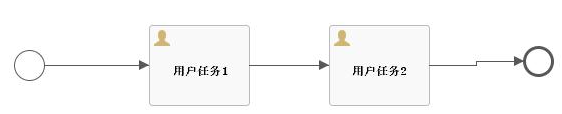

# Flowable6.6-动态增加节点
闲话少说，直接进入正题吧。

本文主要分为两个部分：

1. 使用原生的SDK动态增加节点。
2. 自定义Cmd动态增加节点，更符合现实需要。

Flowable是通过InjectUserTaskInProcessInstanceCmd这个命令类来实现动态增加节点的，调用的示例代码如下：

```java
@ResponseBody
@RequestMapping(value = "executInjectUserTask/{processInstanceId}")
public void executInjectUserTask(@PathVariable("processInstanceId") String processInstanceId) {
    DynamicUserTaskBuilder dynamicUserTaskBuilder = new DynamicUserTaskBuilder();
    dynamicUserTaskBuilder.setId("TEMP_USER_TASK");
    dynamicUserTaskBuilder.setName("新增用户任务");
    dynamicUserTaskBuilder.setAssignee("测试");
    InjectUserTaskInProcessInstanceCmd injectUserTaskCmd
            = new InjectUserTaskInProcessInstanceCmd(processInstanceId, dynamicUserTaskBuilder);
    managementService.executeCommand(injectUserTaskCmd);
}
```
调用上面的方法时，只需要传入流程实例ID即可。定义一个流程，如下图：



然后启动流程，流程会流转到“用户任务1”，此时task和execution中的数据如下图所示：


接下来调用上面定义的接口executInjectUserTask，就会动态增加一个UserTask，流程图会变成：


task、execution、procdef的数据如下所示：


简单说明一下：

1. Flowable通过此命令在流程内增加了一个新的流程定义，此后该流程实例将在新的流程定义上执行。
2. 在流程内增加了一个并行网关，然后新增指定的用户任务，而且这个用户任务完成后会直接结束。
3. 新增了一个用户任务，并且保留了之前已经存在的用户任务。
4. 新增了一个流程执行实例，为了能够执行新增的用户任务。

从新的流程图上来看，虽然动态增加了节点，但是不是特别贴合实际需要。在实际工作中，如果我们要增加节点，基本上应该是如下所示：


既然有源码，应该就可以进行改造，下一篇会介绍一下如何通过自定义命令实现动态增加用户任务节点。

以上，如有问题，欢迎指正。


觉的不错？可以关注我的公众号↑↑↑