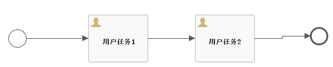
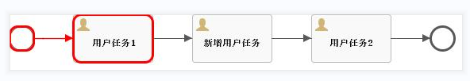
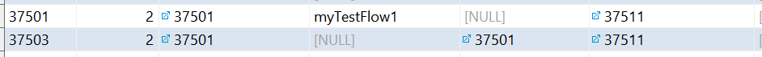
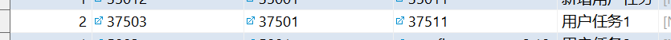
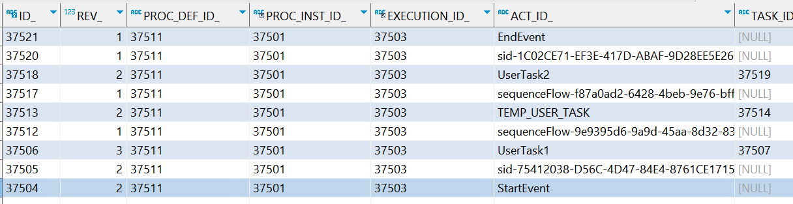

# Flowable6.6-调用自定义Cmd动态增加节点
上一篇，通过自定义Cmd实现了动态增加节点，本篇就调用一下自定义的Cmd看看效果。

测试的代码如下：

```java
/**
 * 自定义增加节点
 * @param processInstanceId 流程实例标识
 */
@ResponseBody
@RequestMapping(value = "executCustomInjectUserTask/{processInstanceId}")
public void executCustomInjectUserTask(@PathVariable("processInstanceId") String processInstanceId) {
    DynamicUserTaskBuilder dynamicUserTaskBuilder = new DynamicUserTaskBuilder();
    dynamicUserTaskBuilder.setId("TEMP_USER_TASK");
    dynamicUserTaskBuilder.setName("新增用户任务");
    dynamicUserTaskBuilder.setAssignee("测试");
    Task task = taskService.createTaskQuery().processInstanceId(processInstanceId).singleResult();
    BpmnModel bpmnModel = repositoryService.getBpmnModel(task.getProcessDefinitionId());
    FlowElement thisFlowElement = bpmnModel.getMainProcess().getFlowElement(task.getTaskDefinitionKey());
    CustomInjectUserTaskCmd customInjectUserTaskCmd
            = new CustomInjectUserTaskCmd(processInstanceId, thisFlowElement, dynamicUserTaskBuilder);
    managementService.executeCommand(customInjectUserTaskCmd);
}
```
仍旧是之前定义的那个简单流程：



启动流程后，仍旧让其流转到“用户任务1”，其execution和task的数据也没有什么变化。

然后调用executCustomInjectUserTask，传入流程实例标识，来看看流程整体有什么变化。

首先是流程图：



然后再看一下execution和task的数据：





这就实现了我们需要的效果：

1. 在“用户任务1”后面增加一个新的节点“新增用户任务”。
2. execution和task仍旧只有用户任务1的数据，新增节点等待触发流转后再生成实际数据。

整个流程流转完成后，history的数据如下：



以上，如有问题，欢迎指正。


觉的不错？可以关注我的公众号↑↑↑