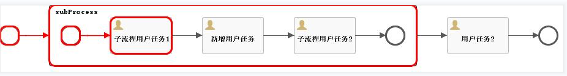

# Flowable6.6-调用自定义Cmd在子流程内动态增加UserTask | 字痕随行

之前说要尝试一下在子流程内动态增加UserTask节点，这篇就简单介绍一下实现和一些注意点。

普通的子流程可以看成在MainProcess内嵌入了另外一个流程。区别于调用子流程，这个嵌入的子流程的所有节点、连接线都在主流程定义文件内。

基于之前的文章，再分析一下流程的定义文件，可以发现动态增加节点的思路是一样的，唯一不同的只在于增加的节点需要在SubProcess内。

那么，同样的，定义一个Cmd即可：

```java
@Override
protected void updateBpmnProcess(CommandContext commandContext, Process process,
                                 BpmnModel bpmnModel, ProcessDefinitionEntity originalProcessDefinitionEntity, DeploymentEntity newDeploymentEntity) {
    if (null == currentElement) {
        super.updateBpmnProcess(commandContext, process, bpmnModel, originalProcessDefinitionEntity, newDeploymentEntity);
        return;
    }
    if (!(this.currentElement instanceof UserTask)) {
        return;
    }
    FlowElementsContainer container = currentElement.getParentContainer();
    if (!(container instanceof SubProcess)) {
        return;
    }
    UserTask currentUserTask = (UserTask) this.currentElement;
    if (currentUserTask.getOutgoingFlows().size() <= 0) {
        return;
    }
    SequenceFlow currentOutgoingFlow = currentUserTask.getOutgoingFlows().get(0);
    FlowElement targetFlowElement = currentOutgoingFlow.getTargetFlowElement();
    //需要动态增加的UserTask节点
    UserTask newUserTask = createUserTask(process);
    SubProcess subProcess = (SubProcess) container;
    FlowElement flowElement = process.getFlowElement(subProcess.getId());
    if (!(flowElement instanceof SubProcess)) {
        return;
    }
    subProcess = (SubProcess) flowElement;
    //新的两条连接线
    SequenceFlow newSequenceFlow1 = createSequenceFlow(subProcess, currentUserTask, newUserTask);
    SequenceFlow newSequenceFlow2 = createSequenceFlow(subProcess, newUserTask, targetFlowElement);
    //加到子流程内
    subProcess.addFlowElement(newUserTask);
    subProcess.addFlowElement(newSequenceFlow1);
    subProcess.addFlowElement(newSequenceFlow2);
    //删掉无用的连接线
    subProcess.removeFlowElement(currentOutgoingFlow.getId());
    //删除流程图内无用的连接线，同时自动排版
    bpmnModel.removeFlowGraphicInfoList(currentOutgoingFlow.getId());
    new BpmnAutoLayout(bpmnModel).execute();

    BaseDynamicSubProcessInjectUtil.processFlowElements(commandContext, process, bpmnModel, originalProcessDefinitionEntity, newDeploymentEntity);
}
```
创建UserTask的代码：

```java
private UserTask createUserTask(Process process) {
    UserTask userTask = new UserTask();
    if (dynamicUserTaskBuilder.getId() != null) {
        userTask.setId(dynamicUserTaskBuilder.getId());
    } else {
        userTask.setId(dynamicUserTaskBuilder.nextTaskId(process.getFlowElementMap()));
    }
    dynamicUserTaskBuilder.setDynamicTaskId(userTask.getId());

    userTask.setName(dynamicUserTaskBuilder.getName());
    userTask.setAssignee(dynamicUserTaskBuilder.getAssignee());
    return userTask;
}
```
创建SequenceFlow的代码：

```java
private SequenceFlow createSequenceFlow(BaseElement parent, FlowElement source, FlowElement target) {
    SequenceFlow sequenceFlow = new SequenceFlow(source.getId(), target.getId());
    //要注意生成连接线的id，不生成的话流程图会没有线
    if (parent instanceof Process) {
        Process process = (Process) parent;
        sequenceFlow.setId(dynamicUserTaskBuilder.nextFlowId(process.getFlowElementMap()));
    } else if (parent instanceof SubProcess) {
        SubProcess subProcess = (SubProcess) parent;
        sequenceFlow.setId(dynamicUserTaskBuilder.nextFlowId(subProcess.getFlowElementMap()));
    }
    return sequenceFlow;
}
```
然后，就可以用之前的方式调用自定义的Cmd进行测试了，流程图就会变成这样：



最后，我试验了一下这种方式是否支持自由跳转。结论是：支持，至少目前这种动态增加的节点可以在流程内自由跳转。

以上，如果有错误，欢迎探讨和指正。


觉的不错？可以关注我的公众号↑↑↑