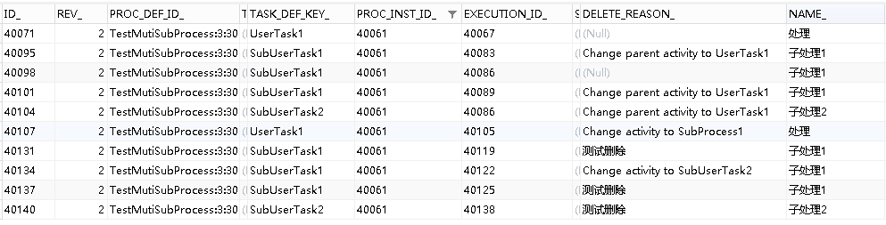
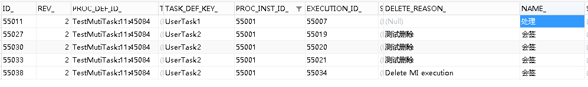

# Flowable6.4 – 删除流程 | 字痕随行
上周忙的要死，微信号的留言都过期了。留言中有个问题，我觉得就是问如何删除一个流程。

这个问题，我能想到的有两个方法，就抛砖引玉一下了：

1\. 直接跳转到结束节点，流程自然就没了，可以见[Flowable6.4节点跳转初探](http://www.blackzs.com/archives/1377)。

2\. 使用API接口删除流程实例。

第一个方法在这里就不详细说了，之前的分享应该就可以解决问题了。这次主要说说第二个办法。

这里用到的API很简单，如下：

```Java
/**
* instId 流程实例ID
* delReason 删除原因
*/
runtimeService.deleteProcessInstance(instId, delReason);

```
我做了一下测试，使用这个API删除的流程实例，数据也会保存至历史表，感觉还是比较安全的。

比如，删除了一个子流程，act\_hi\_taskinst是这样的：



再比如，删除一个带有多实例节点的流程，act\_hi\_taskinst是这样的：



这个API内部到底干了什么呢？以下是关键部分的源码解析。

```Java
@Override
public void deleteProcessInstance(String processInstanceId, String deleteReason) {
    //定义了一个删除的Command
    commandExecutor.execute(new DeleteProcessInstanceCmd(processInstanceId, deleteReason));
}

```
这个Command调用的关键方法如下：

```Java
CommandContextUtil.getExecutionEntityManager(commandContext).deleteProcessInstance(processInstanceEntity.getProcessInstanceId(), deleteReason, false);

```
接着就是删数据的方法了：

```Java
protected void deleteProcessInstanceCascade(ExecutionEntity execution, String deleteReason, boolean deleteHistory) {

    // fill default reason if none provided
    if (deleteReason == null) {
        deleteReason = DeleteReason.PROCESS_INSTANCE_DELETED;
    }
    getActivityInstanceEntityManager().deleteActivityInstancesByProcessInstanceId(execution.getId());

    List<ExecutionEntity> childExecutions = collectChildren(execution.getProcessInstance());
    for (ExecutionEntity subExecutionEntity : childExecutions) {
        //删子级的流程执行实例
    }

    //删任务
    TaskHelper.deleteTasksByProcessInstanceId(execution.getId(), deleteReason, deleteHistory);

    if (getEventDispatcher() != null && getEventDispatcher().isEnabled()) {
        getEventDispatcher().dispatchEvent(FlowableEventBuilder.createCancelledEvent(execution.getProcessInstanceId(),
                execution.getProcessInstanceId(), execution.getProcessDefinitionId(), deleteReason));
    }

    //删子级流程执行实例的关联数据

    //删子级关联的数据
    deleteExecutionAndRelatedData(execution, deleteReason, deleteHistory);

    //保存历史数据
}

```
在执行完上述方法后，接着为SubProcess做一些处理，就完成了流程删除工作。

如果希望加上自己的业务逻辑，可以在调用此API后加上自己的业务逻辑。也可以自定义一个命令，包裹上自己的业务逻辑。

以上，有需要的朋友可以试试，如有问题，欢迎指正。


觉的不错？可以关注我的公众号↑↑↑