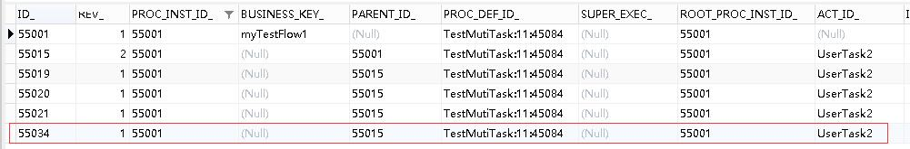

# Flowable6.4 – 加签和减签 | 字痕随行
趁着旅游归来的短暂休息，了解一下Flowable中的加签和减签操作。主要是以下两个方法来实现：

```java
runtimeService.addMultiInstanceExecution(String activityId, String parentExecutionId, Map<String, Object> executionVariables)

runtimeService.deleteMultiInstanceExecution(String executionId, boolean executionIsCompleted)

```
依然是先上流程图：


其中会签节点是多实例节点，此流程的关键xml片段如下：

```xml
<process id="TestMutiTask" isExecutable="true">
    <startEvent id="Start1" name="开始"></startEvent>
    <userTask id="UserTask1" name="处理"></userTask>
    <sequenceFlow id="sid-D14A5BC6-A61E-461F-AD33-0042E91B8B13" sourceRef="Start1" targetRef="UserTask1"></sequenceFlow>
    <userTask id="UserTask2" name="会签">
      <multiInstanceLoopCharacteristics isSequential="false" flowable:collection="${subProcessHelper.getUserNames()}" flowable:elementVariable="assignee">
        <completionCondition>${subProcessHelper.isComplete(execution)}</completionCondition>
      </multiInstanceLoopCharacteristics>
    </userTask>
    <sequenceFlow id="sid-E6847EF6-F54F-409B-AF8B-DCA62ECDC76F" sourceRef="UserTask1" targetRef="UserTask2"></sequenceFlow>
    <userTask id="UserTask3" name="审批"></userTask>
    <sequenceFlow id="sid-AF828B84-DDAA-4056-88C5-9D4F6EA9F725" sourceRef="UserTask2" targetRef="UserTask3"></sequenceFlow>
    <endEvent id="End1" name="结束"></endEvent>
    <sequenceFlow id="sid-C49B6256-0827-4CF5-8A47-5860A107142A" sourceRef="UserTask3" targetRef="End1"></sequenceFlow>
  </process>

```
subProcessHelper.getUserNames()：会返回一个List集合，会签节点会根据此集合的数量生成相对应的实例。

subProcessHelper.isComplete(execution)：用来判断会签节点是否完成，这里设置的条件为“已完成数量/总数量>2/3”。

调用加签和减签的方法如下：

```java
     /**
     * 增加流程执行实例
     * @param nodeId
     * @param proInstId
     * @param assigneeStr 以逗号隔开的字符串
     */
    @RequestMapping(value = "addExecution/{nodeId}/{proInstId}/{assignees}")
    public void addExecution(@PathVariable("nodeId") String nodeId,
                             @PathVariable("proInstId") String proInstId,
                             @PathVariable("assignees") String assigneeStr) {
        String[] assignees = assigneeStr.split(",");
        for (String assignee : assignees) {
            runtimeService.addMultiInstanceExecution(nodeId, proInstId, Collections.singletonMap("assignee", (Object) assignee));
        }
    }

    /**
     * 删除流程执行实例
     * @param excutionId
     * @param complated 是否完成此流程执行实例
     */
    @RequestMapping(value = "delExecution/{excutionId}/{complated}")
    public void delExecution(@PathVariable("excutionId") String excutionId,
                             @PathVariable("complated") Boolean complated) {
        runtimeService.deleteMultiInstanceExecution(excutionId, complated);
    }

```
启动流程，将流程跳转至会签节点，如下图所示：


*act\_ru\_task*


*act\_ru\_execution*

此时请求加签方法：

```Plain Text
http://localhost:8080/flowabledemo/flow/addExecution/UserTask2/55001/test004

```
流程会增加一个新的子实例，并且会增加相对应的参数，如下：


*act\_ru\_task*



*act\_ru\_execution*


*act\_ru\_variable*

此时如果请求减签的方法：

```Plain Text
http://localhost:8080/flowabledemo/flow/delExecution/55034/0

```
流程中相对应的Task和Variable会被删除：


*act\_ru\_task*

以上，就是本次试验的内容，需要注意的是，在减签时，如果Task正好是该多实例节点中的最后一个，将导致流程无法继续流转。下次可以分析一下源码，看看为何会这样。

有问题的话，欢迎指正和讨论。


觉的不错？可以关注我的公众号↑↑↑