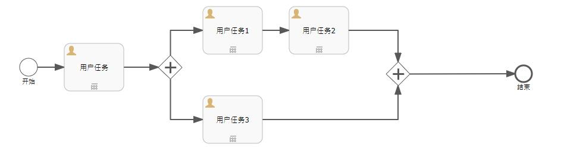
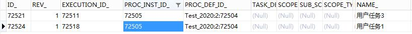
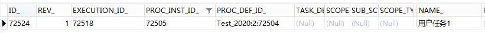
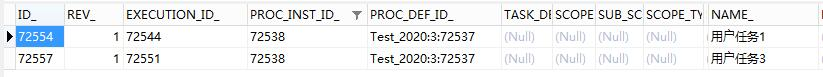
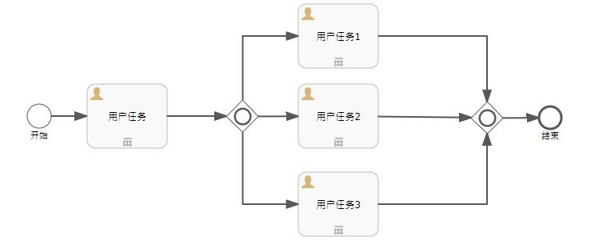
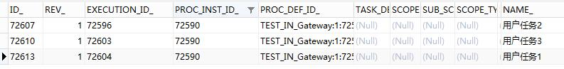
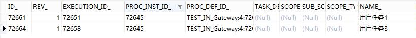

# Flowable6.4 – 并行网关和包容网关 | 字痕随行
这个春节的节奏就是：吃喝睡、吃喝睡，手机都懒的刷了。今天开始提振一下心情，整理一下思路，开始缓慢更新。

这次补完一下之前的一篇《[Flowable6.4-排他网关](http://www.blackzs.com/archives/1584)》，简单介绍一下并行网关和包容网关的使用。

**首先，并行网关。**

顾名思义，就是通过这个网关，可以把一个顺序流分成多个顺序流来执行，然后再通过这个网关，把分出来的多条顺序流合并为一个顺序流继续执行。

还是上个简单例子来演示一下，便于理解。流程图如下：

直接启动该流程，完成开始后的第一个用户任务，数据库中的数据显示如下：

可以看到，整个流程分为两条，一条会执行用户任务1->用户任务2这条线，一条会执行用户任务3这个条线。直接完成用户任务3，数据库中的数据显示如下：

此时，只剩下用户任务1，用户任务3那条线处于等待当中，等待用户任务1这条线完成后，整个流程会流转至结束。

如果为并行网关后的连接线增加条件，会发生什么呢？结果是，什么也不会发生，依然会创建两条记录：

可见，**并行网关不会执行连线的计算条件**。

**那么，包容网关是什么呢？**

排他网关是只执行第一个符合条件的分支，并行网关是同时执行所有的分支。那么，包容网关同时执行所有符合条件的分支。

比如下面这个流程图：

如果没有为包容网关的出口连接线设置过任何条件，在经过包容网关后的效果其实等同于上面的并行网关，它会生成多个顺序流：

如果加上条件的话，设置用户任务1和用户任务3的执行条件为True，用户任务2的执行条件为False，则只有用户任务1和用户任务3这两个分支会被执行：

至此，排他网关、并行网关、包容网关的作用已经介绍完毕。如果有问题欢迎留言讨论。

觉的不错？可以关注我的公众号↑↑↑