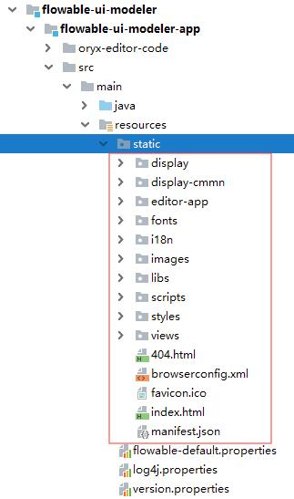
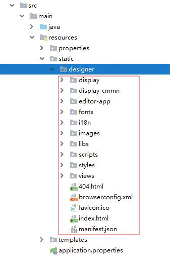
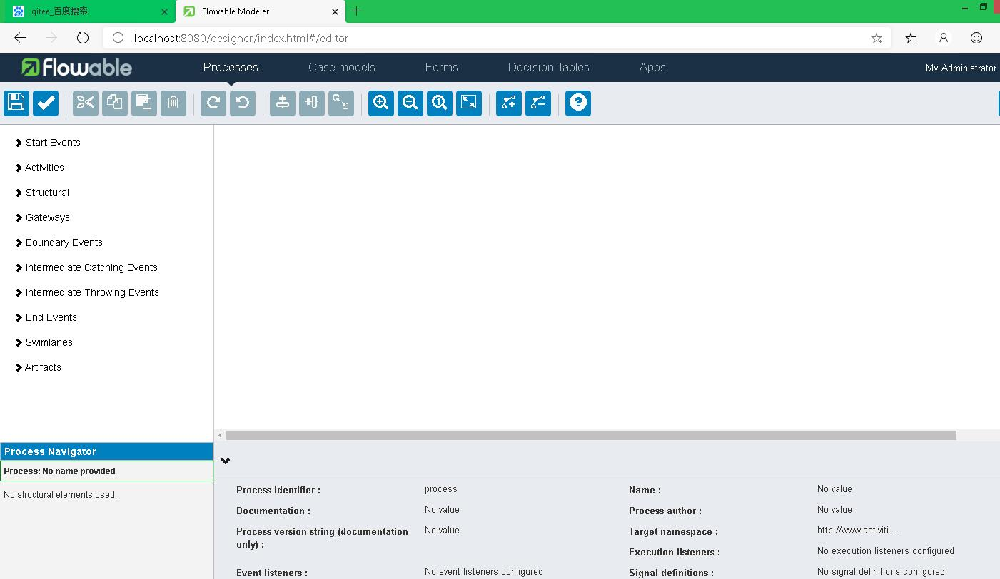

# Flowable6.4 – 整合流程设计器 | 字痕随行
之前一直凑合用Activiti6的流程设计器，这些天琢磨着把流程设计器整合到Web应用中，就挤出点时间搞了一下Flowable的流程设计器，在此记录一下整个的整合过程。  

其实，有了之前的整合经验，Flowable6.4的整合没有什么难点，而且发现相对容易了一些。

在之前[S](http://mp.weixin.qq.com/s?__biz=MzI3NTE2NzczMQ==&mid=2650045992&idx=1&sn=1bbab46a2f3647e06ea1c4e32886f737&chksm=f3083eb4c47fb7a23e82a2e2b792832a830322af2e51136c1c1fbe2f066f7f152cd644696bb5&scene=21#wechat_redirect)[pringBoot整合Flowable6.4](http://www.blackzs.com/archives/1523)的基础上，将flowable-ui-modeler-app中的源码文件拷贝出来，如下图：



将这些文件拷贝至已有的工程内，文件结构如下图所示：



在运行之前，一定先把app-cfg.js文件中的路径更改掉，比如我这里：

```javascript
FLOWABLE.CONFIG = {
    'onPremise' : true,
    'contextRoot' : '',
    'webContextRoot' : '/designer',
    'datesLocalization' : false
};

```
运行工程，并访问对应的地址：

```Plain Text
http://localhost:8080/designer/index.html#/editor

```
不出意外的话，页面肯定显示异常。此时，按下F12调用开发人员工具，查看Network情况，会发现URL account报错，具体的地址如下：

```Plain Text
http://localhost:8080/app/rest/account

```
这个地址的调用，其实在文件app.js中，具体的位置如下：

```Plain Text
\src\main\resources\static\designer\scripts

```
具体的代码如下：

```javascript
$http.get(FLOWABLE.APP_URL.getAccountUrl())
                .success(function (data, status, headers, config) {
                    $rootScope.account = data;
                    $rootScope.invalidCredentials = false;
                    $rootScope.authenticated = true;
});

```
这段代码其实没什么特别的，就是去服务端获取登录用户信息，如果去Flowable的源码里面找到对应的RequestMapping，其实可以看到服务端是使用SecurityUtils获取的账户信息。

如果是整合，不需要集成原有的身份认证，直接使返回用户信息就完事了，具体可以参照[之前的整合教程](http://www.blackzs.com/archives/1217)，代码段如下：

```java
@RequestMapping("account")
public Map<String, Object> getAccount() {
    Map<String, Object> map = new HashMap<String, Object>();
    map.put("email", "admin");
    map.put("firstName", "My");
    map.put("fullName", "Administrator");
    map.put("id", "admin");
    map.put("lastName", "Administrator");

    Map<String, Object> groupMap = new HashMap<String, Object>();
    map.put("id", "ROLE_ADMIN");
    map.put("name", "Superusers");
    map.put("type", "security-role");

    List<Map<String, Object>> groups = new ArrayList<Map<String, Object>>();
    groups.add(groupMap);

    map.put("groups", groups);

    return map;
}

```
刷新后继续，页面仍旧异常，这时去阅读app.js中的路由配置，会发现只有：

```javascript
.when('/editor/:modelId', {
            templateUrl: appResourceRoot + 'editor-app/editor.html',
            controller: 'EditorController'
})

```
需要在这段代码之前，增加一段：

```javascript
.when('/editor', {
            templateUrl: appResourceRoot + 'editor-app/editor.html',
            controller: 'EditorController'
})

```
保证可以正常的显示页面。再刷新之后，会发现在获得Model时，直接就访问了以下地址：

```Plain Text
/app/rest/models/undefined/editor/json

```
中间的“undefined”肯定是不正确的，追踪中路由中配置的controller，在editor-controller.js中发现和之前Acitiviti整合时不太一样，缺少新建时的请求路径。

分析源码，需要在url-config.js中补充配置：

```javascript
newModelInfo: function () {
        return FLOWABLE.CONFIG.contextRoot + '/app/rest/models/';
}

```
需要注意的是，这个url-config.js的路径为：

```Plain Text
\src\main\resources\static\designer\editor-app\configuration

```
然后还需要修改此文件中的getStencilSet，否则的话会发现无法获得所需要的Json数据：

```javascript
getStencilSet: function() {
        // return FLOWABLE.CONFIG.contextRoot + '/app/rest/stencil-sets/editor?version=' + Date.now();
        return FLOWABLE.CONFIG.webContextRoot + '/editor-app/stencilset.json';
}

```
然后修改editor-controller.js中请求Model数据的代码段，使其能够直接初始化一个空的数据，代码如下：

```javascript
 //要注意这个modelId，在bootEditor()有相对应的修改
    var modelId = $routeParams.modelId || '-1';
    var modelUrl;
    if ($routeParams.modelId) {
        modelUrl = FLOWABLE.URL.getModel($routeParams.modelId);
    } else {
        //这个是新增的，为的就是能够在没有modelId时能够获取初始数据
        modelUrl = FLOWABLE.URL.newModelInfo();
    }
    editorManager.setModelId(modelId);
    //we first initialize the stencilset used by the editor. The editorId is always the modelId.
    $http.get(modelUrl).then(function (response) {
        editorManager.setModelData(response);
        return response;
    }).then(function (modelData) {
        if(modelData.data.model.stencilset.namespace == 'http://b3mn.org/stencilset/cmmn1.1#') {
           return $http.get(FLOWABLE.URL.getCmmnStencilSet());
        } else {
           return $http.get(FLOWABLE.URL.getStencilSet());
        }
    }).then(function (response) {
         var baseUrl = "http://b3mn.org/stencilset/";
        editorManager.setStencilData(response.data);
        //the stencilset alters the data ref!
        var stencilSet = new ORYX.Core.StencilSet.StencilSet(baseUrl, response.data);
        ORYX.Core.StencilSet.loadStencilSet(baseUrl, stencilSet, modelId);
        //after the stencilset is loaded we make sure the plugins.xml is loaded.
        return $http.get(ORYX.CONFIG.PLUGINS_CONFIG);
    }).then(function (response) {
        ORYX._loadPlugins(response.data);
        return response;
    }).then(function (response) {
        editorManager.bootEditor();
    }).catch(function (error) {
        console.log(error);
    });

```
刷新页面，仍旧错误，会报找不到findRootStencilName()这个错误，这个问题很麻烦，后来逐行代码调试，发现其实要通过之前设置的modelId去取指定的对象。

所以在上面的代码中需要给modelId设置一个实际的值，然后在editorManager.bootEditor()这个方法中，增加一段代码，如下：

```javascript
this.canvasTracker = new Hash();
var config = jQuery.extend(true, {}, this.modelData); //avoid a reference to the original object.
if (!config.modelId) {
    config.modelId = '-1';
}
if(!config.model.childShapes){
    config.model.childShapes = [];
}

```
再刷新页面，就可以看到正常的页面了：



以上就是本次整合的主要内容，欢迎指正和探讨。


觉的不错？可以关注我的公众号↑↑↑