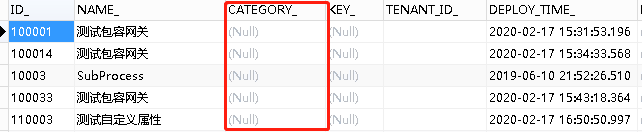
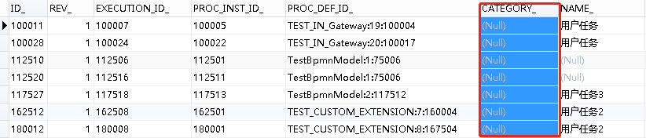

# Flowable6.4 – 设置流程分类 | 字痕随行
这次的内容是从NutzFW里面学来的，我很喜欢Nutz这个框架。所以，我觉得Nutz的衍生项目都很优秀，包括我的权限管理。

如果查看过act\_re\_deployment和act\_ru\_task，会发现这两张表里面都有一个相同的字段 —— Category。使用这个字段，可以为流程和任务添加分类，便于在不同的环境使用。



act\_re\_deployment



act\_ru\_task

**首先，如何设置act\_re\_deployment中的Category?**

为Deployment设置Category属性还是比较容易的，只需要在Deploy流程定义的时候增加相对应的属性即可，代码如下：

```Java
Deployment deployment = repositoryService.createDeployment()
        .name(modelData.getName())
        .category(modelData.getCategory())//设置此属性即可
        .addString(processName, new String(bpmnBytes))
        .deploy();

```
如何在modelData中增加Category？使用以下代码即可：

```Java
Model model = repositoryService.getModel(id);
if (null == model) {
    model = repositoryService.newModel();
}
//json是流程设计器发回服务端的
ObjectNode modelNode = (ObjectNode) new ObjectMapper().readTree(json);
model.setMetaInfo(modelObjectNode.toString());
model.setName(name);
model.setKey(key);
model.setCategory(category);
repositoryService.saveModel(model);

```
**然后，如何设置act\_ru\_task中的Category?**

为Task设置Category有些麻烦，因为在TaskService中没有找到直接设置的API。所以参考NutzFW中的设置方式，是通过在TaskCreateEvent中，直接修改的TaskEntityImpl中的Category属性。

在这里就不再详细说明如何增加TaskCreateEvent了，可以参考之前的文章：《[Activiti执行监听器-启动和结束](http://www.blackzs.com/archives/1280)》。

在事件触发的方法体中，增加以下代码即可设置Category：

```Java
FlowableEntityEvent entityEvent = (FlowableEntityEvent) event;
//act_ru_task的实体
TaskEntityImpl entity = (TaskEntityImpl) entityEvent.getEntity();
if (StrUtil.isBlank(entity.getCategory())) {
    //前提是Deployment已经设置过Category
    ProcessDefinitionEntity processDefinitionEntity = CommandContextUtil.getProcessDefinitionEntityManager().findById(entity.getProcessDefinitionId());
    DeploymentEntity deploymentEntity = CommandContextUtil.getDeploymentEntityManager().findById(processDefinitionEntity.getDeploymentId());
    //直接修改act_ru_task实体的属性
    //因为事件是同步事件，所以会包裹在整体事务中提交
    entity.setCategory(deploymentEntity.getCategory());
}

```
需要注意的是：Task的Category其实是来自于Deployment，所以一定要设置Deployment的Category。

以上，如有问题，欢迎指正。


觉的不错？可以关注我的公众号↑↑↑