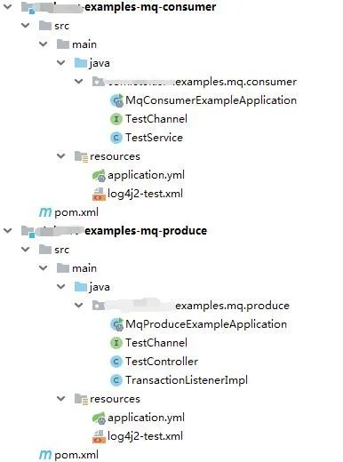

# RocketMQ-与SpringCloudStream结合 | 字痕随行

最近在加班，五一看了一遍《钢之炼金术师》，空闲时间又对Netty产生了兴趣，还得陪闺女，然后TBC怀旧又要蹭一波热度去，所以时间不够用，更新十分缓慢。

我在学习RocketMQ怎么和Spring Cloud结合的时候，首先被下面这个问题困扰：

Spring Cloud Bus和Spring Cloud Stream有什么不同？应用的场景都是什么样的？

后来吧，我得出了一个非常简单的结论，无论什么场景都用Spring Cloud Stream就完事了，因为Spring Cloud Bus是更抽象的封装，但凡场景复杂点就得重构，所以无脑直接用Spring Cloud Stream就行了。

当然了，这是我个人现在的想法，如果后面在使用过程中有变化，我会及时纠正我的错误观点的。

言归正传，这篇简单介绍一下RocketMQ和Spring Cloud的整合，也就是使用Spring Cloud Stream。

整体工程如下图所示：



**第一步，引入最关键的Jar包：**

消费者和生产者全都引入上面的包，其它主要的包：

**第二步，消费者和生产者的通道：**

因为Spring Cloud Stream把队列写入和读取高度抽象化了，是通过注解配合接口实现的。

所以，生产者需要声明：
```java
public interface TestChannel {

    @Output("output1")
    MessageChannel output1();
}

```
消费者需要声明：
```java
public interface TestChannel {

    @Input("input1")
    SubscribableChannel input1();
}

```
这里需要特殊说明一下的是：

1. 生产者的注解是Output，消费者的注解是Input，千万别搞错了。
2. TestChannel这个类名不必一样，这里一样是因为偷懒。
3. output1和input1，可以设置为你想要的任意字符串，只需要和yml文件中配置的对应就可以。
4. MessageChannel和SubscribleChannel不要搞错了。

**第三步，最重要的注解：**

在启动类上方增加关键注解：
```java
@SpringBootApplication
@EnableBinding({TestChannel.class})
public class MqProduceExampleApplication {

    public static void main(String[] args) {
        SpringApplication.run(MqProduceExampleApplication.class, args);
    }

}

```
消费者入口类上也要增加一样的注解。

**第四步，yml配置文件：**

生产者：
```Plain Text
spring:
  cloud:
    # Spring Cloud Stream 配置项，对应 BindingServiceProperties 类
    stream:
      # Binding 配置项，对应 BindingProperties Map
      bindings:
        output1:
          destination: test-topic # 目的地。这里使用 RocketMQ Topic
          content-type: text/plain # 内容格式。这里使用 JSON
      # Spring Cloud Stream RocketMQ 配置项
      rocketmq:
        # RocketMQ Binder 配置项，对应 RocketMQBinderConfigurationProperties 类
        binder:
          name-server: 127.0.0.1:9876 # RocketMQ Namesrv 地址
        # RocketMQ 自定义 Binding 配置项，对应 RocketMQBindingProperties Map
        bindings:
          output1:
            # RocketMQ Producer 配置项，对应 RocketMQProducerProperties 类
            producer:
              group: test # 生产者分组
              sync: true # 是否同步发送消息，默认为 false 异步。

```
消费者：
```Plain Text
spring:
  cloud:
    stream:
      bindings:
        input1:
          destination: test-topic
          content-type: text/plain
          group: test
      rocketmq:
        binder:
          name-server: 127.0.0.1:9876
        bindings:
          input1:
            consumer:
              tags: test

```
**第五步，生产消息：**
```java
@Resource
private TestChannel testChannel;

@ResponseBody
@RequestMapping(value = "send", method = RequestMethod.GET)
public String sendMessage() {
    String messageId = IdUtil.simpleUUID();
    Message<String> message = MessageBuilder
            .withPayload("this is a test:" + messageId)
            .setHeader(MessageConst.PROPERTY_TAGS, "test")
            .build();
    try {
        testChannel.output1().send(message);
        return messageId + "发送成功";
    } catch (Exception e) {
        LOG_COLLECTOR.error(e.getMessage(), e);
        return messageId + "发送失败，原因：" + e.getMessage();
    }
}

```
**第六步，消费消息：**
```java
@StreamListener("input1")
public void receiveInput1(@Payload Message message) throws ValidationException {
    System.out.println("input1 receive: " + message.getPayload() + ", foo header: " + message.getHeaders().get("foo"));
}

```
只要配置文件和注解搞对了，使用上没有什么技术难点。

以上，如有错误，欢迎指正。


觉的不错？可以关注我的公众号↑↑↑