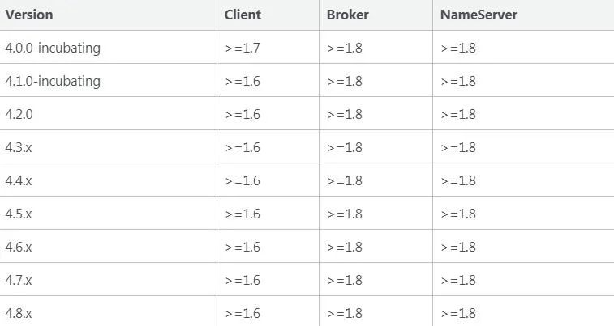
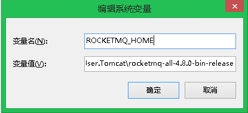
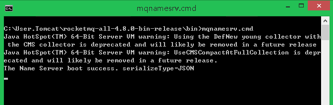
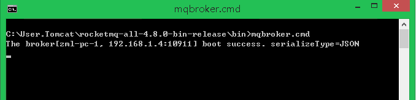
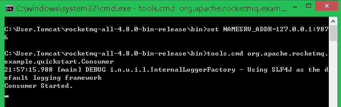
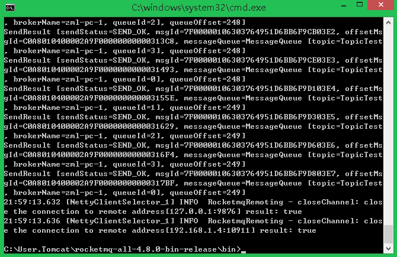
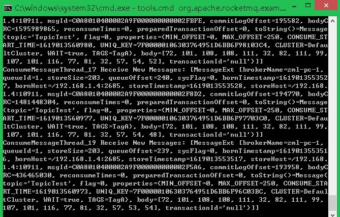

# RocketMQ-入门 | 字痕随行

最近鼓捣了几个小玩意：

1. RocketMQ
2. CAS
3. JWT

有空就记录一下，顺便再梳理一下思路，以后看自己写的东西也比看别人的易于理解。

**如何下载？**

RocketMQ的下载地址如下：

```Plain Text
http://rocketmq.apache.org/dowloading/releases/

```
RocketMQ对于JDK版本的要求还是挺清晰的：



这里测试的话，我没有下载源码进行编译，以后想看源码的话再说。直接下载的是rocketmq-all-4.8.0-bin-release.zip。

伸手党的话，直接使用下面的地址下载：

```Plain Text
https://mirrors.bfsu.edu.cn/apache/rocketmq/4.8.0/rocketmq-all-4.8.0-bin-release.zip

```
**如何启动？**

下载并解压完成后，并不能直接启动，需要进入bin文件夹修改一下启动文件，本文以windows系统为例。

先修改runserver.cmd，主要是修改一下初始内存大小，毕竟只是为了开发测试而已：
```shell
set "JAVA_OPT=%JAVA_OPT% -server -Xms256m -Xmx256m -Xmn128m -XX:MetaspaceSize=128m -XX:MaxMetaspaceSize=320m"
set "JAVA_OPT=%JAVA_OPT% -XX:+UseConcMarkSweepGC -XX:+UseCMSCompactAtFullCollection -XX:CMSInitiatingOccupancyFraction=70 -XX:+CMSParallelRemarkEnabled -XX:SoftRefLRUPolicyMSPerMB=0 -XX:+CMSClassUnloadingEnabled -XX:SurvivorRatio=8 -XX:-UseParNewGC"
set "JAVA_OPT=%JAVA_OPT% -verbose:gc -Xloggc:"%USERPROFILE%\rmq_srv_gc.log" -XX:+PrintGCDetails"
set "JAVA_OPT=%JAVA_OPT% -XX:-OmitStackTraceInFastThrow"
set "JAVA_OPT=%JAVA_OPT% -XX:-UseLargePages"
set "JAVA_OPT=%JAVA_OPT% -Djava.ext.dirs=%BASE_DIR%lib"
set "JAVA_OPT=%JAVA_OPT% -cp "%CLASSPATH%""

```
然后再修改runbroker.cmd，这个文件要修改两个地方，一个是内存，一个是CLASSPATH：
```shell
set "JAVA_OPT=%JAVA_OPT% -server -Xms256m -Xmx256m -Xmn128m"
set "JAVA_OPT=%JAVA_OPT% -XX:+UseG1GC -XX:G1HeapRegionSize=16m -XX:G1ReservePercent=25 -XX:InitiatingHeapOccupancyPercent=30 -XX:SoftRefLRUPolicyMSPerMB=0 -XX:SurvivorRatio=8"
set "JAVA_OPT=%JAVA_OPT% -verbose:gc -Xloggc:%USERPROFILE%\mq_gc.log -XX:+PrintGCDetails -XX:+PrintGCDateStamps -XX:+PrintGCApplicationStoppedTime -XX:+PrintAdaptiveSizePolicy"
set "JAVA_OPT=%JAVA_OPT% -XX:+UseGCLogFileRotation -XX:NumberOfGCLogFiles=5 -XX:GCLogFileSize=30m"
set "JAVA_OPT=%JAVA_OPT% -XX:-OmitStackTraceInFastThrow"
set "JAVA_OPT=%JAVA_OPT% -XX:+AlwaysPreTouch"
set "JAVA_OPT=%JAVA_OPT% -XX:-UseLargePages -XX:-UseBiasedLocking"
set "JAVA_OPT=%JAVA_OPT% -Djava.ext.dirs=%BASE_DIR%lib"
set "JAVA_OPT=%JAVA_OPT% -cp "%CLASSPATH%""

```
runbroker.cmd的%CLASSPATH%少了双引号，导致如果目录包含空格，就会**报错**，这里需要注意一下。

最后，设置一下环境变量，增加ROCKETMQ\_HOME：



在命令行内启动NameServer：



再启动Broker：



不过，建议启动Broker的时候，使用命令：
```shell
##9876是MQ的默认端口
start mqbroker.cmd -n 127.0.0.1:9876 autoCreateTopicEnable=true
```
因为开发测试的时候，最好让它能够自动创建Topic，这样会轻松简单不少。

**如何测试？**

启动以后肯定希望验证一下是否正常，最简单的方法是使用RocketMQ自带的生产者和消费者。

打开Cmd命令行窗口，输入以下命令：
```shell
set NAMESRV_ADDR=127.0.0.1:9876
tools.cmd org.apache.rocketmq.example.quickstart.Consumer

```
启动消费者：



同样的，再打开一个新的命令行窗口，输入以下命令：
```shell
set NAMESRV_ADDR=127.0.0.1:9876
tools.cmd org.apache.rocketmq.example.quickstart.Producer

```
启动生产者，此时它会自动发送消息：



消费者会同时收到消息：



这样就能够测试MQ是否运行正常。

以上就是简单的入门配置，后面再说如何在Spring Cloud中使用。

以上，如果有错误，欢迎探讨和指正。


觉的不错？可以关注我的公众号↑↑↑