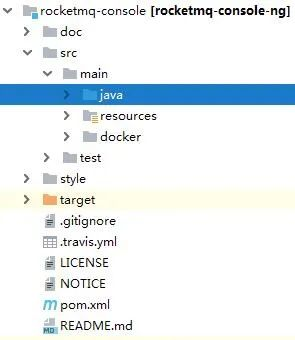
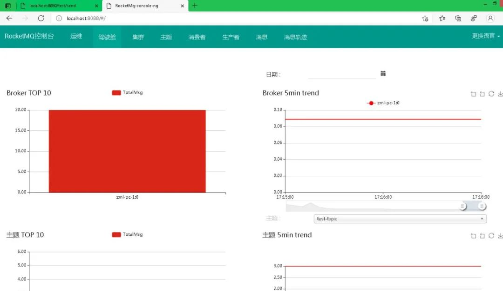

# RocketMQ-消费者异常处理和图形化监控 | 字痕随行

在消费消息时，因为异常导致消费不成功的时候，RocketMQ默认会连续进行三次重试。

可以通过下面的代码测试一下：
```java
@StreamListener("input1")
public void receiveInput1(@Payload Message message) throws ValidationException {
    if (0 == count) {
        //此处模拟的是接收消息时处理出错的情况，抛出异常之后，消息会重试消费
        count++;
        LOG_COLLECTOR.error("接收消息强制抛出错,次数:{},内容:{}", count, message.getPayload());
        throw new ValidationException("接收消息强制抛出错误");
    } else if (1 == count) {
        count++;
        LOG_COLLECTOR.error("接收消息强制抛出错,次数:{},内容:{}", count, message.getPayload());
        throw new ValidationException("接收消息强制抛出错误");
    } else if (2 == count) {
        count++;
        LOG_COLLECTOR.error("接收消息强制抛出错,次数:{},内容:{}", count, message.getPayload());
        throw new ValidationException("接收消息强制抛出错误");
    } else {
        count = 0;
    }
    System.out.println("input1 receive: " + message.getPayload() + ", foo header: " + message.getHeaders().get("foo"));
}

```
运行时，就会输出：
```Plain Text
com.etek.srv.examples.mq.consumer.TestService - 接收消息强制抛出错,次数:1,内容:this is a test:76d0dddeef02479090040f91319f7da3
com.etek.srv.examples.mq.consumer.TestService - 接收消息强制抛出错,次数:2,内容:this is a test:76d0dddeef02479090040f91319f7da3
com.etek.srv.examples.mq.consumer.TestService - 接收消息强制抛出错,次数:3,内容:this is a test:76d0dddeef02479090040f91319f7da3

```
在三次重试后，会抛出异常，可以通过以下方式捕捉异常：
```java
//channel的格式为{destination}.{group}.errors
@ServiceActivator(inputChannel = "test-topic.test.errors")
public void handleError(ErrorMessage errorMessage) {
    LOG_COLLECTOR.error("捕捉到了正在发生的异常");
}

```
如果希望通过图形化的方式对RocketMQ进行监控，可以使用rocketmq-console。

可以通过以下地址下载：
```Plain Text
//原始地址
https://github.com/apache/rocketmq-externals
//加速地址
https://codechina.csdn.net/mirrors/apache/rocketmq-externals/

```
只需要加载rocketmq-externals的子工程rocketmq-console即可。



修改application.properties：
```Plain Text
#改成不冲突的端口
server.port=8088
#指向本地的name server
rocketmq.config.namesrvAddr=localhost:9876

```
然后直接启动，就可以访问图形化监控界面了：



以上，就是本次的内容，如有错误，欢迎指正。


觉的不错？可以关注我的公众号↑↑↑